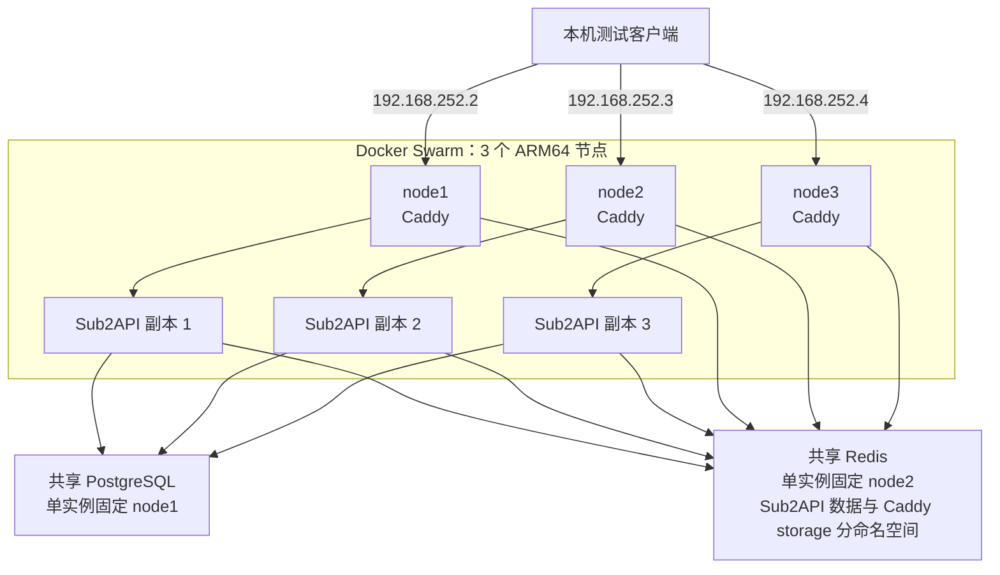
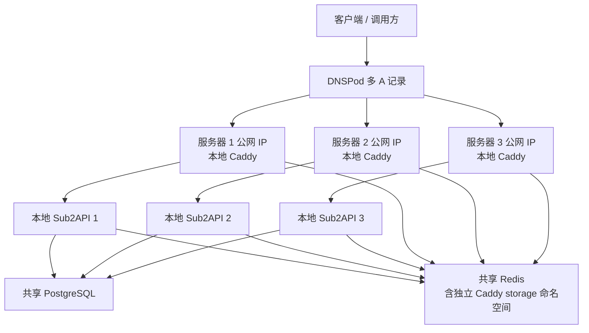
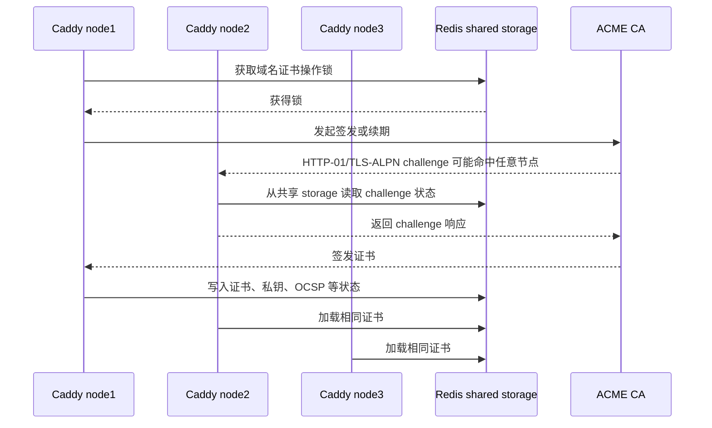

# Sub2API 多节点部署方案

> 状态：本地验证方案与 G1 至 G5 实施基线已完成；Sub2API restart condition 最小修正、node1/PostgreSQL 复测、单副本 OOM 和隔离 migration 失败均通过。当前三个 manager、Sub2API/Caddy `3/3`、PostgreSQL/Redis `1/1`，三个入口与 `release:verify ENV=local` 正常；生产容量、监控、DNS、真实数据迁移及灾难恢复按后续独立门槛补齐
> 创建日期：2026-07-26  
> 更新日期：2026-07-27
> 节点信息来源：[`Multipass-Nodes.md`](./Multipass-Nodes.md)  
> 当前边界：本地阶段 0 至阶段 5 已关闭。`ext.2` 暴露的 PostgreSQL readiness 偏差由 `backend/extends/lifecycle` 两文件修补并在 `ext.3` 复测通过；node1/PostgreSQL 首次整节点场景暴露的正常退出 task 不重建问题，仅由部署层把 Sub2API `restart_policy.condition` 改为 `any` 并增加既有渲染断言，受控滚动和修订门槛复测已通过。node3 单副本真实 cgroup OOM 自动恢复，隔离 migration checksum 故障未进入 ready 且未影响正式数据库。当前不执行生产部署、数据迁移、DNS 切流、容量定标或灾难恢复

## 1. 文档目的

本文用于逐步收敛 Sub2API 的三节点部署与二次开发方案，作为后续需求确认、架构评审、实施设计和验收记录的统一入口。

当前生产环境采用单节点 Sub2API。随着访问量，尤其是生图业务增长，现有约 16G 内存和 200M 公网带宽逐渐成为容量约束。本方案的长期目标是通过多节点分担应用负载，并让域名通过 DNSPod 多 A 记录把不同客户端或连接分散到多台服务器，从而扩展集群总处理能力和聚合公网吞吐。

本轮先在三个 Multipass Ubuntu 节点上完成 Docker Swarm 本地验证，不迁移生产数据，也不接入公网 DNS。所有标记为“待确认”的内容，都不能直接作为生产实施依据。

### 1.1 核心结论

1. 本地验证采用 Docker Swarm `global` service，在三个带 `sub2api=true` 标签的节点上各运行 1 个 Sub2API 副本。
2. 三个副本共享一套独立部署的 PostgreSQL 和 Redis；本地验证阶段各运行 1 个实例，PostgreSQL 固定在 `node1`，Redis 固定在 `node2`，不作为数据服务 HA 方案。
3. Caddy 也作为 Docker Swarm `global` service，在每个 `caddy=true` 节点使用 host network 直接绑定本机 `80/443`，固定代理本机 Sub2API；不引入 Traefik，也不使用 routing mesh 承担公网应用分流。
4. DNS 多 A 可以扩大多个客户端并发访问时的聚合带宽，但不会把一个请求或一条连接的带宽叠加到多台服务器。
5. 三个 Caddy 实例统一使用 Caddy `v2.11.4` 与 `github.com/pberkel/caddy-storage-redis@v1.8.1` 构建的自定义镜像，并使用同一个 Redis storage，共享和协调证书、私钥、OCSP、ACME challenge 状态及证书续期锁。
6. 当前本地阶段统一使用测试域名 `sub2api.test` 和 Caddy `tls internal`；本机通过 `curl --resolve` 分别访问三个节点，DNSPod 多 A 和公网 ACME 在后续生产阶段启用。
7. 现阶段不处理 DNS 故障节点自动摘除，只记录其行为边界。
8. 横向扩展不是只增加副本数；多实例状态、内存保护、长连接排空、共享 Secret 和数据库迁移串行化仍需验证或最小改造。
9. 二次开发基于原项目 fork，保留原项目作为上游；上游同步仅由人工按需发起，不设置固定频率。
10. `extends` 只用于解决第 6.5 节列出的 Sub2API 多实例安全问题，不作为通用扩展框架，也不用于增加无关业务功能。
11. `extends` 中的多实例安全修补默认全部开启，不设置功能开关；三个副本运行相同的 ext 版本和行为。
12. 多实例安全修补代码集中在 fork 根目录 `backend/extends`；原项目只保留不可避免的最小接入点。无法完全避免原项目改动时，优先新增文件；确需修改原文件时，将修改行和职责控制在最小范围。`backend/extends/VERSION` 是该目录中唯一预先批准的非运行时代码例外，仅记录 fork 自有版本，不属于新功能、实体或通用扩展机制。
13. 能通过部署约束解决的问题不进入 `extends`；若无必要不新增 Ent/domain 实体、数据库表或额外抽象，优先复用现有模型和基础设施以降低复杂度。
14. 当前不引入 Consul、etcd、Nacos、Apollo 等独立配置中心；以 `deploy/cluster` 为配置模板权威来源，使用版本化 Docker Swarm Config/Secret 向 Caddy 和 Sub2API 分发不可变配置。
15. 模型价格采用经审计的版本化 Swarm Config 快照；更新价格不重新构建镜像，而是创建新 Config 并以单副本滚动更新使其生效。
16. 三副本滚动更新不暂停整个集群，但当前“每节点 Caddy 只代理本机单副本”且不做 DNS 故障摘除，被更新节点会有短暂不可用窗口；本方案不将其表述为逐节点零中断。
17. 线上生产首期采用 3 台等规格 AMD64 集群节点，每台不少于 16G 内存和 200M 公网带宽；初期 PostgreSQL、Redis 仍部署在该集群并计入所在节点资源预算，后期再迁出为独立服务节点。CPU、磁盘和容器限额在取得现网数据及压测结果后确定。
18. 生产初期接受 PostgreSQL、Redis 各自为单点：所在节点故障时禁止 service 漂移到其他节点的空目录启动，Sub2API `/ready` 返回 503，DNS 不自动摘除；第一期由人工修复原节点/原存储，第二期启用并演练集群外备份后才增加备份恢复路径。
19. 数据恢复目标保留为：PostgreSQL `RPO <= 15 分钟`、`RTO <= 4 小时`，Redis/Caddy storage `RPO <= 1 小时`、`RTO <= 4 小时`；第一期只复用并保留上游已有 S3 兼容接口，不配置对象存储、不实现上传或新增备份组件，因此第一期不能宣称达到跨节点灾难恢复目标。
20. 生产混合部署节点必须限制 Sub2API 容器最大内存；Caddy reservation 不低于 1G，PostgreSQL reservation 不低于 2G，Redis reservation 不低于 2G。Sub2API hard limit 与 `GOMEMLIMIT` 的具体值继续按最不利混合节点预算确认。
21. 本地三个 Multipass 节点保持 4G 内存，不为资源验收扩容；使用独立的缩小资源档，仅验证功能、Swarm 调度和容器限额语义，其结果不得作为生产容量或配额依据。本地档固定为：Caddy `128MiB/256MiB`、PostgreSQL `512MiB/768MiB`、Redis `256MiB/512MiB`、Sub2API `512MiB/2GiB`（reservation/hard limit），并设置 `GOMEMLIMIT=1536MiB`。
22. 本地环境使用全新生成且只用于本地测试的应用 Secret 和测试账号；JWT/TOTP、数据库/Redis 凭据及 Caddy storage encryption key 按各自消费范围在副本间保持一致，并通过 Swarm Secret 注入。`Multipass-Nodes.md` 可保留明文节点登录测试密码，但该例外不扩展到应用 Secret、Provider 凭据或测试账号密码。
23. 本地验收是多实例安全专项，不是 Sub2API 全量业务回归：必须覆盖 HTTP/SSE/WebSocket 与最小滚动排空、全部 OAuth provider 的跨节点回调、当前环境实际启用且确认高内存的生图入口、migration 并发和 Scheduled Test 重复执行；同步/异步复用路径不重复建设 limiter，Batch 保持现有 worker/job lock；缺少真实 Provider 账号时允许协议级模拟，不验收模型效果、内容质量或全部 Provider 业务能力。
24. 采用 GoTask 作为 `deploy/cluster` 内的薄发布/运维入口，只编排校验、部署、验证、回滚和日常运维命令；不引入 Web UI、Agent、状态库、调度器或新控制面。只借鉴 `wuhanstudio/app-docker-swarm` 的 Taskfile 组织方式，不复用其 Traefik、Docker Socket、本地 ACME volume 和可变镜像 tag 方案。
25. 第一期本地验证只做最小观测，不部署 Prometheus、Grafana、Loki 或新的常驻采集/告警组件；使用 Caddy JSON access log、Sub2API 日志、Swarm/容器状态、cgroup/Docker 资源数据及 PostgreSQL/Redis 原生查询形成验收记录，并通过 `request_id + node + replica` 关联请求。GoTask 只统一状态、日志和采样命令，不承担监控平台职责。
26. 当前阶段不考虑镜像签名。生产供应链只使用私有 GHCR、不可变架构 tag、固定平台 digest、构建记录和模块/平台核验；GHCR 不可达时停止生产发布。Multipass 本地验证允许由可信开发机按固定版本/commit/date 构建 ARM64 镜像，以 source image ID、归档 SHA-256 和 node image ID 三重校验后上传加载；不回退到 Docker Hub、`latest`、未核验归档或可变内容。

## 2. 已知环境

### 2.1 节点清单

| 节点 | IPv4 | 系统 | 架构 | CPU | 内存 | 磁盘 | 当前状态 |
| --- | --- | --- | --- | ---: | ---: | ---: | --- |
| `node1` | `192.168.252.2` | Ubuntu 24.04.4 LTS | `aarch64` | 2 vCPU | 4G | 20G | Running |
| `node2` | `192.168.252.3` | Ubuntu 24.04.4 LTS | `aarch64` | 2 vCPU | 4G | 20G | Running |
| `node3` | `192.168.252.4` | Ubuntu 24.04.4 LTS | `aarch64` | 2 vCPU | 4G | 20G | Running |

补充事实：

- 三个节点均由 Multipass 管理，处于同一私有网段。
- 当前通过 `multipass shell` 或 `multipass exec` 管理节点。
- 节点的 SSH 密码登录已禁用；认证细节只保留在节点文档中，不复制到本方案。
- Sub2API 的 Dockerfile 和发布说明已包含 `linux/arm64` 支持；本方案分别构建 `linux/arm64` 测试制品和 `linux/amd64` 生产制品，实际部署前仍需逐一核验 Sub2API、Caddy、PostgreSQL 与 Redis 的目标平台及最终 digest。

### 2.2 环境能力边界

这组三节点适合验证：

- 多节点编排、服务发现和内部网络；
- Sub2API 多副本共享 PostgreSQL/Redis；
- 单节点停止、服务重调度、滚动更新和回滚流程；
- ARM64 镜像、资源限制、日志和监控方案；
- 普通 HTTP、SSE、WebSocket、滚动排空和生图请求在多副本下的行为；
- OAuth 跨节点临时状态、migration 并发和后台任务重复执行等多实例安全语义。

这组三节点不能单独证明：

- 跨物理机、跨可用区或跨机房的真实高可用；
- 宿主机、电源、磁盘和上游网络的独立故障隔离；
- 生产公网入口、DNS、证书和真实带宽条件下的容量；
- 生产数据量下的备份、恢复时间和长期磁盘增长。

原因是三个 Multipass 实例仍共享同一台物理宿主机和宿主网络。

## 3. 当前目标与非目标

### 3.1 当前目标

1. 在三个 Ubuntu ARM64 节点上形成可重复部署的 Docker Swarm 本地验证环境。
2. 运行 3 个 Sub2API 副本，并保证每个节点最多 1 个副本。
3. 让全部 Sub2API 副本共享同一 PostgreSQL 和 Redis。
4. 验证 Sub2API 多副本的一致性、长连接行为、内存隔离和故障恢复边界。
5. 为后续“增加服务器即增加应用和带宽容量”的生产方案验证最小改造路径。
6. 形成部署、升级、回滚、备份、恢复和验收的完整操作入口。
7. 基于已建立的 fork，维护上游同步、`extends` 扩展边界和原项目最小差异的治理基线。
8. 只对第 6.5 节经验证存在的多实例安全问题实施必要修补，不借二次开发增加无关功能。

### 3.2 当前非目标

- 本轮实际安装 Docker Swarm 或部署任何业务服务。
- 本轮接入 DNSPod、公网域名、TLS 或生产流量。
- 本轮迁移现有 PostgreSQL、Redis、配置或业务数据。
- 本轮不调整已建立 fork 的 Git remote，也不修改任何 Sub2API 运行时代码；`backend/extends` 仅新增非运行时版本文件 `VERSION`。
- 建设通用插件系统、可选功能市场，或增加与第 6.5 节多实例安全无关的业务功能。
- 本轮把 PostgreSQL/Redis 扩展为高可用集群。
- 本轮实现 DNSPod 故障节点自动摘除、秒级切换或 CLB 等价能力。
- 在需求确认前给出 CPU、内存、并发、队列、超时和磁盘配额的最终数值。
- 直接把 Multipass 验收结果等同于生产环境高可用验收。

## 4. 需求基线

| 主题 | 当前状态 | 当前结论或待确认问题 |
| --- | --- | --- |
| 节点数量 | 已确认 | 3 个节点 |
| 操作系统与架构 | 已确认 | Ubuntu 24.04.4 LTS，`aarch64` |
| 节点资源 | 已确认 | 每节点 2 vCPU、4G 内存、20G 磁盘 |
| 环境用途 | 已确认 | 本地验证；不代表生产高可用验收 |
| 目标平台 | 已确认 | 当前测试为 `linux/arm64`；线上生产为 `linux/amd64`，两者使用相同版本基线并分别固定平台镜像 digest |
| 编排方式 | 已确认 | Docker Swarm |
| Sub2API 副本数 | 已确认 | 3 个副本，每个节点最多 1 个 |
| Sub2API service mode | 已确认 | 使用 `global`；每个带 `sub2api=true` 标签的节点自动运行 1 个副本，新增合格节点后自动扩容 |
| 节点入口 | 已确认 | 每节点 Caddy 固定代理本机 Sub2API；不采用 Traefik |
| Caddy service mode | 已确认 | 使用 Swarm `global`；每个 `caddy=true` 节点运行 1 个 host-network task，直接绑定本机 `80/443`，不使用 systemd、Docker Socket 或 routing mesh |
| Caddy 制品版本 | 已确认 | Caddy `v2.11.4` + `github.com/pberkel/caddy-storage-redis@v1.8.1`；分别构建 `linux/arm64`、`linux/amd64` 镜像，部署固定对应平台 digest |
| 多节点 TLS | 已确认 | 所有 Caddy 使用相同 Redis storage，协调证书签发与续期 |
| 本地 TLS | 已确认 | 测试域名使用 `sub2api.test`，Caddy 使用 `tls internal`；本机通过 `curl --resolve` 定向验证三个节点，并信任同一 Caddy Local CA 根证书 |
| PostgreSQL | 已确认初期边界 | 本地验证固定在 `node1`；生产初期作为集群内单实例 service，固定在唯一 `postgres=true` 节点，全部副本共享；后期迁出为独立服务节点，不视为 HA |
| Redis | 已确认初期边界 | 本地验证固定在 `node2`；生产初期作为集群内单实例 service，固定在另一个唯一 `redis=true` 节点，全部副本及 Caddy storage 共享但使用独立 ACL/namespace；后期迁出为独立服务节点，不视为 HA |
| 数据服务故障边界 | 已确认 | PostgreSQL/Redis 节点故障时不漂移到空目录；依赖不可用期间正式副本 `/ready=503`，DNS 不自动摘除，由人工修复或恢复；不承诺数据服务 HA |
| S3 备份阶段 | 已确认 | 上游已有 S3 兼容备份接口；第一期保持未配置/禁用，不新增接口、SDK、实体或备份组件，只为后续启用保留配置边界；既定 RPO/RTO 在实施集群外备份前仅为目标 |
| 外部入口 | 已确认当前阶段 | 仅本机测试；未来目标是 DNSPod 多 A 记录指向多台公网服务器 |
| DNS 故障摘除 | 当前不处理 | 不做自动摘除；本地验收只记录节点故障后的入口表现 |
| 数据迁移 | 已确认 | 全新部署，暂不迁移旧数据 |
| 二次开发仓库 | 已确认并已建立仓库基线 | 当前仓库 `origin=https://github.com/ryanpenn/sub2api.git`，`upstream=https://github.com/Wei-Shaw/sub2api.git`；同步仅由人工按需发起，不设置固定频率；多实例安全代码修补尚未实施 |
| `extends` 功能范围 | 已确认 | 只解决第 6.5 节 Sub2API 多实例安全问题；不是通用扩展框架，不增加无关新功能 |
| `extends` 启用方式 | 已确认 | 不设置功能开关，所有多实例安全修补默认开启；全部副本运行相同 ext 版本和行为 |
| 代码与部署边界 | 已确认 | `extends` 只处理无法通过部署解决的代码级多实例安全问题；共享依赖、Secret、现有启动 migration 的部署验证、Swarm/Caddy 和资源限制留在部署层 |
| 新增实体原则 | 已确认 | 若无必要不新增 Ent/domain 实体、数据库表或额外抽象；优先复用现有实体、Redis/key namespace、配置和接口 |
| OAuth 临时状态 | 已确认 P0 | 通用 OAuth、OpenAI、Antigravity、Grok/xAI、Gemini CLI 的进程内 `SessionStore` 全部外置到共享 Redis；统一机制、按 provider 隔离 key namespace 和 TTL，不新增数据库实体 |
| 并发槽启动清理 | 已确认 P0 | 不再按“非当前 request prefix”删除其他副本槽位，也不在启动时无条件删除共享等待计数；仅依赖现有 Redis score/TTL 和索引清理回收过期状态，不新增 owner 实体或 heartbeat |
| 图片并发保护 | 已确认证据门槛 | 保持每副本本地 limiter，不增加 Redis 集群总计数；三个副本统一启用现有 limiter 并使用相同参数。先证明同步 Responses、Images 和异步复用路径已有保护，Batch 保持现有 worker/job lock；仅在 WebSocket、Gemini native 或其他实际高内存入口的失败测试证明遗漏时增加最小调用点，不预建 ext limiter 框架 |
| readiness 与排空 | 已确认 | 保留 `/health` 作为 liveness，由 ext 增加 `/ready`；启动未完成、依赖不可用或 draining 时返回 503；`SIGTERM` 先停止接收新请求，再按可配置窗口排空，且与 Swarm `stop_grace_period` 对齐 |
| WebSocket 排空 | 已确认第一期最小范围 | draining 后拒绝新的 WebSocket upgrade；进程内 registry 只追踪本副本客户端连接，已有连接可继续到窗口结束，到期发送 `1012 Service Restart` 后关闭并由客户端重连；第一期不识别当前/new turn，不侵入 forwarding loop，不跨副本迁移连接，不新增 Redis 状态或实体 |
| WebSocket 状态边界 | 已确认 | `response_id -> conn_id`、`session -> conn_id` 和执行中的 turn 保持进程内；重连建立新连接，不跨副本续接未完成 turn；只有确需跨请求、跨副本读取的状态才复用现有 Redis 机制，不新增实体 |
| 后台任务多实例安全 | 已确认证据门槛 | Account/Proxy expiry 先验证既有条件更新/事务语义，测试通过即不改代码；Scheduled Test 是当前唯一明确门控候选，只有重复执行失败测试成立时才复用现有 Redis leader lock 与 PostgreSQL advisory lock 回退；两者均不可用时跳过当次，不新增全局 leader 实体或调度框架 |
| 数据库 schema migration | 已确认 | 保留每个应用副本启动时的现有 migration；固定 ID 的 PostgreSQL session advisory lock 串行执行，等待副本获锁后重新核对 `schema_migrations` 和 checksum；全新数据库保留现有 10 分钟总上下文，以三次冷启动最慢不超过 5 分钟作为本地门槛；`*_notx.sql` 和不可逆迁移按第 6.4.1 节恢复/回滚边界处理；不新增 migration Job 或 ext 修补 |
| 首次 bootstrap 与配置 | 已确认 | 仅一个临时受控实例执行一次 `AUTO_SETUP`；显式提供管理员密码、JWT/TOTP Secret，完成后关闭；正式副本统一只读挂载版本化 `config.yaml` Swarm secret 并设置 `AUTO_SETUP=false`，新增节点不重复 setup |
| 本地 Secret 与测试账号 | 已确认 | 全新生成本地专用值，不复用生产凭据；JWT/TOTP 和应用配置由三个 Sub2API 副本共享，Caddy storage key 由三个 Caddy 共享，数据库/Redis 凭据按相应客户端统一注入；Provider 凭据仅在对应测试时按需注入，全部不进入 Git；`Multipass-Nodes.md` 明文节点登录测试密码是唯一文档例外 |
| 本地功能验收范围 | 已确认 | 聚焦多实例安全：HTTP/SSE/WebSocket 与最小排空、全部 OAuth provider 跨节点回调、当前实际启用且确认高内存的生图入口、migration 并发及 Scheduled Test 重复执行；Account/Proxy expiry 只验证既有安全并行语义；无真实账号时允许协议级模拟；不做模型效果、内容质量和全部 Provider 业务能力的全量回归 |
| 应用发布与原地更新 | 已确认 | Sub2API 容器视为不可变制品；生产通过固定镜像 digest，本地通过已校验归档/image ID，由 Swarm 更新/回滚；Caddy 阻断在线更新检查、可回滚版本查询、原地更新和原地回滚入口，只保留 `GET /api/v1/admin/system/version` 展示完整 fork 版本；不修改源码、不增加开关 |
| 配置中心 | 已确认不引入 | 当前三节点、低频配置变更场景使用 Docker Swarm Config/Secret 即可；不新增独立配置中心及其客户端监听、认证、备份和高可用体系 |
| 多节点配置分发 | 已确认 | Caddyfile 使用版本化 Swarm Config；Sub2API `config.yaml` 使用版本化 Swarm Secret；敏感参数只进入 Secret，配置通过创建新版本并滚动更新，不共享可写文件 |
| 模型价格快照 | 已确认 | 经审计的 `model_pricing.json` 使用版本化 Swarm Config，只读挂载到三个副本；本地第一期关闭远程同步，仅使用该 Config；生产准入时远程数据和 hash URL 必须固定到与快照一致的不可变上游 revision，不跟随 `main` 漂移 |
| 模型价格更新 | 已确认 | 创建新价格 Config 并更新 service 引用；无需重建应用镜像，以 `parallelism: 1`、`order: stop-first` 和 `failure_action: pause` 更新，发布流程逐副本验证 `/ready` |
| 滚动更新可用性 | 已确认边界 | 不整体停服，通常仍有另外两个副本提供集群容量；但本机 Caddy 不跨节点转发且当前不做 DNS 摘除，被更新节点存在短暂请求失败或重连窗口，不承诺逐节点零中断 |
| 扩展代码目录 | 已按边界实施 | fork 根目录 `backend/extends` 包含独立 `VERSION`、Redis OAuth SessionStore 与最小 lifecycle manager；薄接入点已逐项登记，没有新增实体、开关或通用扩展框架 |
| 集群部署目录 | 已完成 G1/G2/G3 | fork 根目录 `deploy/cluster` 已创建 Stack、双环境模板、Caddyfile、GoTask 契约和本地归档分发任务；G2 已回填平台 digest，G3 已完成 node1 单副本，生产占位域名/IP及容量门槛仍会阻止未完成输入进入部署 |
| 发布/运维入口 | 已完成 G1/G2/G3 | 在 `deploy/cluster` 内使用 GoTask 提供统一命令入口；GoTask 不是长驻控制面，不承担 RBAC、Secret 存储、监控、分布式锁或审批。根 Taskfile、分组 Taskfile 和 GHCR manifest 提升脚本已创建并静态验证；G3 已通过同一入口完成本地归档分发、bootstrap、Stack apply 与 verify |
| 原项目改动原则 | 已确认 | 遵循最小改动原则；优先新增文件，确需修改原文件时只保留最小接入改动 |
| `extends` 目录例外 | 已确认 | ext 实现及其实现测试位于 `backend/extends`；原包私有行为与薄接入点的回归测试允许就地新增并登记为 test-only 例外，不能为了测试目录合规而导出私有 API、增加 wrapper 或重复 adapter；运行时 upstream 修改严格受第 6.8.2 节白名单约束 |
| `extends` 接入与依赖 | 已确认 | Wire 只接入一个 `extends.ProviderSet`；server/router 只注入窄 readiness interface 并注册 `/ready`，不建设统一扩展路由器；适配代码新增文件优先；`extends` 不得反向导入 `cmd/server`、`internal/server`，原有 domain/service 不得依赖 `extends` |
| 上游同步细节 | 已确认 | 仅人工按需发起，不设置固定频率；在临时同步分支 merge `upstream/main`，验证后再进入自有 `main`；共享分支禁止 rebase/force-push；发生冲突时人工介入，不设置强制处理规范 |
| 版本标识 | 已确认 | `backend/cmd/server/VERSION` 只随 upstream 变化，fork 不修改；`backend/extends/VERSION` 只由 fork 独立维护且不随 upstream 重置。计划中的首个组合为 `0.1.165` + `ext.1`，发布和镜像 tag 为 `v0.1.165-ext.1`，部署固定镜像 digest |
| 镜像来源与当前供应链边界 | 已确认 | 生产使用私有 GHCR 的 ARM64/AMD64 架构 tag、multi-arch manifest 与固定平台 digest；Multipass 本地使用可信开发机的固定输入构建与校验归档上传，不向节点配置 GHCR 凭据；两条路径都保存版本、commit、模块/平台和镜像身份，不使用 `latest` 或未核验制品 |
| 容量目标 | 已确认分阶段 | 首期 3 台等规格 AMD64 集群节点，每台不少于 16G 内存和 200M 公网带宽；PostgreSQL/Redis 初期在集群内并计入所在节点资源预算，后期迁出；CPU、磁盘、普通 QPS、并发流/生图、请求大小及时延明确延期到 AMD64 压测后确定，不阻塞本地阶段 0，但未补齐前禁止认定生产就绪 |
| 资源预留与限制 | 已确认本地档、生产数值部分待定 | 生产 Caddy memory reservation 不低于 `1G`，PostgreSQL/Redis 各不低于 `2G`；混合部署节点上的 Sub2API 必须设置统一 memory hard limit，具体生产 limit、reservation 与 `GOMEMLIMIT` 待压测确认；当前 4G Multipass 保持不扩容，本地专用档采用 Caddy `128MiB/256MiB`、PostgreSQL `512MiB/768MiB`、Redis `256MiB/512MiB`、Sub2API `512MiB/2GiB`（reservation/hard limit）及 `GOMEMLIMIT=1536MiB`，且不做容量验收 |
| 本地可观测性 | 已确认 | 第一期只使用 Caddy JSON access log、Sub2API 日志、Swarm/容器状态、cgroup/Docker 资源数据及 PostgreSQL/Redis 原生查询；以 `request_id + node + replica` 关联链路，由 GoTask 统一状态、日志和采样命令并保存验收记录；不部署 Prometheus/Grafana/Loki 或本地常驻告警平台，生产监控另行设计 |
| 可用性目标 | 目标已确认、第一期未实现 | 接受 PostgreSQL/Redis 单点及人工恢复；目标为 PostgreSQL `RPO<=15m`/`RTO<=4h`、Redis/Caddy storage `RPO<=1h`/`RTO<=4h`；第一期不接入集群外 S3，不能据此验收灾难恢复 |

## 5. 目标拓扑

### 5.1 本地验证拓扑

本地阶段不使用 DNSPod。三个节点组成 Docker Swarm，每个节点运行一个 Caddy 本地入口和一个 Sub2API 副本；全部 Sub2API 副本访问相同的 PostgreSQL 和 Redis，全部 Caddy 实例使用相同的 Redis storage。



本地验证从本机分别访问三个 Caddy 入口，以便确认每节点副本、节点带宽和故障行为。Sub2API 使用 `host` publish 暴露本机端口，Caddy 固定代理 `127.0.0.1` 上的本地 Sub2API；不应只访问一个 routing mesh 端口后就宣称三个节点均已独立验证。

本地验证已确认不增加第 4 个数据节点：PostgreSQL 与 `node1` 的 Sub2API/Caddy 共机，Redis 与 `node2` 的 Sub2API/Caddy 共机，`node3` 只运行应用与入口组件。这样可以在现有三节点内验证共享依赖，同时避免 PostgreSQL 和 Redis 集中竞争同一节点资源。当前每节点 4G 内存只适合功能和编排验证，不能据此推导生产资源配额或数据服务 HA 能力。

### 5.2 未来生产入口目标

未来生产目标是让同一域名配置多个 A 记录，各公网 IP 落到该服务器的本地入口和本地 Sub2API 副本：



该拓扑的目标是：不同客户端或新连接命中不同公网服务器，由该节点 Caddy 固定转发到本机 Sub2API，各自使用对应服务器的公网带宽和应用资源。Sub2API 采用 `host` 模式发布本机端口，避免入口节点收到请求后又通过 Swarm routing mesh 转发到其他节点。

DNSPod 多 A 的能力边界：

- 它是 DNS 级分流，不是把多台服务器带宽合并成一条链路。
- 单个生图请求、SSE 或 WebSocket 连接只会落在一台服务器上，其速度仍受该节点、客户端和上游链路限制。
- 多客户端或多连接分散后，集群聚合吞吐才可能随节点数增长。
- DNS 缓存、TTL、客户端解析顺序和连接复用会导致分布不严格均匀。
- DNS 本身不替代 L7 健康检查、连接排空和无损发布；现阶段不实现故障节点自动摘除，只保留风险记录。
- 扩容不仅要新增服务器和 A 记录，还要确认共享 PostgreSQL/Redis、连接数、Provider 额度和账号并发没有成为新的集中瓶颈。

## 6. 需要收敛的架构主题

### 6.1 编排与节点角色

已确认 Docker Swarm、`global` service 和“当前 3 个副本、每节点 1 个”的基线。现有 `node1`、`node2`、`node3` 固定作为 manager 并保留 worker 能力，使 manager 数量保持为 3 并可验证单 manager 故障；后续容量扩展节点全部只作为 worker 加入，不把 manager 扩展到 3 个以上。若原 manager 永久失效，则从合格 worker 中晋升一个替代节点，使 manager 数量恢复为 3；该操作属于控制面修复，不属于容量扩展。

Sub2API service mode 已确认采用 `global`：

- `node1`、`node2`、`node3` 均设置 `sub2api=true`，因此当前自动运行 3 个副本；
- `global` 不配置固定 `replicas`，每个符合 placement constraint 的节点只运行 1 个任务；
- 新服务器加入 Swarm 并通过基线验收后，显式添加 `sub2api=true` 标签，Swarm 自动在该节点增加 1 个副本；
- 后续容量扩展节点只以 worker 身份加入，由三个 manager 维持 Swarm 控制面；新增 worker 不参与 Raft quorum；仅在原 manager 永久失效时晋升替代节点以恢复三个 manager；
- 删除标签或将节点置为 drain 时，该节点副本停止；不会把第二个 Sub2API 副本补到其他已有节点；
- 单节点故障时集群容量下降一个副本，符合“每节点最多 1 个”和当前不做入口故障自动摘除的边界。

同时必须：

- 通过节点标签限定可运行 Sub2API 的节点；
- 依赖 `global` 语义保证同一合格节点恰好 1 个 Sub2API 副本；
- 节点故障后保持容量下降，不允许任务在其他节点形成第二副本；
- 避免在同一 4G 节点启动第二个高内存副本；
- 将 PostgreSQL/Redis placement 与持久化目录绑定，防止漂移到空数据目录；
- 生产初期只给一个节点设置 `postgres=true`，给另一个节点设置 `redis=true`，两个标签不得位于同一节点；第三个节点不设置数据服务标签，只运行 Caddy/Sub2API。

### 6.2 入口与流量分配

入口组件已确定为 Caddy，不采用 Traefik。选择依据：

- 当前只有一个域名和一个核心业务服务，不需要 Traefik 的 Swarm 动态路由能力；
- Caddy 可直接复用仓库现有 `deploy/Caddyfile` 的 `localhost:8080` 反向代理基线；
- Caddy 不需要读取 Docker API 或挂载 Docker Socket，减少入口对 Swarm control plane 的耦合；
- Caddy 原生支持 SSE、WebSocket 和流式响应，适合 Sub2API 长连接和生图响应；
- 每节点固定代理本机 Sub2API，最符合 DNSPod 多 A 后使用各节点独立公网带宽的目标。

部署职责已确认：

- Sub2API 由 Docker Swarm 以 `global` 模式管理；
- Sub2API 以 `host` publish 方式在每个节点提供本机端口，绕过 routing mesh；
- Caddy 由 Docker Swarm 以 `global` 模式管理，只在 `caddy=true` 节点运行；
- Caddy task 使用 host network，直接绑定本机 `80/443`，不再额外声明 Swarm published port；
- Caddy 固定代理 `127.0.0.1:<Sub2API host-published 端口>`，不通过 overlay service name 或 routing mesh 访问其他节点副本；
- Caddy 不挂载 Docker Socket；admin API 仅监听 host network 的 `127.0.0.1:2019`，不向局域网或公网开放；
- Caddyfile 通过版本化 Swarm Config 只读挂载，Redis storage 密码和 encryption key 通过 Swarm Secret 注入；
- 公网阶段只开放 Caddy 的 `80/443`，Sub2API host-published 端口必须由主机防火墙或 `DOCKER-USER` 规则限制，不能从公网绕过 Caddy；
- 新增服务器时，加入 Swarm、完成基线验收、增加 `sub2api=true`/`caddy=true` 标签并添加 DNS A 记录；两个 `global` service 自动各增加一个 task。

本地验证阶段：

- 不接入公网域名、DNSPod 或公共 ACME；使用 `sub2api.test` 和 `tls internal` 验证本地 TLS；
- 从本机分别访问三个节点 Caddy，验证每个入口只代理本机副本；
- 记录每次请求实际命中的 `node_id`/`instance_id`，避免只看到 HTTP 200 却无法证明分流；
- 验证普通 HTTP、HTTP/2、Keep-Alive、SSE、WebSocket 和大图片响应；
- 验证停止一个副本后，该节点入口的预期行为和其他两个节点是否继续可用。

未来生产阶段：

- DNSPod 多 A 指向每台服务器的公网 IP；
- 每个节点 Caddy 固定转发到本地 Sub2API，避免 routing mesh 二次转发；
- 统一 TLS 证书签发、分发、续期和权限管理；
- Caddy 对本机 upstream 使用 `/ready` 判断是否接收新流量；readiness 必须能在滚动更新和排空时停止新请求，但不承担 DNSPod 故障节点摘除；
- 不把会话粘性作为正确性前提：OAuth 临时状态外置共享 Redis；WebSocket 连接绑定状态按第 6.5 节保持在命中副本并通过客户端重连处理。DNS 或客户端连接复用形成的自然粘性可以存在，但方案不依赖它掩盖跨副本状态问题。

负载均衡不能被假定为按实时内存或生图成本均匀分配请求，每个副本仍需独立保护自身资源。

### 6.3 Caddy 多节点 TLS 与共享 Storage

#### 6.3.1 方案结论

三个 Caddy 实例必须配置相同的 storage，组成一个 Caddy TLS 协调集群。为避免引入 NFS、Consul 或新的对象存储，本方案复用已经存在的共享 Redis 服务，并为 Caddy 划分独立的 ACL、逻辑数据库或 key prefix。

Caddy 默认不包含 Redis storage，已确认使用 Caddy `v2.11.4` 和 `github.com/pberkel/caddy-storage-redis@v1.8.1` 构建自定义镜像。版本追溯固定为：Caddy tag 对应 commit `e2eee6a7fce366321294c9c2a79f3146891dcbdf`，Redis storage module tag 对应 commit `230a32809cc4016427db0c11c925d703132941b1`。构建命令的核心输入为：

```bash
xcaddy build v2.11.4 \
  --with github.com/pberkel/caddy-storage-redis@v1.8.1
```

该 module 属于非标准插件，仍须记录源码审计、构建日志、模块清单和最终镜像 digest。测试与生产分别构建 `linux/arm64`、`linux/amd64` 制品，不能在三个节点上分别临时构建，也不能使用 `latest` 或 module `main`。

#### 6.3.2 协调流程



共享 storage 的作用包括：

- 对证书首次签发和续期使用分布式锁，避免三个节点重复向 CA 下单；
- 共享证书、私钥、ACME account、challenge 状态、OCSP staple 和 session ticket key；
- 允许 ACME challenge 请求命中任意一个 Caddy 节点；
- 新增节点后从相同 storage 加载现有证书，而不是重新签发。

#### 6.3.3 Redis 隔离与持久化要求

Caddy storage 与 Sub2API 业务 Redis 可以复用同一个 Redis 实例，但必须逻辑隔离：

- 使用独立 Redis 用户/ACL，只允许访问 Caddy storage 的 key namespace；
- 使用独立逻辑数据库或固定 key prefix，禁止与 Sub2API key 混用；
- Sub2API 使用的 Redis 用户不得执行会清除 Caddy namespace 的 `FLUSHDB`/`FLUSHALL` 或批量删除操作；
- Caddy storage 不得使用允许关键证书数据被淘汰的缓存策略；若业务 Redis 存在主动清库或 eviction 需求，生产阶段应拆成独立 Redis 实例；
- Redis 地址、用户名、密码和 storage encryption key 通过统一 Secret 注入三个 Caddy；
- 三个节点必须使用完全相同的 storage 配置和 encryption key；
- Caddy 使用 host network，不能依赖 Swarm overlay service name；Redis 必须提供仅私网可达的稳定端点，并由防火墙限制来源；
- 第一期 Redis 启用本地 AOF/RDB 持久化，验证进程/节点重启后仍能加载证书私钥及 ACME account；该本地副本不算跨节点备份；
- 第二期启用集群外备份后，Redis 备份需要加密保存；storage encryption key 单独备份，不能与 Redis 数据放在同一失效域；
- Caddy 只能通过私网访问 Redis，Redis 不向公网开放；
- 监测 Redis 连接、错误、持久化状态，以及 Caddy 的证书获取、续期和 storage 错误。

#### 6.3.4 故障边界

| 场景 | 预期行为 |
| --- | --- |
| 单个 Caddy 停止 | 其他节点继续使用共享证书；该节点入口不可用，现阶段不自动删除其 DNS 记录 |
| Redis 短暂不可用 | 已加载到内存的证书通常仍可继续服务；新的 Caddy 启动、首次签发、证书加载或续期可能失败 |
| Redis 数据丢失 | 可能丢失证书私钥、ACME account 和锁状态；第一期未实现集群外备份，不能承诺恢复，本地环境只能显式重建证书体系；第二期启用备份后必须从备份恢复，不能把重新签发作为生产唯一恢复策略 |
| 一个节点触发续期 | 由共享锁保证同一时间只有一个实例执行，其他实例从 Redis 获取更新后的证书 |
| 新增 Caddy 节点 | 使用相同 storage 和 Secret 后加载已有证书，不单独创建新的证书体系 |

#### 6.3.5 本地验证门槛

1. 三个 Caddy 都能读写相同 Redis storage，并识别为同一证书集群。
2. 三个节点使用完全相同的 `sub2api.test` Caddy site 和 `tls internal` 配置。
3. 仅保留一个节点首次触发内部 CA 签发，其余节点能够从共享 storage 加载相同证书和私钥指纹。
4. 本机使用同一 Local CA 根证书，通过 `curl --resolve` 分别完成三个节点的 TLS 和 `/ready` 验证。
5. 重启任意 Caddy 后不产生独立 CA 或重复证书体系，能够从 Redis 恢复证书。
6. 在 Redis 短暂中断时记录已有 TLS 连接、新 TLS 握手、Caddy 重启和续期行为。
7. 重启 Redis 并重新挂载同一本地持久化目录后，三个节点仍能加载同一内部 CA 和站点证书；集群外备份恢复不属于第一期门槛。

本地 Multipass 阶段不使用公共 DNS 或公网 ACME。公网证书签发、ACME challenge 和 DNSPod 多 A 在生产预演阶段另行验收。

#### 6.3.6 本机解析与 CA 信任

三个节点的 Caddyfile 使用同一个站点名：

```caddyfile
sub2api.test {
    tls internal
    reverse_proxy 127.0.0.1:8080
}
```

精确验证某个节点时，不需要修改本机 DNS 或 `/etc/hosts`。`curl --resolve` 会同时设置目标 IP、HTTP Host 和 TLS SNI；`--noproxy '*'` 用于避免本机系统代理或环境变量代理接管 Multipass 私网请求：

```bash
curl --noproxy '*' --cacert /tmp/sub2api-caddy-root.crt \
  --resolve sub2api.test:443:192.168.252.2 https://sub2api.test/health

curl --noproxy '*' --cacert /tmp/sub2api-caddy-root.crt \
  --resolve sub2api.test:443:192.168.252.3 https://sub2api.test/health

curl --noproxy '*' --cacert /tmp/sub2api-caddy-root.crt \
  --resolve sub2api.test:443:192.168.252.4 https://sub2api.test/health
```

当前正式 service 已部署 `v0.1.165-ext.3`，三个节点均以 `/ready` 验证域名、TLS、共享依赖和本机代理链路。`v0.1.165-ext.2` 镜像保留在三个节点并由 Swarm `PreviousSpec` 指向，作为已核实的回滚输入；本轮复测通过，未实际执行 rollback。

首次签发完成后，从任一 Caddy 的本机 admin API 导出 Local CA 根证书。admin API 只监听节点回环地址，不向局域网或公网开放：

```bash
multipass exec node1 -- curl -fsS http://127.0.0.1:2019/pki/ca/local \
  | jq -r '.root_certificate' \
  > /tmp/sub2api-caddy-root.crt

openssl x509 -in /tmp/sub2api-caddy-root.crt \
  -noout -subject -issuer -fingerprint -sha256
```

仅使用命令行验证时保留 `--cacert` 即可，不需要修改 macOS 系统信任。若需要通过浏览器或不带 `--cacert` 的客户端访问，可将根证书加入 macOS System Keychain：

```bash
sudo security add-trusted-cert -d -r trustRoot \
  -k /Library/Keychains/System.keychain \
  /tmp/sub2api-caddy-root.crt
```

浏览器访问需要本机名称解析。为保证命中节点可控，`/etc/hosts` 同一时间只保留一个活动映射，例如：

```text
192.168.252.2 sub2api.test
```

切换节点时把该 IP 改为 `192.168.252.3` 或 `192.168.252.4`，然后刷新 macOS DNS 缓存：

```bash
sudo dscacheutil -flushcache
sudo killall -HUP mDNSResponder
```

不要依赖在 `/etc/hosts` 中为同一域名同时写入三个 IP 实现轮询；客户端选择顺序和缓存不可控，不能据此验证流量均衡。若启用了系统代理或 VPN，还需在其代理绕过列表中加入 `sub2api.test` 和 `192.168.252.0/24`；命令行验收仍统一使用 `--noproxy '*'`。

### 6.4 PostgreSQL、Redis 与持久化

已确认三个 Sub2API 副本必须共享相同的 PostgreSQL 和 Redis。本地阶段为全新部署，不迁移旧数据。

本地阶段已确认：

- PostgreSQL、Redis 各作为独立 Swarm service，不随每个 Sub2API 副本重复部署；
- PostgreSQL 运行 1 个实例，通过 placement 固定在 `node1`，使用该节点的本地持久化卷；
- Redis 运行 1 个实例，通过 placement 固定在 `node2`，使用该节点的本地持久化卷；
- `node3` 不放置 PostgreSQL/Redis，只运行本节点 Caddy 和 Sub2API；
- 两个数据服务均不做副本、自动故障转移或跨节点存储，本地结果不作为 HA 证明；
- 全部 Sub2API 副本通过内部 overlay network 和稳定 service name 访问；
- PostgreSQL/Redis 不通过测试入口对外公开；
- 数据目录使用 Stack-scoped Docker local named volume，并通过唯一 placement 固定到原节点；恢复验收必须同时核对 volume 名称、driver、Mountpoint 和数据身份，不能只凭 service `1/1` 或 `/ready=200`；
- 不允许节点故障后服务漂移到空目录并以“新库”启动；
- 保留应用启动时的现有 migration；三个副本可以同时启动，但 migration runner 必须通过固定 ID 的 PostgreSQL session advisory lock 串行执行 SQL，不能绕过该锁；
- 等待副本获锁后必须重新读取 `schema_migrations` 并核对 checksum，已成功应用的文件直接跳过；迁移失败的副本不得进入 ready；
- `AUTO_SETUP` 与 migration 分开治理：只有一个临时 bootstrap 实例执行 setup；三个正式副本仍各自在正常启动路径竞争 migration advisory lock；
- 三个 Sub2API 副本使用统一连接池预算，数据库/Redis 总连接数按副本数计算。

生产初期沿用“数据服务在同一 Swarm 内、单实例、placement 绑定节点本地 named volume”的形态，但目标平台为 AMD64，且 PostgreSQL/Redis 所在节点仍同时运行本机 Caddy 和一个 Sub2API task。PostgreSQL 固定在唯一 `postgres=true` 节点，Redis 固定在另一个唯一 `redis=true` 节点，第三个节点不放数据服务。后期迁出时只改变数据位置和连接端点，不改变三个 Sub2API 副本共享同一 PostgreSQL/Redis 的语义，也不为迁出新增应用实体或业务功能。

生产初期故障语义已确认：PostgreSQL 或 Redis 所在节点失联、磁盘不可用或服务无法读取原持久化目录时，Swarm 不得把该数据 service 调度到其他节点并创建空库/空 Redis。service 保持失败，全部依赖该服务的 Sub2API 副本必须 `/ready=503`；Caddy 对本机未就绪 upstream 返回失败，DNS 记录保持不变。第一期只能由人工修复原节点/原存储；第二期启用并演练集群外备份后，才允许按手册恢复到明确的新目标并修改 placement。两阶段均不做自动故障转移。

#### 6.4.1 Migration 超时、非事务恢复与回滚边界

第一期保留现有应用启动 migration 和 10 分钟总上下文，不增加配置项、migration Job 或 `extends` 修补。该上下文同时覆盖 advisory lock 等待和实际 SQL 执行，不应被描述成仅有 10 分钟锁等待。三个副本允许同时启动，但同一时刻只能有一个数据库 session 持有固定 ID 的 advisory lock 并执行 SQL；失败或超时的副本保持 `/ready=503`，不得绕过 migration 进入服务。

本地阶段对全新数据库至少执行三次冷启动测试，记录获锁等待、SQL 执行、总耗时和最终 checksum。最慢一次不得超过 5 分钟，为现有 10 分钟总上下文保留至少 2 倍余量；若超过 5 分钟，阻断阶段 3，不直接放宽超时，先定位慢 migration、节点 I/O 和资源限制后重新评审。

当前源码快照中的 `*_notx.sql` 均用于 `CREATE/DROP INDEX CONCURRENTLY`，保持以下恢复规则：

1. 失败后暂停发布，临时将正式 Sub2API 限制为一个受控 task 执行检查和重试；不创建临时 migration service/Job。
2. 根据错误日志确定 migration 文件，核对 `schema_migrations`，并通过 PostgreSQL `pg_class`/`pg_index` 检查该文件涉及索引的 `indisvalid`、`indisready`。
3. 只对已确认由该失败 migration 留下的无效索引执行 `DROP INDEX CONCURRENTLY IF EXISTS`；已有且有效的索引保留，由原 SQL 的 `IF NOT EXISTS` 在重试时跳过。
4. 以相同镜像 digest 重新启动一个受控 task；完整执行并写入正确 checksum 后，才恢复其他副本。
5. 禁止人工伪造、删除或修改 `schema_migrations` 记录；重复数据等前置条件错误必须人工确认修复，不自动删除业务数据。
6. 后续新增的每个 `*_notx.sql` 必须随发布差异记录提供失败中间态、索引名、检查 SQL 和恢复步骤；缺少恢复说明时不得进入发布版本。

每次包含 schema 变化的发布必须在 `release:plan` 中标记为 `backward-compatible` 或 `forward-only`：

- 只有确认旧应用兼容新 schema 时，才允许单独回滚应用镜像；
- 本地全新环境在写入有价值数据前，失败时优先删除并重建数据库，不编写猜测性的 down migration；
- 已有业务数据后不自动执行 down migration，优先用新的 forward migration 修正；
- 生产执行 `forward-only` migration 前必须具备经过验证的备份恢复方案，否则阻断发布；
- 不可逆 schema 已应用且旧应用不兼容时，禁止仅回滚镜像，必须执行已批准的 forward 修正或从已验证备份恢复。

#### 6.4.2 S3 预留接口与分阶段恢复目标

恢复目标保持不变，但按“避免过度设计”拆分实施阶段。源码已经存在 `BackupS3Config`、`BackupObjectStore`、S3 factory、管理 API、定时配置以及上传/下载/恢复流程，第一期不再新增 S3 接口、AWS SDK、数据库实体、配置抽象或 `extends` 代码。

现有应用内 S3 备份的能力边界是 `pg_dump -> gzip -> S3` 逻辑备份：它不生成 physical base backup，不归档 WAL，不覆盖 Redis，也不能单独证明 `RPO<=15m` 或 PITR。后续若要满足既定恢复目标，应在部署层使用 PostgreSQL/Redis 原生备份工具并复用 S3 兼容存储，不修改 Sub2API 业务边界。

第一期：

- 保持应用内 S3 配置为空、定时备份禁用，不创建 bucket、凭据、上传任务或新备份 service；
- 仅记录现有接口字段、管理 API、固定 `TOTP_ENCRYPTION_KEY` 前置条件和未来启用验收项；
- 保留节点本地持久化、AOF/RDB/数据库目录的基础验证，但明确它们不构成跨节点备份；
- 第一阶段验收不得宣称已满足 PostgreSQL/Redis 的跨节点 RPO/RTO。

后续目标阶段的 PostgreSQL 方案：

- `RPO <= 15 分钟`，`RTO <= 4 小时`；
- 每日生成 physical base backup，并持续把完整 WAL 序列归档到集群外存储，以支持 PITR；
- WAL 切换/归档间隔、失败重试和告警必须保证最坏情况下仍满足 15 分钟 RPO，不能仅依赖每日 `pg_dump`；
- 恢复时先还原最近 base backup，再回放 WAL 到指定时间点，完成 schema、关键表、行数和应用读写校验后才允许恢复 `/ready`。

后续目标阶段的 Redis 与 Caddy storage 方案：

- 节点或磁盘丢失场景 `RPO <= 1 小时`，`RTO <= 4 小时`；
- Redis 开启 AOF，`appendfsync everysec` 用于本机进程/系统崩溃恢复；
- 每小时生成一致的 RDB 并加密复制到集群外存储，备份必须包含 Sub2API 使用的数据和 Caddy TLS storage namespace；
- 恢复后核对 Redis ACL/DB/key prefix、Caddy 证书/私钥/ACME account 和关键 Sub2API 状态，三个 Caddy 必须能加载同一证书体系。

两类备份均不得只保存在原数据节点或同一块磁盘。启用跨节点恢复目标前必须完成一次从集群外备份恢复的演练，后续演练周期、保留期和备份存放位置继续单独确认。该恢复方案不增加 PostgreSQL/Redis replica、自动故障转移或新的 Sub2API 业务实体。

以下内容明确延期到生产准入或第二期恢复方案，不阻塞本地设计完成和阶段 1：

- PostgreSQL、Redis 与同节点应用/Caddy 的资源上限和 reservation；
- 第二期启用现有 S3 接口或部署层原生备份工具的具体时点、存放位置、加密密钥、保留期和恢复演练周期；
- 20G 节点磁盘下数据库、备份、镜像和日志的空间预算。

### 6.5 Sub2API 多实例安全

基于 2026-07-26 的当前源码快照，正式启用多副本前至少要验证：

1. `CleanupStaleProcessSlots` 当前会删除所有不属于本进程 request prefix 的槽位，并无条件删除对应共享等待计数；由于每个副本的 prefix 不同，新副本启动可能清理其他健康副本状态，已确认列为 P0 修补。
2. 通用 OAuth、OpenAI、Antigravity、Grok/xAI、Gemini CLI 均存在进程内 `SessionStore`；认证发起和回调落到不同副本时会丢失临时状态。已确认由 `backend/extends/oauthsession` 提供一个 typed Redis JSON store，五个 service 各自定义最窄接口并由统一 `extends.ProviderSet` 注入，不修改五个 `internal/pkg/*/oauth.go` 内存实现。一次性消费使用 Lua 原子完成“读取、比较预期 state、匹配后删除并返回”；state 不匹配不得删除，Redis 错误 fail closed，不回退进程内 store。
3. 图片并发 limiter 是进程内计数；已确认保持每副本本地保护，使单节点内存受控且集群容量随节点增加。当前同步 Responses、Images 与复用 Images/GrokImages 的异步路径已有保护，Batch 也已有单 worker/副本和跨实例 job lock；第一期只重点验证 WebSocket 生图、Gemini native 及实际启用的其他高内存入口，只有失败测试证明具体调用点绕过保护时才做最小补齐。
4. `/health` 当前无条件返回 200，Docker 也只检查该端点；HTTP server 收到 `SIGTERM` 后仅等待 5 秒。已确认增加独立 `/ready` 和进程内 draining 状态，并将退出窗口改为可配置参数。
5. 全部副本必须共享数据库、Redis、关键 Secret 和业务配置，不能依赖某个副本的本地临时状态。
6. `http.Server.Shutdown` 不负责管理已升级的 WebSocket，当前代码也没有统一的客户端连接 registry；第一期只增加最小进程内客户端连接 registry 和 draining 行为：拒绝新 upgrade，已有连接可继续到排空窗口结束，到期发送 `1012 Service Restart` 后关闭并由客户端重连，不迁移已有连接。识别当前/new turn 并侵入 forwarding loop 的精细排空延期为 P1，实施前需单独评审。
7. OpenAI Responses WebSocket 的 `response_id -> conn_id`、`session -> conn_id` 和执行中 turn 属于连接绑定状态；已确认继续保存在本进程，重连后建立新连接，不跨副本续接未完成 turn。确需跨请求、跨副本读取的状态继续复用现有共享机制，例如 `response_id -> account_id` 使用 GatewayCache/Redis，不为连接状态新增 Redis key 或数据库实体。
8. 当前源码已有 Redis `LeaderLockCache` 和 PostgreSQL advisory lock 回退，部分周期任务已使用。Account expiry 已使用条件更新，Proxy expiry 已使用事务/条件更新，第一期先验证其安全并行语义，测试通过即不改代码；Scheduled Test 在无锁 `ListDue` 后执行外部测试，是当前唯一明确门控候选，只有多进程重复执行失败测试成立时才复用现有锁机制。Redis 和 PostgreSQL 均无法协调时跳过当次。S3 定时备份保持禁用，只验证三副本启动后没有备份执行；不创建通用 scheduler、leader facade 或任务注册框架。
9. migration runner 已使用同一 PostgreSQL advisory lock 串行化整个迁移集合；默认迁移逐文件在事务中执行，失败回滚。已确认全新数据库保留现有 10 分钟总上下文，并以三次冷启动最慢不超过 5 分钟作为本地门槛；`*_notx.sql` 失败按第 6.4.1 节检查并只清理对应无效索引，禁止人工修改 `schema_migrations`。不可逆 migration 采用 forward-only 边界，不在无备份情况下允许生产发布或仅回滚不兼容的旧镜像。
10. `NeedsSetup()` 只检查当前节点本地的 `config.yaml` 和 `.installed`；三个独立文件系统会同时判定需要 setup。`AUTO_SETUP` 还会在未显式指定时分别生成 JWT Secret，而管理员创建采用“先查询、再插入”，并发执行可能造成配置漂移和部分副本因唯一约束失败。已确认仅允许一个临时受控实例执行一次 `AUTO_SETUP`，显式提供 `ADMIN_PASSWORD`、JWT/TOTP Secret；成功后关闭该实例。正式副本统一只读挂载同一版本化 `config.yaml` Swarm secret、设置 `AUTO_SETUP=false`，新增节点只挂载现有 Secret，不重新 setup。
11. migration 后的数据库内 bootstrap 继续复用现有幂等/唯一约束语义并执行三副本验证：JWT bootstrap 通过唯一键和 `ON CONFLICT DO NOTHING` 收敛，Simple Mode 默认分组将并发唯一约束冲突视为已完成；不为这些步骤新增协调实体。
12. 管理端 `POST /api/v1/admin/system/update` 和 `POST /api/v1/admin/system/rollback` 会修改当前副本的可执行文件及本地 `.backup`，在 Swarm 中只会改变一个副本、容器重建后丢失，并绕过镜像 digest；现有版本比较还会把 `0.1.165-ext.1` 的 patch 段解析失败并退化为 `0`，使上游更新检查和可回滚版本筛选产生错误结果。已确认由每节点 Caddy 阻断 `GET /api/v1/admin/system/check-updates`、`GET /api/v1/admin/system/rollback-versions` 及两个原地更新/回滚写接口，只保留 `GET /api/v1/admin/system/version` 展示完整 fork 版本；Sub2API 端口不对测试入口直接发布，防止绕过 Caddy。不为在线更新兼容性修改应用源码，不新增功能开关。
13. pricing cache 当前由每个副本独立从远程检查 hash 并更新内存及本地文件，没有本地文件变更监听；直接使用可变的上游 `main` 会造成副本短暂不一致，手工改本地文件也不能可靠热加载。已确认在部署层改用经审计、带内容摘要的 `model_pricing.json` Swarm Config，只读挂载到三个副本。本地第一期将 `pricing.remote_url`/`pricing.hash_url` 置空，只验证不可变 Config；生产准入时再固定到与生产快照一致的不可变上游 revision。更新价格时创建新 Config 并滚动更新 service，不修改价格服务代码、不共享可写目录、不新增实体。
14. 还需继续盘点自定义页面/静态覆盖、调试日志和临时文件等本地文件边界。

以上是扩容评审项，不直接等同于已确认缺陷；最终结论需要由双副本、三副本测试和故障演练支持。

`backend/extends` 的唯一运行时功能范围是承载本节经验证后确有必要、且无法仅通过部署解决的代码级多实例安全修补。`backend/extends/VERSION` 仅作为 fork 发布元数据，不参与运行时逻辑，是唯一非功能性例外。不能把“可能有风险”直接转化为新功能，也不能借此建设通用插件机制。

责任边界已经确认：

| 归属 | 典型事项 | 原则 |
| --- | --- | --- |
| `backend/extends` 代码修补 | OAuth Redis SessionStore、最小 readiness/drain lifecycle，以及失败测试证明无法通过部署或现有机制解决的具体多实例安全缺口 | 先验证、后修补；并发槽直接删除 upstream 启动调用，不建立 ext 包装层；图片与后台任务没有失败证据时不产生代码提交；连接绑定状态保持原实现，不建设通用 leader、调度、连接或 limiter 框架 |
| `backend/extends/VERSION` 发布元数据 | fork 自有 `ext.N` 版本；与上游 `backend/cmd/server/VERSION` 只读组合形成最终版本 | 只由 fork 发布准备提交更新，全局独立递增且不随 upstream 重置；不承载 Go 代码、运行时状态或功能开关 |
| `deploy/cluster` 集群部署配置 | 共享 PostgreSQL/Redis、单次临时 bootstrap、版本化只读 `config.yaml` Swarm secret、经审计的模型价格 Swarm Config、统一 JWT/TOTP Secret、现有启动 migration 的串行化验证、Swarm Stack 与副本放置、Caddy 本机代理/TLS storage/原地更新阻断、容器资源限制、统一 ext 版本和固定镜像 digest，以及统一启用现有图片 limiter 和配置相同的每副本参数 | 作为集群部署配置的统一存放目录，不放业务修补代码；正式副本禁用 `AUTO_SETUP`，不新增长期 bootstrap 服务或 migration Job；模型价格通过版本化 Config 和滚动更新管理，不修改价格服务代码；应用更新只走 Swarm，不修改容器内二进制；G1 已生成静态配置骨架，G3/G4 已据此创建并验证本地 Swarm 对象与服务 |

如果部署约束足以消除风险，则该事项不进入 `extends`。如果必须改代码，也应先复用现有实体、Redis、key namespace、配置和接口；若无必要不新增实体或额外抽象。

为满足“最小改造”，建议把处理顺序收敛为：

| 优先级 | 项目 | 本地验证策略 | 生产前目标 |
| --- | --- | --- | --- |
| P0 | 统一数据库、Redis、JWT/TOTP Secret 和运行配置 | 从第一轮部署即统一 | 必须完成 |
| P0 | 并发槽跨实例清理语义 | 三副本并发启动、持槽、重启和 `SIGKILL` 测试，确认其他健康 prefix 的槽位和等待计数不受影响 | 不按 prefix 删除其他副本状态；只清理 score/TTL 已过期成员，不无条件删除共享等待计数；不新增 owner 实体或 heartbeat |
| P0 | migration 串行执行 | 三副本同时启动，验证仅一个副本持有固定 ID 的 PostgreSQL advisory lock；其他副本等待，获锁后跳过已记录且 checksum 一致的迁移；全新数据库执行三次冷启动并记录锁等待/SQL/总耗时，最慢不超过 5 分钟；覆盖 10 分钟总上下文超时、事务失败、`*_notx.sql` 无效索引恢复和相同 digest 重试 | 保留现有启动 migration 和 10 分钟上下文，不新增 Job/ext/配置项；事务迁移失败必须回滚，非事务恢复不得修改 `schema_migrations` 或自动删除业务数据；失败或超时副本不进入 ready；forward-only 发布必须满足第 6.4.1 节回滚门槛 |
| P0 | 单次 bootstrap 与统一配置 | 仅启动一个临时实例，以一次性管理员密码 Secret 和统一 JWT/TOTP Secret 完成 `AUTO_SETUP`；成功后删除一次性密码对象，再启动三个正式副本；核对相同 `app-config` Secret 名称/object ID，并以不输出 Secret 的跨节点行为测试验证 JWT/TOTP 一致；新增节点复用同一 Secret | `AUTO_SETUP` 不得在三个正式副本启用；唯一权威 `config.yaml` 以版本化 Swarm secret 只读挂载；不保留 bootstrap 服务，不新增协调实体或应用代码 |
| P0 | 容器不可变与统一发布 | 从三个节点分别请求在线更新检查、可回滚版本查询、原地更新和原地回滚接口，确认除 `/version` 外均由 Caddy 拒绝，且 Sub2API 容器 digest、可执行文件和副本版本不变；验证应用端口未对测试入口直接发布 | 只通过固定镜像 digest 执行 Swarm 滚动更新/回滚；只保留 `/version` 展示完整 fork 版本；阻断规则位于 `deploy/cluster`，不修改源码、不新增功能开关 |
| P0 | 模型价格快照一致性 | 三个副本挂载同一 `model_pricing.json` Config 并核对 Config 名称、内容摘要、运行时 `local_hash` 和模型价格；用新 Config 执行单副本滚动更新并验证失败暂停及旧版本回滚 | 价格数据和远程 URL/hash 固定到同一经审计 revision；更新不重建镜像、不修改代码、不共享可写目录；允许滚动期间旧/新价格短暂并存，不允许更新失败后无提示继续推进 |
| 条件修补 | 图片内存保护 | 通过部署统一启用现有每副本 limiter；确认同步 Responses、Images 和异步复用路径已有保护，Batch 保持现有 worker/job lock；重点测试 WebSocket、Gemini native 及本环境实际启用的高内存入口 | 保持本地 limiter，不增加 Redis 集群总计数或新开关；只有失败测试证明具体入口遗漏时才增加最小调用点，不建立 ext limiter 框架 |
| P0 | 全部 OAuth 进程内 session | 对每种 OAuth 流程执行“节点 A 发起、节点 B 回调”和 TTL/一次性消费测试 | 统一外置到共享 Redis；按 provider 隔离 namespace 和 TTL，不依赖粘性，不新增数据库实体 |
| P1 | readiness、drain 和退出窗口 | 验证启动、依赖中断、`SIGTERM`、滚动更新及超时场景 | `/health` 仅表示进程存活；`/ready` 在未就绪或 draining 时返回 503；先拒绝新请求再排空，应用退出窗口与 Swarm `stop_grace_period` 对齐 |
| P1 | WebSocket 最小排空与本地状态 | 验证 draining 后拒绝新 upgrade，已有连接可继续到窗口结束，到期以 `1012 Service Restart` 关闭及客户端重连；第一期不识别当前/new turn | 仅用进程内 registry 管理本副本客户端连接；既有连接绑定映射和 turn state 保持原实现，不复制到 lifecycle；不新增 Redis 状态或实体；精细 turn-aware 排空单独延期 |
| 条件修补 | 后台任务重复执行 | 三副本同时验证 Scheduled Test 是否重复外部执行；Account/Proxy expiry 只验证现有条件更新/事务语义；S3 定时备份保持禁用并验证零执行 | Scheduled Test 失败测试成立时才复用 Redis leader lock + PostgreSQL advisory lock 回退；Account/Proxy 测试通过即不改；不新增 leader 实体、全局 leader 服务或通用调度框架 |

本地验收仅围绕上述多实例安全风险形成最小闭环：HTTP、SSE、WebSocket 和最小滚动排空必须验证；所有已识别 OAuth provider 都必须覆盖“节点 A 发起、节点 B 回调”，没有真实账号时可用协议级 stub/mock 验证 state、TTL 和一次性消费语义；当前环境实际启用且确认高内存的生图入口必须验证现有 limiter 或 worker/job lock 保护。migration 并发和 Scheduled Test 重复执行按表中用例验收，Account/Proxy expiry 只验证既有安全并行语义。模型生成效果、内容质量、Provider 模型完整性、额度和全部业务功能回归不属于本地多实例专项范围。

本地验证可以先部署“未改代码的基线”用于暴露问题，但不能因三个容器均健康就直接认定当前版本可安全用于生产多副本。

### 6.6 资源与生图内存

生产背景中的 16G 内存和 200M 带宽是扩容动因；当前 Multipass 每节点只有 4G 内存，其结果只用于比较单副本和三副本行为，不能直接换算生产容量。

生产首期容量基线已确认：使用 3 台等规格 `linux/amd64` 集群节点，每台物理内存不少于 16G、公网带宽不少于 200M。初期 PostgreSQL 和 Redis 仍部署在该集群内，因此必须计入所在节点的 CPU、内存、磁盘 I/O 和容量预算；后期再迁出为独立服务节点。该数值是节点准入下限，不是 Sub2API 容器的最终 hard limit。CPU、磁盘、`GOMEMLIMIT`、容器 reservation/limit 和并发参数必须在取得当前生产峰值及单/三副本压测数据后再确定。

三台节点扩大的是多客户端、多连接的聚合吞吐和可用内存总量，不会把单个生图请求的网络或内存处理跨节点拆分；单请求仍受命中节点的 200M 以上带宽、单机内存和上游 Provider 限制。

混合部署节点的生产资源基线已确认：

| Service | Swarm memory reservation | Hard limit | 说明 |
| --- | ---: | ---: | --- |
| Caddy | 不低于 `1G` | 待实测确认 | 每个节点均运行，reservation 计入节点调度预算 |
| PostgreSQL | 不低于 `2G` | 待实测确认 | 只在 `postgres=true` 节点运行 |
| Redis | 不低于 `2G` | 待实测确认 | 只在 `redis=true` 节点运行，同时承载业务状态和 Caddy storage |
| Sub2API | 待实测确认 | **必须设置**，具体值待确认 | 三个 `global` task 默认使用同一 limit，避免为资源差异拆成多个 service |

reservation 是 Swarm 调度承诺，不等于容器最大可用内存；Sub2API 必须另设 `deploy.resources.limits.memory`。`GOMEMLIMIT` 应低于容器 hard limit，给非 Go heap、图片 payload、网络缓冲、CGO/系统库和退出排空保留余量。节点准入还必须单独预留宿主系统、Docker daemon、日志和突发负载空间，不能把 16G 物理内存全部分配给 service limits。

为了保持一个 `global` Sub2API service，三个副本第一期使用统一 hard limit，按同时承载 Caddy 和数据服务的最不利节点计算；第三个无数据服务节点的额外内存先作为安全余量，不为利用这部分余量拆出第二套 Sub2API service。若后续实测证明统一 limit 明显浪费容量，再单独评审，不在当前方案预先增加 service 类型。

当前 Multipass 节点只有 4G：仅 Caddy `1G` 加 PostgreSQL/Redis `2G` reservation 已占 3G，尚未计入 Sub2API 与宿主系统，因此不能直接套用上述生产 reservation。已确认保持三个本地节点为 4G，并采用独立的缩小资源档，仅验证功能、Swarm 调度、reservation/limit 是否生效以及 OOM/重启行为；本地压测结果不用于推导生产容量，生产最低 reservation 也不因本地缩小档而下调。

本地专用资源档固定如下：

| Service | Swarm memory reservation | Hard limit |
| --- | ---: | ---: |
| Caddy | `128MiB` | `256MiB` |
| PostgreSQL | `512MiB` | `768MiB` |
| Redis | `256MiB` | `512MiB` |
| Sub2API | `512MiB` | `2GiB` |

Sub2API 同时设置 `GOMEMLIMIT=1536MiB`。最重的 `node1` hard limit 合计约 `3GiB`，给 Ubuntu、Docker daemon、日志和短时突发保留约 `1GiB`；该余量只是本地功能验证边界，不是生产 sizing 依据。

资源方案需要先取得实测数据，再决定：

- Sub2API 容器硬限制和 reservation；
- `GOMEMLIMIT`、`GOGC` 与容器硬限制之间的余量；
- 普通请求和图片请求的并发预算；
- 有界等待队列、等待超时和快速拒绝策略；
- PostgreSQL/Redis 所在节点与同节点应用/Caddy 的具体资源上限和 reservation；
- OOM 后重启、熔断、降载和容量恢复条件。

至少采集容器 `memory.current`/`memory.peak`、OOM、Go heap/GC、活跃生图请求、请求/响应字节和请求时长，不能只依据 CPU 均值或 TCP 连接数判断容量。

容量结论需要分别报告：

- 单节点、单副本的内存峰值和吞吐；
- 三节点、三副本的集群聚合吞吐；
- 单请求最大吞吐，不能把它与聚合吞吐混淆；
- DNS/入口分布不均时最热副本的资源峰值；
- PostgreSQL、Redis、上游 Provider 和账号额度形成的共享瓶颈。

生产部署前必须另行批准“容量与可观测性补充方案”。容量部分至少基于当前生产峰值和 AMD64 单/三副本压测，确定 Sub2API reservation/hard limit/`GOMEMLIMIT`、各服务 CPU 与 hard limit、PostgreSQL/Redis 连接池、图片并发/队列/拒绝门槛、最大请求/响应、SSE/WebSocket 连接数、磁盘与日志增长预算，以及延迟、错误率和可用性目标。在该补充方案完成前，不得把本地功能验证或节点准入下限表述为生产 sizing 结论，也不得执行生产切流。

### 6.7 配置、Secret 与镜像

已确认：

- 仅一个临时受控实例执行一次 `AUTO_SETUP`；完成后关闭，不保留长期 bootstrap service；
- bootstrap 必须显式提供管理员密码、JWT/TOTP Secret，不能让各节点分别自动生成；管理员密码通过一次性 bootstrap Secret 注入，bootstrap 成功后删除该对象；
- 唯一权威 `config.yaml` 作为版本化 Docker Swarm secret 只读挂载到所有正式副本；正式副本统一设置 `AUTO_SETUP=false`；
- 新增节点只挂载当前版本的同一配置 Secret，不重新执行 setup；Secret 轮换通过创建新版本并滚动更新 service 完成，不原地修改；
- 本地验证使用全新生成的专用管理员密码、JWT Secret、`TOTP_ENCRYPTION_KEY`、数据库/Redis 密码和 Caddy storage encryption key，不复用生产值；Provider API key、OAuth client secret 和测试账号密码仅在对应测试时按需注入；
- 上述流程全部由 `deploy/cluster` 的初始化、Secret 和验收配置表达，不进入 `backend/extends`。
- Sub2API 容器是不可变制品；管理端在线更新检查、可回滚版本查询、原地更新和原地回滚入口由 Caddy 阻断。生产应用发布和回滚只允许使用固定平台镜像 digest；本地 Multipass 可使用本机固定输入构建、带完整版本的本地 tag、归档 SHA-256 和节点加载后 image ID 的组合身份，通过 Swarm 完成部署。只保留 `GET /api/v1/admin/system/version` 展示完整 fork 版本。

#### 6.7.1 推荐配置分工

当前规模和变更频率下不引入独立配置中心。Docker Swarm control plane 负责分发不可变 Config/Secret，`deploy/cluster` 保存可审查的模板、对象引用和发布记录；应用 Secret、Provider 凭据和测试账号密码不以明文进入 Git。

`Multipass-Nodes.md` 只记录本地测试节点事实，允许保留节点登录测试密码明文。该例外不得复用或扩展到 Sub2API 管理员密码、JWT Secret、`TOTP_ENCRYPTION_KEY`、PostgreSQL/Redis 密码、Caddy storage encryption key、Provider API key/OAuth client secret 或测试账号密码。测试与生产必须使用完全独立的 Secret 集合。

| 配置 | 统一载体 | 一致性与更新方式 |
| --- | --- | --- |
| Caddyfile | Docker Swarm Config | 三个 Caddy service task 引用同一个版本化 Config；修改时创建新版本并滚动更新全部 Caddy |
| Caddy Redis 地址等非敏感参数 | Swarm Config 或统一环境参数 | 由同一 Stack 定义分发，禁止按节点手工修改 |
| Caddy Redis 密码、storage encryption key 等敏感参数 | Docker Swarm Secret | 按消费范围拆分；所有同类 Caddy 引用同一 Secret 版本，不执行普通自动轮换 |
| Sub2API `config.yaml` | Docker Swarm Secret | 三个正式副本只读挂载同一 Secret 版本；JWT Secret、TOTP key 默认收敛在该对象中，只有消费范围确实不同时才拆分；新增节点复用，正式副本禁止 `AUTO_SETUP` 重写 |
| Sub2API `model_pricing.json` | Docker Swarm Config | 经审计后以 `sub2api-{env}-model-pricing-<sha12>` 形式只读挂载到三个副本的 `pricing.data_dir`；`pricing.remote_url`/`pricing.hash_url` 固定到对应不可变 revision，禁止跟随上游 `main` 自动漂移 |
| Stack、Caddyfile 和 `config.yaml` 脱敏模板 | `deploy/cluster` | Git 管理模板、对象名称、摘要和发布关系，不提交明文密码或密钥 |
| Sub2API 动态业务配置 | 现有共享 PostgreSQL/Redis | 继续复用原有共享数据机制，不为文件配置一致性新增配置中心 |

#### 6.7.2 一致性、发布与回滚

- 稳态“配置一致”定义为所有同类 service task 引用同一个不可变配置对象版本和内容摘要，而不是共享一个可写文件；滚动更新期间允许相邻版本短暂并存；
- Config 名称固定为 `sub2api-{env}-{purpose}-{sha12}`，其中 `{env}` 只使用 `local` 或 `production`，`sha12` 是非敏感 Config 内容的 SHA-256 前 12 位，例如 `sub2api-local-caddyfile-<sha12>`；
- Secret 名称固定为 `sub2api-{env}-{purpose}-vNNN`，例如 `sub2api-local-app-config-v001`、`sub2api-local-postgres-password-v001`、`sub2api-local-redis-app-password-v001`、`sub2api-local-redis-caddy-password-v001` 和 `sub2api-local-caddy-storage-key-v001`；Secret 名称、发布记录和日志中不得包含内容摘要；
- 只有消费范围不同的敏感值才拆成独立 Secret，避免为每个字段创建对象；JWT Secret 和 `TOTP_ENCRYPTION_KEY` 默认位于 `app-config`，PostgreSQL、Redis 与 Caddy storage 凭据按各自消费者边界拆分；
- Config/Secret 不原地覆盖；变更时创建新对象、更新 service 引用并完成逐副本验证。默认只保留最近一个仍可用的旧版本作为回滚代次；回滚窗口结束且确认没有 service 引用后再清理；
- 回滚通过恢复 service 对旧 Config/Secret 对象的引用完成，并记录 Config 名称/内容摘要、Secret 名称/object ID、生产镜像 digest 或本地归档/image ID 组合身份，以及部署时间的对应关系，不记录 Secret 内容或内容摘要；
- PostgreSQL/Redis 可轮换凭据使用“创建新凭据或新 role/ACL、更新消费者、验证、撤销旧凭据”的顺序，不直接修改仍被消费者使用的密码；
- JWT Secret 不参与普通滚动轮换；如确需轮换，作为会使现有登录失效的维护操作处理。`TOTP_ENCRYPTION_KEY` 和 Caddy storage encryption key 不做常规自动轮换；没有经过验证的重加密流程时必须恢复旧 key，不为轮换增加双 key 框架、配置中心或额外实体；
- 本地全新环境不为应用 Secret 建立集群外备份，Secret 丢失时允许重建环境；生产启用前必须确定独立的加密保管位置，但本阶段不预设具体产品。Swarm Secret 是分发副本，不是唯一备份；
- Secret 不得进入 Git、命令行参数、Stack YAML、Swarm Config、镜像层或日志。发布和验收记录只保存 Secret 对象名、Docker object ID、消费者和时间；
- 仅变更模型价格时不重建 Sub2API 镜像；创建新 `sub2api-{env}-model-pricing-<sha12>` Config，并在同一次 service spec 更新中切换价格 Config 及与其匹配的不可变远程 URL/hash；
- Sub2API 更新固定为 `parallelism: 1`、`order: stop-first` 和 `failure_action: pause`；Swarm 检测到任务/容器健康失败时暂停，发布流程还必须逐副本检查 `/ready`，不能把 `failure_action` 误当作 Swarm 原生的独立 readiness 机制；具体 `monitor`/`delay` 与人工或脚本暂停步骤在生成 Stack 和发布手册时确定；
- 滚动期间旧任务和新任务可能短暂使用不同价格版本，因此价格变更应在维护窗口执行并记录开始、完成和回滚时间；当前不为追求原子热切换新增配置中心、共享状态或应用代码；
- 滚动更新不暂停整个三副本集群，但被替换副本所在节点的 Caddy 在本地 upstream 未就绪期间无可跨节点转发的备用副本；该节点可能短暂请求失败或需要客户端重连，另外两个节点继续提供服务；
- 不使用 NFS 或节点间同步目录承载可写 `config.yaml`/Caddyfile，也不把 Caddy Redis TLS storage 当作配置中心；
- Caddy Redis storage 只共享证书、私钥、OCSP、ACME challenge 和协调锁，与 Caddyfile 分发职责分离。

#### 6.7.3 重新评估配置中心的条件

只有在节点/环境显著增加、配置高频变化、必须无滚动部署动态生效、需要灰度/租户级配置或 Swarm Config/Secret 发布成为主要运维瓶颈时，才重新评估独立配置中心。届时必须同时评估配置中心自身的认证、高可用、备份恢复、客户端缓存、监听失败和版本回滚，不因“多节点”本身直接引入。

G2 已完成首次 GHCR 构建并回填 ARM64/AMD64 平台镜像 digest。G3 本地节点不依赖 GHCR 凭据，改为在可信开发机以相同固定源码、版本和 `ldflags` 输入构建 ARM64 镜像，校验源 image ID 与归档 SHA-256 后上传到目标节点执行 `docker load`，并再次校验节点 image ID；生产仍使用 G2 的平台 digest。

#### 6.7.4 双架构制品共同基线

测试与生产在目标平台、入口域名/TLS、共享依赖端点和镜像交付方式上分开；应用版本、Caddy 版本、Redis storage module、配置结构和运行约束保持一致。本地使用可审计的归档分发是测试环境例外，不取代生产 registry/digest 发布链。

| 组件 | 固定版本或构建输入 | ARM64 测试 tag | AMD64 生产 tag | 部署约束 |
| --- | --- | --- | --- | --- |
| Sub2API | release `v0.1.165-ext.1`；构建参数 `VERSION=0.1.165-ext.1`，同时注入 fork `COMMIT`、`DATE` | `sub2api-local/sub2api:v0.1.165-ext.1-arm64`；node image ID `sha256:658b62d53062a22140670a40622b65f69432c7f32293113e2960c74b826e1e04` | `ghcr.io/ryanpenn/sub2api:v0.1.165-ext.1-amd64@sha256:0186e45b9e2cf7a9dad65dadb0e342b9275764ddd3da406c48d343cd1e43e08f` | 本地归档 SHA-256 `150e648aeefec2cd541807bb726e9ca4b4c243f4f1cf639045d50ce49a51da39`；生产固定平台子镜像 digest |
| Caddy | Caddy `v2.11.4` + `github.com/pberkel/caddy-storage-redis@v1.8.1` | `sub2api-local/caddy:v2.11.4-redis-v1.8.1-arm64`；node image ID `sha256:26a85a756bcbd9d2f94d9bc55e48fce85ee55cf181b6002a3c82e1292504b739` | `ghcr.io/ryanpenn/sub2api-caddy:v2.11.4-redis-v1.8.1-amd64@sha256:b69f3df3fd10b6ec14db870047678e3be7cf511119169894100534404839cbed` | 本地归档 SHA-256 `cc8f05e47661ca5b41998b884831abc8e126082cf9ed697cd82fdc56d9c92ff2`；生产固定平台子镜像 digest |
| PostgreSQL | `postgres:18-alpine`；index `sha256:9a8afca54e7861fd90fab5fdf4c42477a6b1cb7d293595148e674e0a3181de15` | `postgres:18-alpine@sha256:122c9942437efcbbb8d595fc578dee7d26ee1543c2a8634d183adfa4a1e55b4d` | `postgres:18-alpine@sha256:b6a16ed0eb96e2c362811f7eeb951eac8b459e7b40be4149ea5444aa7c65569b` | 不使用浮动 tag 直接部署 |
| Redis | `redis:8-alpine`；index `sha256:8096655e437712b07503796fb64d81359256cfcff0ab29d95a7da72863786efb` | `redis:8-alpine@sha256:ca5075df9552da2423c20c691a0208d60106f2ea71b47406d52c396bf0a6bd65` | `redis:8-alpine@sha256:465aff338d817971674ff1ec3c0d59182e2b687018e87bf94b6e1491d0bb79e2` | 不使用浮动 tag 直接部署 |

本地归档分发由 `task images:distribute-local ENV=local` 统一执行：只接受 `local-arm64` 环境，先核对开发机镜像平台和 source image ID，再生成临时归档并核对记录的 SHA-256，上传到 `LOCAL_IMAGE_NODES` 后执行 `docker load`，最后核对各节点 image ID 并删除临时归档。Stack 使用 `--resolve-image never`，环境校验在发布前确认本地 tag 解析到记录的 node image ID；不得手工重打同名 tag 后跳过分发校验。扩展到 node2/node3 前，必须先把它们加入 `LOCAL_IMAGE_NODES` 并完成同一校验。

G2 的 annotated tag `v0.1.165-ext.1` 固定到 `5779d0b4b0d7b4821f2283afd667598380343386`。Sub2API 发布运行 [`30207208963`](https://github.com/ryanpenn/sub2api/actions/runs/30207208963) 与 Caddy 发布运行 [`30207210054`](https://github.com/ryanpenn/sub2api/actions/runs/30207210054) 最终成功，两个 GHCR package 均已核验为 private。首次架构 push 后 GitHub 将新 package 初始化为 public，post-push gate 按设计阻止了最终 tag 提升；人工把精确 package 调整为 private 后，Sub2API 仅重跑失败 publish job 并复用相同 digest，Caddy 则在 publish 前完成调整。该一次性初始化事实保留在实施记录中，后续发布因 package 已存在且为 private，会在任何 digest push 前通过同一门槛复核。

fork 将 `.github/workflows/release.yml` 收敛为唯一的 Sub2API 集群镜像发布入口：只允许 `workflow_dispatch` 输入已经存在的完整 fork tag；只读组合 `backend/cmd/server/VERSION` 与 `backend/extends/VERSION`，并校验 tag 严格等于 `v${FORK_VERSION}`。任何 digest push 前，Workflow 必须确认已有 GHCR package 为 private，或确认 package 尚不存在；随后复用现有多阶段 Dockerfile，以固定 `VERSION/COMMIT/DATE` 分别构建 ARM64/AMD64 内容 digest。两个架构都成功且 push 后再次确认 GHCR package 为 private，才提升带完整版本的两个架构 tag 与一个 multi-arch tag。任何最终 tag 都不可覆盖；若中途只留下架构 tag，重跑仅在其 digest 与本次构建完全相同时继续，否则停止并由人工处理。发布链不创建 GitHub Release、不发布 Docker Hub、不发送外部通知，也不使用 `latest`、major 或 minor 可变 tag。

两份 GoReleaser 配置只保留上游兼容、本地制品构建和一致性校验：继续通过 `-X main.Version={{.Env.FORK_VERSION}}` 注入不带前导 `v` 的完整 fork `Version`，并保留 `Commit`、`Date`、`BuildType`；配置中不包含 `dockers`、`docker_manifests` 或其他 registry publisher，也禁用 SCM Release。GoReleaser 因此不能形成第二条镜像发布链。Caddy 使用独立 package 和手工 workflow，但复用同一个 digest 提升脚本，不复制发布控制逻辑。multi-arch tag 仅用于人工查看和通用拉取，Stack 最终仍固定对应平台的子镜像 digest。

Caddy Redis storage 配置支持从环境变量读取密码和 encryption key，但 Docker Swarm Secret 以文件形式挂载。Caddy service 的受控 entrypoint 必须在容器内读取 `/run/secrets/caddy_redis_password`、`/run/secrets/caddy_storage_encryption_key` 后导出为环境变量，再 `exec caddy run`。Secret 内容不得进入镜像层、Stack YAML、Swarm Config、Caddyfile、命令行参数或日志。`encryption_key` 固定为 32 个字符，并由两个环境共享各自独立的值。

每个架构制品至少执行以下验收：

```bash
caddy version
caddy list-modules | grep -F caddy.storage.redis
caddy validate --config /etc/caddy/Caddyfile --adapter caddyfile
```

同时记录目标平台、Caddy 版本、module 版本、源码 revision 和 digest；现有发布链可直接产出时附镜像 SBOM/扫描结果，新增扫描工具延期到生产准入。不得仅凭 tag 名判断实际架构或模块是否存在。

#### 6.7.5 当前测试环境配置（ARM64）

本配置只用于三个现有 Multipass 节点，不接入公网 DNS 或公共 ACME：

```yaml
profile: local-arm64
platform: linux/arm64
nodes:
  - {name: node1, address: 192.168.252.2, roles: [caddy, sub2api, postgres]}
  - {name: node2, address: 192.168.252.3, roles: [caddy, sub2api, redis]}
  - {name: node3, address: 192.168.252.4, roles: [caddy, sub2api]}
images:
  delivery: local-archive
  sub2api: sub2api-local/sub2api:v0.1.165-ext.1-arm64
  caddy: sub2api-local/caddy:v2.11.4-redis-v1.8.1-arm64
  postgres: postgres:18-alpine@sha256:<postgres-arm64-digest>
  redis: redis:8-alpine@sha256:<redis-arm64-digest>
entry:
  domain: sub2api.test
  tls: caddy-internal
  public_dns: disabled
  dns_failure_removal: disabled
services:
  placement_invariant:
    postgres_and_redis_on_different_nodes: true
    third_node_data_services: none
    data_service_failover: disabled
    empty_volume_relocation: forbidden
  sub2api:
    mode: global
    constraints: [node.labels.sub2api == true, node.platform.arch == aarch64]
    host_port: 8080
    auto_setup: false
  caddy:
    mode: global
    constraints: [node.labels.caddy == true, node.platform.arch == aarch64]
    network: host
    listen: [80, 443]
    admin: 127.0.0.1:2019
  postgres:
    mode: replicated-1
    placement: node1
    endpoint_for_sub2api: postgres:5432
  redis:
    mode: replicated-1
    placement: node2
    endpoint_for_sub2api: redis:6379
    private_endpoint_for_caddy: 192.168.252.3:6379
caddy_storage:
  client_type: simple
  db: 1
  key_prefix: sub2api-caddy-tls
  tls_enabled: false
  username: caddy_tls
secrets:
  values: never-commit
  scope: local-test-only
  generate_new: true
  caddy: [sub2api-local-redis-caddy-password-v001, sub2api-local-caddy-storage-key-v001]
  sub2api: [sub2api-local-app-config-v001]
  postgres: [sub2api-local-postgres-password-v001]
  redis: [sub2api-local-redis-app-password-v001, sub2api-local-redis-caddy-password-v001]
  bootstrap_admin_password: one-time-delete-after-success
  provider_credentials: inject-on-demand
  multipass_login_password_exception: documentation-only-not-service-secret
configs: [sub2api-local-caddyfile-<sha12>, sub2api-local-model-pricing-<sha12>]
resources:
  profile: local-reduced-functional-only
  production_reservations_applicable: false
  capacity_acceptance: excluded-with-current-4GiB-nodes
  reservations:
    caddy: 128MiB
    postgres: 512MiB
    redis: 256MiB
    sub2api: 512MiB
  limits:
    sub2api: 2GiB
    caddy: 256MiB
    postgres: 768MiB
    redis: 512MiB
  sub2api_gomemlimit: 1536MiB
```

`node2:6379` 只为 host-network Caddy 提供 Multipass 私网端点；Redis service 仍同时接入应用 overlay network，供 Sub2API 使用 `redis:6379`。宿主机防火墙必须只允许三个节点访问该私网端口，不允许宿主机其他网络或公网访问。正式副本启动前，只运行一个临时 bootstrap 实例完成 `AUTO_SETUP`，随后关闭并将三个正式副本统一设置为 `AUTO_SETUP=false`。阶段 3 分支已经实现 ext readiness，候选部署模板已将 `SUB2API_HEALTH_PATH` 切换为 `/ready`；该切换只能与包含 `/ready` 的新镜像一起发布，不为此增加应用开关。

测试环境 Caddyfile 基线：

```caddyfile
{
    admin 127.0.0.1:2019
    storage redis {
        address        "{$CADDY_REDIS_ADDRESS}"
        username       "{$CADDY_REDIS_USERNAME}"
        password       "{$CADDY_REDIS_PASSWORD}"
        db             "{$CADDY_REDIS_DB}"
        key_prefix     "sub2api-caddy-tls"
        encryption_key "{$CADDY_STORAGE_ENCRYPTION_KEY}"
        compression    false
        tls_enabled    false
    }
}

sub2api.test {
    tls internal

    @blocked_update {
        path /api/v1/admin/system/check-updates /api/v1/admin/system/rollback-versions /api/v1/admin/system/update /api/v1/admin/system/rollback
    }
    respond @blocked_update 403

    reverse_proxy 127.0.0.1:8080 {
        health_uri /ready
        health_interval 5s
        health_timeout 2s
    }
}
```

旧的 `v0.1.165-ext.1` 入口链路基线可继续用 `/health` 验证，但不能把它作为最终 readiness 验收。阶段 3 候选镜像必须使用 `/ready`。测试配置不使用 `/etc/hosts` 多 IP 轮询；按第 6.3.6 节使用 `curl --resolve` 精确访问每个节点。

#### 6.7.6 线上生产环境配置（AMD64）

生产初始目标为 3 个等规格 `linux/amd64` 集群节点，每节点不少于 16G 内存和 200M 公网带宽。每个节点均运行 Caddy 和 Sub2API；PostgreSQL、Redis 初期也作为单实例 service 部署在该 Swarm 内，使用 placement 绑定到指定节点并计入该节点资源预算，后期再迁出为独立服务节点。已确认的 RPO/RTO 是后续备份恢复目标，第一期只保留上游现有 S3 兼容接口且不配置对象存储，不能按该目标验收；数据服务仍不引入 HA，后期迁出时再根据 SLA 单独评估是否需要自动故障转移。

```yaml
profile: production-amd64
platform: linux/amd64
cluster_nodes: 3
minimum_per_node:
  memory: 16GiB
  public_bandwidth: 200Mbps
  cpu: pending-production-metrics
  disk: pending-production-metrics
images:
  sub2api: ghcr.io/ryanpenn/sub2api:v0.1.165-ext.1-amd64@sha256:<sub2api-amd64-digest>
  caddy: ghcr.io/ryanpenn/sub2api-caddy:v2.11.4-redis-v1.8.1-amd64@sha256:<caddy-amd64-digest>
  postgres: postgres:18-alpine@sha256:<postgres-amd64-digest>
  redis: redis:8-alpine@sha256:<redis-amd64-digest>
entry:
  domain: <production-domain>
  tls: caddy-public-automatic-https
  dns: dnspod-multi-a
  dns_failure_removal: disabled
services:
  placement_invariant:
    postgres_and_redis_on_different_nodes: true
    third_node_data_services: none
    data_service_failover: disabled
    empty_volume_relocation: forbidden
  sub2api:
    mode: global
    constraints: [node.labels.sub2api == true, node.platform.arch == amd64]
    host_port: 8080
    auto_setup: false
  caddy:
    mode: global
    constraints: [node.labels.caddy == true, node.platform.arch == amd64]
    network: host
    listen: [80, 443]
    admin: 127.0.0.1:2019
  postgres:
    mode: replicated-1
    placement: node.labels.postgres == true
    endpoint_for_sub2api: postgres:5432
    storage: placement-bound-local-volume
  redis:
    mode: replicated-1
    placement: node.labels.redis == true
    endpoint_for_sub2api: redis:6379
    private_endpoint_for_caddy: <redis-node-private-ip>:6379
    storage: placement-bound-local-volume
caddy_storage:
  client_type: simple
  db: 1
  key_prefix: sub2api-caddy-tls
  tls_enabled: false
  username: caddy_tls
secrets:
  values: never-commit
  caddy: [sub2api-production-redis-caddy-password-vNNN, sub2api-production-caddy-storage-key-vNNN]
  sub2api: [sub2api-production-app-config-vNNN]
  postgres: [sub2api-production-postgres-password-vNNN]
  redis: [sub2api-production-redis-app-password-vNNN, sub2api-production-redis-caddy-password-vNNN]
configs: [sub2api-production-caddyfile-<sha12>, sub2api-production-model-pricing-<sha12>]
resources:
  node_admission_floor: 16GiB-memory-and-200Mbps-public-bandwidth
  reservations:
    caddy: 1GiB
    postgres: 2GiB
    redis: 2GiB
    sub2api: pending-production-capacity-test
  limits:
    sub2api: required-pending-production-capacity-test
    caddy: pending-production-capacity-test
    postgres: pending-production-capacity-test
    redis: pending-production-capacity-test
  sub2api_gomemlimit: below-hard-limit-pending-production-capacity-test
  in_cluster_data_services: included-in-node-budget
backup_phasing:
  phase1:
    existing_s3_interface: reserved-unconfigured
    scheduled_s3_backup: disabled
    new_s3_code_or_service: false
    cross_node_rpo_rto_claim: false
  future_target:
    s3_compatible_storage: deployment-layer-native-backup-tools
recovery_targets:
  status: target-not-phase1-acceptance
  postgres:
    rpo: 15m
    rto: 4h
    method: daily-physical-base-backup-plus-continuous-wal-archive
  redis_and_caddy_storage:
    rpo: 1h
    rto: 4h
    method: aof-everysec-plus-hourly-off-cluster-rdb
  automatic_failover: disabled
later_externalization:
  postgres: <future-postgres-private-host>:5432
  redis_for_sub2api: <future-redis-private-host>:6379/db0
  redis_for_caddy: <future-redis-private-host>:6379/db1
  application_change: config-secret-endpoint-update-and-rolling-restart
```

生产环境 Caddyfile 基线：

```caddyfile
{
    admin 127.0.0.1:2019
    storage redis {
        address        "{$CADDY_REDIS_ADDRESS}"
        username       "{$CADDY_REDIS_USERNAME}"
        password       "{$CADDY_REDIS_PASSWORD}"
        db             "{$CADDY_REDIS_DB}"
        key_prefix     "sub2api-caddy-tls"
        encryption_key "{$CADDY_STORAGE_ENCRYPTION_KEY}"
        compression    false
        tls_enabled    false
    }
}

{$SUB2API_DOMAIN} {
    @blocked_update {
        path /api/v1/admin/system/check-updates /api/v1/admin/system/rollback-versions /api/v1/admin/system/update /api/v1/admin/system/rollback
    }
    respond @blocked_update 403

    reverse_proxy 127.0.0.1:8080 {
        health_uri /ready
        health_interval 5s
        health_timeout 2s
    }
}
```

生产 Caddy 不配置 `tls internal`，由站点域名触发公共自动 HTTPS。初期 Caddy 通过 Redis 所在节点的稳定私网 IP 访问 storage，不能使用仅存在于 overlay network 的 service name。若 Redis 使用私有 CA，还必须通过只读 Secret 挂载 CA 文件并设置 `tls_server_certs_path`；不得以 `tls_insecure true` 绕过证书校验。公网防火墙只开放每节点 Caddy `80/443`，Sub2API `8080`、PostgreSQL `5432`、Redis `6379` 和 Caddy admin `2019` 均不得公网可达。

生产首期的集群内 Redis 与当前 Stack 一致，未配置 Redis 传输层 TLS；Caddy 通过受防火墙限制的节点私网端口连接，Redis ACL、独立 DB/key prefix 和 storage encryption key 仍然生效。此处不为 Redis TLS 新增 CA、服务端证书或额外代理。后期迁出 PostgreSQL/Redis 时，保持数据库名、Redis DB/ACL/key prefix、Secret 语义和应用配置结构不变；若独立 Redis 服务提供受信任 TLS，再先完成证书链与 Caddy storage 验证，然后创建新版 `config.yaml` Secret/Caddyfile Config 并滚动切换私网端点。迁出不新增 Sub2API 业务功能或 `extends` 代码。

DNSPod 为生产域名配置每个应用节点公网 IP 的 A 记录，Caddy 固定代理本机 Sub2API；当前明确不配置故障节点自动摘除。新增节点时必须先完成镜像 digest、Secret/Config、共享依赖、`/ready` 和 TLS storage 验收，再添加 DNS A 记录，不能把“加入 Swarm”与“对公网接流量”合并为一步。

#### 6.7.7 GHCR 发布与拉取

生产统一使用以下两个私有 GHCR package：

- `ghcr.io/ryanpenn/sub2api`：fork 的 Sub2API 镜像；
- `ghcr.io/ryanpenn/sub2api-caddy`：固定 Caddy 与 Redis storage module 的自定义镜像。

使用收敛后的 GitHub Actions + Buildx digest-first 主链路：workflow 使用仓库 `GITHUB_TOKEN` 推送关联 package，保留 `linux/arm64`、`linux/amd64` 架构 tag 和 multi-arch manifest。发布链只读 `backend/cmd/server/VERSION` 与 `backend/extends/VERSION`，按 `${UPSTREAM_VERSION}-${EXT_VERSION}` 计算不带前导 `v` 的 `FORK_VERSION`，并校验手工输入的已有 tag 严格等于 `v${FORK_VERSION}`；tag 只是对两个文件组合结果的断言，不是版本来源。`backend/cmd/server/VERSION` 只能随 upstream merge 改变，fork 发布流程永不修改；`backend/extends/VERSION` 只由 fork 发布准备提交更新，全局独立递增且不随 upstream 重置，CI 不回写任一文件。

两份 GoReleaser 兼容配置必须显式保留 `-X main.Version={{.Env.FORK_VERSION}}`，继续注入 `Commit`、`Date` 和 `BuildType`，设置 `release.disable=true`，并且不得包含镜像 tag 模板、`dockers`、`docker_manifests` 或其他 registry publisher。这些 `.github/workflows`/GoReleaser 调整属于发布治理白名单；`backend/extends/VERSION` 是 `backend/extends` 中唯一的非运行时代码元数据例外。Caddy 使用独立 package 和构建 job，不把 Caddy 二进制塞入 Sub2API 镜像，并与 Sub2API 复用窄 manifest 提升脚本。上游一键安装器和应用内在线更新不作为集群发布入口，第一期不为其兼容 `-ext.N` 修改源码；集群只使用已验证的平台镜像 digest 发布和回滚。

生产拉取规则：

- package 必须保持 private；首次创建后若 GitHub 返回非 private，post-push gate 必须在最终 tag 提升前停止，由人工只针对精确 package 修正可见性后再恢复；发布 workflow 只使用仓库级 `GITHUB_TOKEN` 写入，不创建长期 `write:packages` PAT；
- 部署使用独立的只读 PAT classic，权限只包含 `read:packages`，不能复用个人日常高权限 token；
- 推荐只在执行部署的 manager 上完成 `docker login ghcr.io`，再使用 `docker stack deploy --with-registry-auth` 将拉取认证发送给 Swarm agent；若目标环境安全规范要求逐节点预登录，仍使用同一只读权限模型；
- Stack 中记录的是平台架构 tag 加平台子镜像 digest；发布前使用 manifest 检查确认 digest 的 `os=linux` 和 `architecture` 与目标环境一致；
- tag、manifest 和 digest 均不可覆盖；回滚继续引用旧平台 digest；
- registry credential 不进入 Git、Swarm Config、应用 Secret、镜像层或日志，轮换后重新部署 service auth；
- GHCR 不可达时停止生产发布，不自动回退到 Docker Hub、`latest`、本地可变 tag 或其他未核验制品。

Multipass 本地验证是独立交付例外：开发机使用与 G2 相同的固定源码、版本和 `ldflags` 输入构建 ARM64 镜像，`task images:distribute-local ENV=local` 校验 source image ID、归档 SHA-256 和节点加载后 image ID，再由 Stack 以 `--resolve-image never` 使用带完整版本的本地 tag。节点不保存 GHCR 凭据；归档仅作为本地测试交付物临时生成并在加载后删除，不定义为生产离线兜底。

本 fork 的集群发布入口不保留 Docker Hub、GitHub Release 或外部通知路径。若未来确需恢复任何对外发布面，必须先单独修改方案并取得授权，不能复用 G2 的私有 GHCR 授权。

### 6.8 二次开发与上游同步边界

本文中的 `extends` 不是通用功能扩展层，而是第 6.5 节多实例安全修补的专用代码边界。任何新增代码必须能对应到一个已验证的多实例风险、修补理由和验收用例；无法建立该对应关系的功能不进入本轮 fork。

#### 6.8.1 已确认原则

当前本文所在 fork 已完成仓库关系设置：`origin` 指向 `https://github.com/ryanpenn/sub2api.git`，`upstream` 指向 `https://github.com/Wei-Shaw/sub2api.git`；当前 `backend/cmd/server/VERSION=0.1.165`、`backend/extends/VERSION=ext.3`，只读组合版本与活动本地集群均为 `0.1.165-ext.3`。annotated tag `v0.1.165-ext.3` 已创建并推送，peel 后固定到版本提交 `6c859d2d83e03c49fb49a53e530932d7a6c789d7`，未上传 GHCR。G1 完整实施提交链为 `4077dd769f54e69cd8a6acec6b44ad5e322ba4d9`（静态骨架）→ `08825263b6b04e72e8bba45273d406969a900aac`（发布面收敛）→ `2842f9ba729dae6d6d7d58e1881a92730108286b`（关闭最终发布阻断）→ `5779d0b4b0d7b4821f2283afd667598380343386`（G1 文档闭环），最终 CI `30206791653` 与 Security Scan `30206791734` 均通过。G2 已发布固定到 `5779d0b4b0d7b4821f2283afd667598380343386` 的 tag 和双架构制品并回填 digest；阶段 3 及 G4-A 已完成 `ext.2` 多实例安全修补、固定 ARM64 归档和三节点正式部署，后续 PostgreSQL readiness 修补、`ext.3` 三节点滚动/复测及标签闭环也已完成。因此以下内容同时作为既有实施约束和后续阶段的边界：

1. 保持 `origin` 指向自有 fork、`upstream` 指向原项目，避免误向原项目推送；实施前后均通过只读命令核对 remote。
2. 仅由人工按需从 `upstream` 获取更新，不设置固定频率，也不启用定时同步或自动合并；上游同步提交与自定义功能提交分离，确保来源、冲突和回滚范围可追溯。
3. 新增的后端多实例安全实现及其实现测试集中在 `backend/extends`；涉及原包私有行为或薄接入点的回归测试允许就地新增并登记为 test-only 例外，禁止仅为目录合规导出私有 API、增加 wrapper 或复制 adapter。
4. 集群部署所需的 Stack、Caddy、环境模板、初始化和验收配置集中在 `deploy/cluster`，不得把代码修补逻辑放入该目录。
5. 原项目已有包只通过必要的薄接入点调用 `extends`，不得把多实例安全修补逻辑散落回原项目目录。
6. 不得不触碰原项目代码时，优先在原包中新增独立文件；只有无法通过新增文件完成接入时，才修改已有文件。
7. 对已有文件的修改只保留注册、调用、接口适配或依赖注入等最小接入逻辑，并逐项记录修改原因。
8. 不以复制整份原实现到 `extends` 的方式规避修改；复用应通过明确接口或窄适配层完成，避免形成难以同步的影子实现。
9. `extends` 不设置功能开关，纳入 fork 的多实例安全修补默认全部开启；不得保留“代码已部署但按开关关闭”的双重行为路径。
10. 三个 Sub2API 副本必须运行相同的 ext 版本和必要参数，不能出现部分节点开启、部分节点关闭或行为不一致。
11. 若某项改动不能直接解决第 6.5 节的多实例安全问题，则默认不实现；确有新增范围时必须先修改并重新审核本文。
12. 能通过共享依赖、Swarm/Caddy、单次 bootstrap、统一只读配置 Secret、固定镜像 digest、Caddy 阻断原地更新、现有 PostgreSQL advisory lock 串行 migration、资源限制等部署约束解决的问题，不进入 `extends`。
13. 若无必要不新增 Ent/domain 实体、数据库表、repository/service 层级或通用抽象；优先复用现有模型、Redis/key namespace、配置和窄接口。
14. 确需新增实体时，必须先证明现有模型和基础设施无法安全表达所需状态，并记录新增理由、替代方案、migration、兼容性和回滚影响。
15. `backend/extends/VERSION` 是 `extends` 功能边界之外唯一批准的发布元数据文件：只保存 fork 自有 `ext.N`，不包含 Go 代码、不参与运行时逻辑，也不放宽“只修补多实例安全问题”的代码范围。

#### 6.8.2 已确认功能范围与目录白名单

Go 模块当前位于 fork 根目录下的 `backend`，服务入口、Wire 初始化、路由、Ent schema 和 migration 均已有固定目录。已确认采用“ext 实现集中、upstream 薄接入白名单、测试就近”的边界：ext 实现及其实现测试位于 `backend/extends`；原包私有行为和薄接入点的回归测试允许就地新增。运行时代码只允许修改下表列明的文件或职责，未列入项默认禁止。

| 主题 | 状态 | 当前结论或待确认内容 |
| --- | --- | --- |
| 代码与部署责任 | 已确认 | `extends` 只处理无法通过部署消除的代码级风险；单次 bootstrap、统一只读配置 Secret、共享依赖、现有启动 migration 的验证、固定镜像 digest、Caddy 原地更新阻断、Swarm 和资源限制留在部署层；不新增 bootstrap/migration 服务或 Job |
| 集群部署目录 | 已确认 | Stack、Caddy、环境模板、单次 bootstrap、版本化配置 Secret、GoTask 入口、原地更新阻断、初始化和验收等集群配置集中在 `deploy/cluster`；不承载 Go 修补逻辑，目录结构按第 6.9 节的最小基线实施 |
| ext 新增文件 | 已确认白名单 | 按实际需要新增 `backend/extends/VERSION`、`backend/extends/oauthsession/`、承载最小 readiness/drain 的 `backend/extends/lifecycle/`，以及仅在存在 provider 时创建的 `backend/extends/wire.go`；不预建其他占位包 |
| 数据模型 | 明确禁止修改 | 第一期不修改 Ent schema、domain 实体或新增 migration；若现有模型无法表达，立即停止并重新评审，不把潜在需求预先列入白名单 |
| Wire 与入口 | 已确认白名单 | `cmd/server/wire.go` 和生成的 `wire_gen.go` 只接入一个 `extends.ProviderSet`；`cmd/server/main.go` 只接入 draining 和 shutdown timeout；不为每项修补分散增加生命周期入口 |
| HTTP 与路由 | 已确认白名单 | `internal/server/http.go`、`router.go` 和 common route 只注入窄 readiness interface 并注册 `/ready`；不增加通用扩展路由框架 |
| OAuth service | 已确认白名单 | 五个 OAuth service 文件只替换 store 字段、构造注入及 `Put/Take` 调用；保持五个 `internal/pkg/*/oauth.go` 内存 SessionStore 不变，service 不直接 import `extends` |
| 并发槽与后台任务 | 已确认白名单 | `internal/service/wire.go` 直接删除破坏性启动清理；仅当 Scheduled Test 重复执行失败测试成立时，才按既有注入方式接入 leader lock；不创建 ext concurrency/scheduler 包装层 |
| 图片 handler | 条件白名单 | 仅当失败测试证明某个实际高内存入口绕过保护时，允许在该具体 handler 增加现有 limiter 调用；没有证据时不修改 |
| 配置 | 已确认白名单 | 如可配置 shutdown timeout 确有需要，`internal/config/config.go` 只增加一个时长参数；不得增加 ext 功能开关。图片 limiter 复用现有配置，不新增第二套参数 |
| 测试 | 已确认 test-only 例外 | ext 实现测试位于 `backend/extends`；原包私有行为、薄接入和生成 Wire 的回归测试就地新增并逐项登记，不为测试导出私有 API或增加包装层 |
| 发布元数据 | 已确认白名单 | `backend/cmd/server/VERSION` 为 upstream-owned，只随 upstream merge 变化；`backend/extends/VERSION` 为 fork-owned，只保存独立递增且不重置的 `ext.N`，是 `extends` 中唯一非运行时代码例外 |
| 发布配置 | 已确认白名单 | `.github/workflows/{release,caddy-release}.yml` 和 `deploy/cluster/promote-ghcr-manifests.sh` 只做双 VERSION 只读组合/tag 校验、private GHCR 推送前/后校验、digest-first 双架构镜像与不可变 tag 提升；两份 GoReleaser 兼容配置只做本地制品构建与 `main.Version` 注入，不含 registry publisher；CI 禁止修改任一 VERSION 文件，不创建 GitHub Release、Docker Hub/通知路径或第二套发布控制框架 |
| 前端 | 当前不纳入 | 多实例安全修补原则上不新增产品界面；若以后证明前端改动不可避免，必须先单独审核其必要性和最小范围 |
| 上游同步 | 已确认 | 仅人工按需发起且无固定频率；先在临时同步分支 merge `upstream/main`，验证后再进入自有 `main`；共享分支禁止 rebase/force-push；冲突由人工介入，处理方式按实际情况决定 |
| 版本标识 | 已确认 | 采用“upstream-owned 版本 + fork-owned ext 版本”；由两个 VERSION 文件只读组合，ext 全局独立递增且不随 upstream 重置；构建时通过现有 `ldflags` 注入完整 fork `Version`、`Commit`、`Date`，部署固定镜像 digest |

白名单不是自由修改许可：每个目录外例外都必须与第 6.5 节的具体风险，或本文已确认的部署/发布治理要求对应；不得承载可放入 `extends` 的修补逻辑，也不得用于增加无关功能。其余边界未确认前，不创建占位实现，不为假设中的扩展点提前修改原项目。

明确禁止新建通用 scheduler、plugin、leader facade、connection-state 或 limiter 框架，禁止新增跨节点 WebSocket 状态，禁止修改五个上游内存 OAuth SessionStore，禁止为 fork 修改应用内更新逻辑。

#### 6.8.3 接入点与依赖方向

扩展接入固定遵循以下约束：

1. `cmd/server` 作为依赖组装入口，只接入一组统一的 `extends` provider；不得为每个多实例安全修补项分别修改 Wire 主流程。
2. `internal/server` 只注入窄 readiness interface 并在 common route 注册 `/ready`；不建设统一扩展路由注册器。
3. Wire、router 和 server 所需适配代码优先放在对应 package 的新增测试或适配文件中；现有 `wire.go`、`wire_gen.go`、`router.go` 等文件只保留无法避免的 import、provider 或参数传递改动。
4. `extends` 只使用显式注入的窄接口或经批准的基础依赖，不得导入 `cmd/server` 或 `internal/server`。
5. 原有 domain、service、repository 等核心业务包不得依赖 `extends`；依赖组装层可以调用 `extends`，但扩展实现不得反向穿透组装层。
6. 第一阶段只有 readiness/drain lifecycle 可以通过单一入口接入应用启动和退出；其他扩展不得借此注册通用后台任务。

该方向把扩展依赖限制在组装边界，避免循环依赖，也便于上游同步时快速识别全部接入差异。

#### 6.8.4 上游同步合并策略

上游同步固定采用保留历史的 merge 流程：

1. `origin` 代表自有 fork，`upstream` 代表原项目；不得直接向 `upstream` 推送。
2. 每次同步从自有 `main` 创建临时同步分支，获取最新 `upstream/main` 后在同步分支执行 merge。
3. 冲突只在同步分支由人工介入解决，不设置固定责任人、强制二次审核或统一处理步骤；扩展差异检查、构建和回归测试通过后，才允许合并回自有 `main`。
4. 自有 `main`、发布分支及其他共享分支禁止 rebase 和 force-push，确保上游同步点及冲突处理历史可追溯。
5. rebase 只允许用于尚未推送、未被他人依赖的个人功能分支，并以更新后的自有 `main` 为基线。
6. 上游同步提交不得混入新的自定义功能；同步本身与 `extends` 功能开发保持可独立审查和回滚。
7. 同步仅由人工按需发起，不设置固定频率，不配置定时任务、机器人自动同步或自动合并。

临时同步分支名称按当次操作决定，不额外建立强制命名规范。

#### 6.8.5 版本标识

fork 版本采用两个所有权独立的 VERSION 文件只读组合：

```text
backend/cmd/server/VERSION = 0.1.165  # upstream-owned
backend/extends/VERSION    = ext.1    # fork-owned

FORK_VERSION = 0.1.165-ext.1
main.Version = 0.1.165-ext.1
Git tag      = v0.1.165-ext.1
Image tag    = v0.1.165-ext.1
```

1. `backend/cmd/server/VERSION` 由 upstream 所有，只能因人工 merge upstream 提交而变化；fork 功能开发、发布准备和 CI 均不得修改该文件。
2. `backend/extends/VERSION` 由 fork 所有，只在 fork 发布准备提交中更新；固定格式为 `ext.N`，其中 `N` 为正整数并相对全部历史 fork 发布全局递增，不随 upstream 基线变化而重置。
3. 例如当前发布为 `v0.1.165-ext.3`，下一次 upstream 基线升级到 `0.1.166` 后，fork 下一版为 `v0.1.166-ext.4`，不能重新使用 `ext.1`。
4. 构建流程只读两个文件，校验上游版本满足 `^[0-9]+\.[0-9]+\.[0-9]+$`、扩展版本满足 `^ext\.[1-9][0-9]*$`，并按 `${UPSTREAM_VERSION}-${EXT_VERSION}` 生成 `FORK_VERSION`。
5. Git tag 必须严格等于 `v${FORK_VERSION}`；tag 是组合结果的发布断言，不是覆盖文件内容的版本来源。CI 发现 tag、文件、历史 ext 序号任一不一致时立即失败，不修复或回写文件。
6. `main.Version` 通过 `-X main.Version={{.Env.FORK_VERSION}}` 注入且不带前导 `v`；`Commit`、`Date`、`BuildType` 继续沿用现有 `ldflags`。原始 `main.go` 已允许注入值覆盖嵌入的上游版本，无需为组合版本修改 Go 入口。
7. Git tag、ARM64/AMD64 架构镜像 tag 和 multi-arch 镜像 tag 使用带前导 `v` 的同一 fork 版本；实际部署最终固定平台镜像 digest，不能只依赖 tag。
8. fork 正式构建入口必须显式传入组合后的 `FORK_VERSION`。未经过正式入口、没有 `ldflags` 的裸 `go build` 允许回退并显示上游 VERSION，但不能作为发布制品。
9. `-ext.N` 在 SemVer 中属于 prerelease 标识，但 fork 制品只通过 private GHCR 集群发布入口交付；两份 GoReleaser 兼容配置禁用 GitHub Release，集群不依赖 GoReleaser prerelease 语义、上游一键安装器或应用内在线更新判断发布版本。
10. 已发布的 fork tag 和对应镜像不得覆盖或复用；上游基线、ext 版本、fork commit、运行时版本、镜像 digest 和部署记录必须可以相互追溯。

#### 6.8.6 差异审计与同步门槛

每次发布或同步上游时至少记录：

- 上游仓库、基线 tag/commit 和同步时间；
- 自有 fork commit、构建镜像 digest 和部署版本之间的对应关系；
- `backend/extends` 中的扩展清单及测试结果；
- 每项 ext 修补与第 6.5 节风险、验证证据和验收用例的映射；
- `deploy/cluster` 中的集群配置清单、版本和对应部署环境；
- 新增实体、表、repository/service 或通用抽象的清单；若存在，附必要性、替代方案和兼容/回滚影响；
- 原项目新增文件清单、原有文件修改清单、每项必要性和修改行范围；
- 两个 VERSION 文件的当前值、所有权、最后修改来源，以及 ext 序号相对历史 fork tag 全局递增的验证结果；
- `.github/workflows`/GoReleaser 发布配置差异，以及“CI 未修改任一 VERSION 文件”“tag 等于两个文件组合结果”“运行时 `main.Version` 等于 `FORK_VERSION`”的验证结果；
- 上游同步产生的冲突、解决方式和回归测试结果；
- 无法继续保持最小改动时触发的重新评审结论。

### 6.9 GoTask 发布与运维入口

#### 6.9.1 定位与采用边界

采用 GoTask 作为“可执行运维手册”和统一 CLI 入口，将 Docker/Swarm 命令、发布前检查、逐节点验证和回滚流程固化在 `deploy/cluster`。GoTask 不是集群控制面，Swarm 仍是运行时期望状态的唯一管理者，Git 仍是 Stack/配置模板的权威来源。

`wuhanstudio/app-docker-swarm` 仅作为 Taskfile 组织和 `docker stack deploy` 命令封装的参考，不直接复制：

- 保留“任务命名 + 短命令入口 + Compose/Stack 文件”的简单模式；
- 不引入其 Traefik 入口，继续使用每节点 Caddy 固定代理本机 Sub2API；
- 不挂载 Docker Socket 给 Caddy，不使用单节点 ACME local volume；
- 不使用可变镜像 tag、未受控 bind mount 或直接 `docker stack rm` 的通用 `uninstall` 任务；
- 不新增 Web UI、Agent、状态库、发布调度器、RBAC 或专用分布式锁服务；
- 镜像构建/推送与集群部署分离；生产 Manager 只拉取和部署经验证的固定 digest，不现场构建镜像。

#### 6.9.2 最小目录结构

第一期只保留下列结构，不为未确认能力预先创建包、控制器或通用框架：

```text
deploy/cluster/
├── Taskfile.yml
├── promote-ghcr-manifests.sh
├── taskfiles/
│   ├── validate.yml
│   ├── release.yml
│   └── ops.yml
├── stacks/
└── env/
    ├── local-arm64/
    └── production-amd64/
```

| 路径 | 职责 | 最小化约束 |
| --- | --- | --- |
| `Taskfile.yml` | 根入口，通过 `includes` 暴露统一命令 | 只做组合，不堆积长 Shell |
| `promote-ghcr-manifests.sh` | 校验两个平台 digest，提升不可变架构 tag 与 multi-arch tag，并输出证据 | 只由审核后的手工 Workflow 调用；不构建镜像、不保存凭据、不执行部署，已有 tag 不一致时立即停止 |
| `taskfiles/validate.yml` | Docker Context、Manager/quorum、节点标签/架构、资源、Secret/Config 引用、镜像 digest 与 Stack 校验 | 校验失败必须阻断发布 |
| `taskfiles/release.yml` | `plan/apply/verify/rollback` 以及受控的单次 bootstrap | 不包含通用 `uninstall`，不新增 migration Job |
| `taskfiles/ops.yml` | 第一期只含状态、日志和节点检查；drain/undrain 自动化延期，需要时按手册人工执行 | 对有状态 service 和节点变更必须再次校验目标 |
| `scripts/`（条件目录） | 放置 Taskfile 无法安全表达且需要独立测试/错误处理的短逻辑 | 第一期不预建空目录；仅在具体任务需要时创建，不建通用脚本库 |
| `stacks/` | Swarm Stack/Compose 模板及 Caddy 配置引用 | 不存放明文 Secret，不使用不受控可变 tag |
| `env/` | ARM64 本地档与 AMD64 生产档的非敏感参数/脱敏模板 | 敏感值仅进入 Swarm Secret 生成流程 |

#### 6.9.3 任务接口基线

首批任务只覆盖已确认的部署边界：

```text
task validate:environment ENV=local
task validate:stack ENV=local
task release:plan ENV=local RELEASE=v0.1.165-ext.1
task release:apply ENV=local RELEASE=v0.1.165-ext.1
task release:verify ENV=local
task release:rollback ENV=local RELEASE=<previous>
task release:bootstrap ENV=local CONFIRM=bootstrap-sub2api
task ops:status
task ops:logs SERVICE=sub2api
task ops:node-status
```

任务名是实施时的稳定入口，底层 Docker 命令可在不改变操作语义的前提下调整。第一期不为每个 Docker 命令创建一个 Task，避免 Taskfile 变成与运维手册重复的命令清单；drain/undrain 先保留为手册中的人工命令，不建设 Task 自动化。

#### 6.9.4 发布与安全约束

- 发布前必须核对显式 Docker Context、Swarm 标识、Manager/quorum、目标环境、节点标签、平台架构、端口和 placement invariant；
- 禁止仅凭 tag 部署；`release:plan` 必须输出上一版/本版镜像 digest、Config 名称/内容摘要、Secret 名称/object ID、fork commit 和目标环境；
- `release:apply` 只允许在 `validate:*` 通过后运行；GoTask `preconditions`/`requires` 只是防误用机制，不当作不可绕过的安全边界；
- 本地第一期只允许从指定 Manager 人工发布；生产阶段由单一发布 runner 串行执行并利用外部 CI/CD 审批/日志，不自建发布锁服务；
- 明文 Secret 不得进入 Task 变量、命令行、Git 或发布摘要；Task 只引用版本化 Swarm Secret 对象；
- bootstrap 必须使用独立命令和明确 `CONFIRM`，成功后关闭临时实例；日常 `release:apply` 不得触发 `AUTO_SETUP`；
- 应用发布不默认更新 PostgreSQL、Redis 或 Caddy；数据/入口组件只通过显式专项任务变更；
- `release:verify` 必须通过每个节点的 Caddy 本机入口分别验证 `/ready`、运行 digest、Config/Secret 引用和节点落位，不能只检查 `docker service ls`；
- 失败暂停/回滚同时依赖 Swarm `update_config`/`rollback_config` 和任务编排；GoTask 不提供跨多 service 的原子交易保证；
- 回滚优先使用已记录的旧 digest 与旧 Config/Secret 版本组合，不只依赖不带发布上下文的手工 `docker service update --rollback`。

### 6.10 可观测性与运维

第一期本地验证采用最小观测，不新增 Prometheus、Grafana、Loki、OpenTelemetry Collector 或其他常驻采集/告警组件，也不在 4G 节点上为监控栈预留资源。GoTask 只包装可重复执行的只读状态、日志和采样命令，不存储时序数据、不持续轮询，也不承担告警平台职责。

本地必须采集并保存到验收记录：

- Caddy JSON access log，以及 Sub2API 标准应用日志；
- 现有 `request_id`、Swarm node/task/service 信息和副本标识，使一次请求可按 `request_id + node + replica` 关联入口、应用和依赖事件；
- `docker service ps`、task 状态、容器重启次数、liveness/readiness 和依赖健康结果；
- cgroup/Docker 的 CPU、`memory.current`、`memory.peak`、OOM、网络和磁盘数据；
- PostgreSQL 原生连接、活动查询、容量与健康查询，以及 Redis `INFO`、连接、内存、持久化和 eviction 状态；
- 每次故障、滚动更新和容量专项的开始/结束时间、执行命令、关键输出与明确通过/失败结论。

本地日志使用 Docker 日志轮转限制磁盘增长，Secret、Provider 凭据和测试账号密码不得写入日志。GoTask 验收命令可在发现 OOM、task 非预期重启、`/ready` 失败或依赖异常时返回非零状态，但这只是测试失败判定，不等同于常驻告警系统。

生产阶段的指标后端、日志集中化、保留期、告警阈值、值班入口和故障升级流程纳入“容量与可观测性补充方案”，技术选型不在当前本地阶段预设。该补充方案及 AMD64 压测证据是生产准入门槛；本地最小观测结论不能替代生产监控验收。该延期不阻塞本地阶段 0 完成或阶段 1 实施。

## 7. 分阶段实施框架

### 阶段 0：需求冻结与架构决策

输出：

- 本文件第 4、6、9 节中影响本地第一期实施的设计项已全部确认；生产容量细项和生产监控目标保持显式延期，不阻塞本地验证；
- 记录 Sub2API `global` service、`sub2api=true` 节点标签及新增节点自动扩容流程；
- 记录 Caddy `global` service、`caddy=true` 标签、host network、本机端口绑定及 Config/Secret 挂载边界；
- 记录 PostgreSQL 固定 `node1`、Redis 固定 `node2` 的 placement，并确认资源边界；
- 记录已固定的 Caddy `v2.11.4`、Redis storage module `v1.8.1` 和 ARM64/AMD64 分架构制品规则；
- 固化私有 GHCR 包名、只读拉取权限、现有 multi-arch 发布链复用和平台子镜像 digest 规则；
- 记录 `sub2api.test`、Caddy `tls internal`、本机 `--resolve`/CA 信任流程，并确认数据服务形态和可用性目标；
- 固化 `extends` 白名单例外、统一接入点和依赖方向；
- 固化 `backend/extends` 与 `deploy/cluster` 的代码/部署目录边界；
- 固化 GoTask 作为 `deploy/cluster` 薄发布/运维入口的定位、最小目录结构和首批任务契约；
- 固化单次 bootstrap、权威 `config.yaml` Swarm secret、正式副本禁用 `AUTO_SETUP` 和新增节点复用 Secret 的流程；
- 固化不可变容器、固定镜像 digest、Caddy 阻断在线更新检查/可回滚版本查询/原地更新/原地回滚并只保留 `/version` 的策略；
- 固化“不引入独立配置中心”的边界，以及 Caddyfile/Sub2API 配置分别使用版本化 Swarm Config/Secret 的分工；
- 固化模型价格快照的审计、内容摘要、不可变远程 revision、Swarm Config 和单副本滚动更新边界；
- 固化 S3 第一阶段仅保留上游现有接口、保持未配置/禁用且不宣称跨节点 RPO/RTO 的边界；
- 固化 Caddy/PostgreSQL/Redis 的最低 memory reservation、Sub2API 必设 hard limit，以及当前 4G 本地节点不参与生产容量验收的边界；
- 固化 fork remote、分支、上游同步和冲突人工处理策略，并确认双 VERSION 文件所有权、ext 独立递增、只读组合/tag 校验及 `ldflags` 注入规则；
- 形成明确的范围外事项和风险接受记录。

进入下一阶段的门槛：本地架构、故障边界、节点角色、Config/Secret 和 migration 策略已完成人工确认，阶段 0 门槛已满足，G1 已通过。G2 制品发布与 G3 节点实施仍需分别授权，当前不代表已获得镜像推送、实际安装、部署或生产切流授权。

### 阶段 1：节点与基础设施基线

输出：

- 节点连通性、时间同步、DNS、磁盘、内核和容器运行时核验；
- Sub2API 和含 Redis storage module 的 Caddy ARM64/AMD64 制品清单、构建输入、平台核验及固定版本；本地阶段只拉取和运行 ARM64 digest；
- GHCR 私有 package 权限、manager 只读登录、`--with-registry-auth` 和凭据轮换基线；
- 固定的 GoTask 版本/安装校验方式，以及指定 Manager 上的 Docker Context/Swarm 身份校验基线；
- 固定由 `node1`、`node2`、`node3` 组成三个 `manager + worker`，后续容量扩展节点仅作为 worker；原 manager 永久失效时只补足到三个 manager。同时完成内部/host network 和最小安全基线；阶段 2 只给 `node1` 添加 `sub2api=true`/`caddy=true`，`node2`/`node3` 仅做能力检查，阶段 4 再启用；
- Docker 日志轮转、Caddy JSON access log、Sub2API 日志、节点/task 标识和最小只读采样命令基线；
- 不部署业务时的基础设施验收记录。

### 阶段 2：数据服务与单副本基线

输出：

- PostgreSQL 单实例固定 `node1`、Redis 单实例固定 `node2` 的 placement、本地持久化和健康检查；
- 核对上游现有 S3 配置/接口仍存在，但第一期保持配置为空、定时 S3 备份禁用，不创建 bucket、凭据、上传任务或新备份 service；本地目录、AOF/RDB 仅做基础持久化验证，不作为跨节点备份或 RPO/RTO 验收；
- 单个临时实例使用显式管理员密码和 JWT/TOTP Secret 完成一次 `AUTO_SETUP`，随后关闭；
- 权威 `config.yaml` 的版本化 Swarm secret 制作、只读挂载和摘要记录；
- 经审计的 `model_pricing.json` 版本化 Swarm Config、对应不可变远程 URL/hash 及单副本加载基线；
- Caddy `global` service 的 host network、`80/443` 绑定、回环 admin API 及最小 capability 配置；
- Caddyfile 的版本化 Swarm Config 制作、单副本引用和摘要记录；三个 Caddy task 的一致性留到阶段 4；
- Caddy storage 使用的 Redis ACL、key namespace、Secret 和私网端点；
- 单节点 Caddy 到本机 Sub2API 的入口基线；
- 单副本 Sub2API 的功能、流式请求和生图容量基线；
- 初始资源预算和日志/指标基线。

### 阶段 3：多实例前置收敛

阶段 3 保持 `node1` 单副本 Swarm 基线；多进程语义通过单元、进程级集成和协议级 stub/mock 验证，不提前启用 `node2`/`node3` 应用副本。

2026-07-27 实施结果：阶段 3 已通过。`v0.1.165-ext.2` 固定到 fork commit `9aca50a8fd1ad34de6ef6ecf08eb58800a19fa89`；ARM64 候选经 source image ID、归档 SHA-256 与 node1 image ID 三重校验后，用一个全新 PostgreSQL 数据库并发启动三个隔离容器，3.497 秒内全部返回 JSON `/ready`。最终 236 个 migration 文件对应 236 条唯一记录，checksum 异常和重复 filename 均为 0；并发 bootstrap 最终恰好创建 1 个管理员，另外两个实例幂等跳过。验证容器和临时数据均已清理；此后 G4-A 已将该版本部署为三个正式副本，阶段 3 证据本身仍不包含故障演练。

输出：

- 多实例状态盘点与必要改造清单；
- `/health` liveness、`/ready` readiness、进程内 draining、可配置退出窗口及与 Swarm `stop_grace_period` 对齐的方案；
- WebSocket 最小进程内客户端连接 registry、draining 拒绝新 upgrade、窗口到期发送 `1012 Service Restart` 和客户端重连测试；第一期不识别当前/new turn；
- 既有 WebSocket 连接绑定映射与 turn state 保持原实现、重连建立新连接且不跨副本续接旧 turn 的边界测试；
- 三个测试进程或并发数据库 session 的 migration 串行化测试，包括单一 advisory lock 持有者、等待进程获锁后跳过已执行文件、checksum 校验、三次全新数据库冷启动最慢不超过 5 分钟、事务失败回滚、`*_notx.sql` 无效索引检查/受控清理/相同 digest 重试和 10 分钟总上下文超时；
- 渲染后的三个目标副本引用同一 `config.yaml` Secret 名称、Caddyfile Config 和模型价格 Config 的静态验证；object ID、跨节点行为、滚动和回滚留到阶段 4；
- JWT bootstrap、Simple Mode 默认分组和管理员并发升级等数据库内启动 seed 的进程级幂等/唯一约束测试；
- 后台任务分类清单；Scheduled Test 先做多进程重复执行失败测试，成立时才复用既有锁；Account/Proxy expiry 只验证现有条件更新/事务语义，测试通过即不改；S3 定时备份保持禁用并验证零执行；
- 通用 OAuth、OpenAI、Antigravity、Grok/xAI、Gemini CLI 共享 Redis session 方案及跨副本回调测试；
- OAuth provider 缺少真实测试账号时，使用协议级 stub/mock 覆盖 state、TTL、一次性消费和跨节点回调；不得因此跳过相应 provider 的 SessionStore 验证；
- 并发槽启动、并发持槽、单副本重启和 `SIGKILL` 场景下的跨 prefix 隔离与 TTL 回收测试；
- 现有图片 limiter 调用链盘点，以及 WebSocket、Gemini native 和当前实际启用高内存入口的失败测试；没有失败证据时不产生图片代码提交；
- 三个 Caddy 使用相同 Redis storage 的证书协调、重启和恢复测试准备；
- fork 与上游 remote 关系、同步流程和版本追溯基线；
- `backend/extends` 边界、test-only 例外、upstream 修改白名单和原项目差异清单；人工上游同步演练不作为本地退出门槛；
- `deploy/cluster` 集群配置目录边界和配置清单；
- `deploy/cluster` 的 GoTask 最小目录、`validate/release/ops` 任务入口、短脚本边界和一次静态校验；
- Caddy 对管理端在线更新检查、可回滚版本查询、原地更新和原地回滚入口的阻断规则，以及 `/version` 保留和绕过路径检查；
- 阶段 4 双副本、三副本集成测试用例准备；
- “不改代码基线”与“必要最小改造”之间的差异记录。

### 阶段 4：三副本与故障演练

2026-07-27 已完成获授权的 G4-A：node1 先通过 GoTask 从 `ext.1` 更新到 `ext.2`，随后固定 ARM64 归档分发到三个节点，node2/node3 依次添加应用与入口 label。最终 Sub2API/Caddy 均为 `3/3` 且每节点一个 task，三个 `https://sub2api.test/ready` 均通过同一 Local CA 返回 200，叶证书 serial/指纹一致，正式容器 image ID、app-config Secret、模型价格 Config 和 Caddyfile Config 均一致。PostgreSQL/Redis 保持 `1/1`。

同日完成 S4-B 非破坏性专项：node1 签发的 JWT 可跨 node2/node3 使用，refresh token 跨节点轮换、旧 token 拒绝和注销后撤销均通过；一个临时 API Key 在三个节点间写后可见并已删除；三个节点的用户、分组、模型价格、版本和管理 WebSocket 一致。OAuth、SSE/OpenAI WebSocket、生图 limiter、Batch lock、Scheduled Test、Account/Proxy expiry、计费和 migration 使用既有协议级、race 或隔离 integration harness 验证，没有为凑实机用例新增 Provider、Scheduled Test plan、业务实体或外部费用。正式数据库 migration 保持 `236/236` 唯一、零空 checksum、零重复 filename，敏感日志扫描命中 0。管理员 TOTP 当前未启用；滚动与回滚已由后续 G4-B1/S4-C 完成，三个正式 task 同时替换、双协调后端同时故障、TLS 续期/恢复和故障矩阵仍需 G4-B2 或对应后续授权，不能由 S4-B 结果推定通过。

随后完成获授权的 G4-B1/S4-C：固定旧制品实际回滚到 `v0.1.165-ext.1` 后重新滚动到 `ext.2`；可恢复错误 Secret 使 Swarm 明确进入 `paused` 且验证任务失败，恢复正式 Secret 后三个副本回到一致状态；模型价格 Config 完成不重建镜像的滚动更新和旧 Config 回滚。验证同时发现一次 Stack 变更多个 service 时，Swarm 会分别并行滚动：Sub2API healthcheck 与 Caddy upstream health 同时变化曾出现 1 个样本有两个入口短暂失败。第一期因此固定为跨 service 关联变更串行执行，新旧应用共用过渡健康路径，先应用、后应用 healthcheck、最后 Caddy upstream health。最终 Sub2API/Caddy `3/3`、数据服务 `1/1`、三个 `/ready=200`，没有残留临时 Secret/Config；后续 G4-B2a/S4-D 低风险子集、G4-B2b-1 Redis 暂停/恢复均已通过。G4-B2b-2a 首次在 `ext.2` 下失败，最小修补后的 `ext.3` 已滚动部署并在同一 PostgreSQL 容器暂停/恢复场景复测通过；G4-B2b-2b-1 node2/Redis 数据节点停止/恢复也已通过。G4-B2b-2b-2 首次未通过的历史保留，后续仅修改 Sub2API restart condition 并完成运行态应用与同场景复测；单副本 OOM 和隔离 migration 失败也已通过，最终 G5 只确认本地实施基线。

输出：

- Sub2API 以 `global` service 部署，在三个 `sub2api=true` 节点上各运行 1 个副本；
- Caddy `global` service 在三个 `caddy=true` 节点各运行 1 个 host-network task，并固定代理各自本机 Sub2API；
- 三个真实 Swarm 副本同时启动下完成 migration、共享 Config/Secret object ID、跨节点 JWT/TOTP、OAuth、Scheduled Test、实际高内存入口和最小 WebSocket 排空专项；
- 从本机分别访问三个 Caddy 入口，验证请求命中和流量分配；
- 验证三个 Caddy 加载相同证书、共享 challenge 状态且不重复签发；
- 单副本停止/OOM、单节点停止、依赖中断和恢复演练；
- 滚动更新、失败暂停和版本回滚验证；
- 通过 GoTask 完成 `release:plan/apply/verify/rollback` 的本地闭环，核对发布前阻断、逐节点 `/ready` 验证、旧 digest/Config/Secret 组合回滚和发布摘要；
- 以 `parallelism: 1`、`order: stop-first` 更新模型价格 Config，记录旧/新价格短暂并存、另外两个节点继续服务、更新节点本地入口短暂不可用，以及 task/health 失败暂停和 `/ready` 未通过时的人工或脚本暂停行为；
- 从三个节点分别验证在线更新检查、可回滚版本查询、原地更新和原地回滚请求被 Caddy 拒绝，`/version` 返回组合后的完整 fork 版本，且容器 digest、可执行文件及三个副本版本保持一致；
- 容量、热点和稳定性报告。

### 阶段 5：环境交付

输出：

- 最终部署清单、操作手册、备份恢复手册和回滚手册；
- GoTask 命令清单、目标环境/权限边界、发布摘要格式与故障处理入口；
- 已知限制、遗留风险和后续扩容条件；
- 单独列出 DNSPod 多 A、生产域名和生产切流的后续设计项；
- 记录“当前不处理 DNS 故障节点摘除”的已接受边界；
- 若迁移生产环境，另行形成生产变更与切流审批。

## 8. 验收框架

### 8.1 功能

- 本节是多实例安全专项验收，不作为模型效果、内容质量、Provider 模型完整性、额度或全部 Sub2API 业务能力的全量回归；
- Docker Swarm 中稳定运行 3 个 Sub2API 副本，每个节点最多 1 个；
- Sub2API service mode 为 `global`；新增合格节点添加 `sub2api=true` 标签后自动增加一个副本，删除标签或 drain 后不会在其他节点形成第二副本；
- 管理端、用户端和核心 API 可用；
- 普通 HTTP、SSE、WebSocket 和最小滚动排空均完成验证；精细 turn-aware WebSocket 排空不作为第一期门槛；
- 当前环境实际启用且确认高内存的生图入口完成保护验证；同步/异步复用路径不重复接入，Batch 验证既有 worker/job lock；
- 多副本共享账户、Key、额度、调度和计费状态；
- 通用 OAuth、OpenAI、Antigravity、Grok/xAI、Gemini CLI 均完成“节点 A 发起、节点 B 回调”，临时状态可读取、只能消费一次并按 TTL 清理；缺少真实账号时可使用协议级 stub/mock，但不能跳过对应 provider 的 SessionStore 语义；
- migration 并发和后台任务重复执行分别满足第 8.3、8.6 节的专项验收条件。

### 8.2 故障与恢复

- 停止一个 Sub2API 副本后，已有请求和新请求行为符合预期；
- 停止一个节点后，控制面、入口、应用和数据服务行为符合故障矩阵；
- PostgreSQL/Redis 中断时不会返回误导性的健康状态；
- PostgreSQL 只在 `node1`、Redis 只在 `node2` 运行，节点重启后重新挂载原数据目录，不会漂移到其他节点空目录启动；
- 生产初期只有一个节点带 `postgres=true`、另一个节点带 `redis=true`，两个标签不在同一节点；第三节点没有数据服务标签，三个节点仍各自只有一个 Sub2API/Caddy task；
- 生产初期 PostgreSQL/Redis 任一节点故障后，数据 service 保持失败且未在其他节点以空目录启动；故障节点的入口不可达，另外两个 Sub2API `/health=200`、`/ready=503`，DNS 记录未自动摘除。第一期只验证普通受控关机后人工启动原节点并重新使用原 local volume，不使用强制断电；备份恢复流程只在第二期启用集群外备份后验收；
- 节点不可达时必须以 task-level desired/current state、NODE、placement 调度错误和真实入口状态验收：不可达节点旧 task 可能保留最后已知 `Running`，global desired 数会随可用节点变化，因此 `docker service ls` 的 `REPLICAS` 汇总值可能出现 `3/2` 或仍为 `1/1`，不能单独作为进程存活或数据服务可用的证据；
- 第一期确认上游现有 S3 配置为空、定时 S3 备份禁用，未增加 S3 接口、实体、SDK、`extends` 修补或备份 service；本地持久化验证不得记为跨节点灾难恢复通过；
- 第二期启用集群外备份后，PostgreSQL 从 physical base backup + WAL 恢复的实测结果满足 `RPO<=15m`、`RTO<=4h`，并完成指定时间点的数据一致性和应用读写校验；
- 第二期启用集群外备份后，Redis 从集群外 RDB 恢复的实测结果满足 `RPO<=1h`、`RTO<=4h`，AOF `everysec` 已启用，恢复后的 Sub2API key namespace 与 Caddy 证书体系均通过检查；
- OOM、重启和反复崩溃不会形成无限重启或数据破坏；
- 第二期备份可实际恢复，恢复后的数据完整性经过检查；第一期不以该项作为交付门槛。

### 8.3 发布与回滚

- 新版本按既定顺序更新，长连接排空可观测；
- GoTask 只作为 `deploy/cluster` 的薄入口，不存在新的长驻 Agent、Web UI、状态库、调度器或发布锁服务；
- `validate:environment`/`validate:stack` 能阻断错误 Docker Context/Swarm、非 Manager、quorum 异常、节点标签/架构不符、placement 违反、可变镜像 tag、缺失资源限制及 Config/Secret 引用异常；
- `release:plan` 能在 apply 前展示目标环境、fork commit、新旧镜像 digest、Config 名称/内容摘要及 Secret 名称/object ID，不输出 Secret 内容或内容摘要；
- `release:verify` 通过三个节点的本机 Caddy 入口分别校验 `/ready`、运行 digest、配置引用和 task 落位，不以 `docker service ls` 作为唯一成功依据；
- `release:rollback` 能恢复已记录的旧 digest 与旧 Config/Secret 组合；应用发布失败时不顺带变更 PostgreSQL、Redis 或 Caddy；
- 不提供通用 `uninstall`；bootstrap 仅通过独立任务和明确 `CONFIRM` 执行，日常发布不触发 `AUTO_SETUP`；
- Swarm 检测到 task/health 失败时按 `failure_action: pause` 暂停；逐副本 `/ready` 验证失败时由发布流程人工或脚本暂停并按手册回滚；
- 首次部署只有一个临时实例执行 `AUTO_SETUP`，成功后已经关闭；三个正式副本及后续新增节点均未执行 setup；
- 三个正式副本挂载相同名称和 object ID 的只读 `config.yaml` Swarm secret，且 `AUTO_SETUP=false`；跨节点 JWT/TOTP 行为一致性验证不输出对应 Secret 值或内容摘要；
- 配置变更使用新 Config/Secret 对象和滚动更新，不原地覆盖；回滚可恢复旧配置对象引用，并能关联对应镜像 digest；
- 三个副本的模型价格 Config 名称、内容摘要和稳定态 `local_hash` 一致，`pricing.remote_url`/`pricing.hash_url` 指向同一不可变上游 revision；
- 仅更新模型价格时没有重新构建镜像；新价格通过单副本 `stop-first` 滚动更新生效，Swarm task/health 失败会暂停，发布流程逐副本核验 `/ready`；
- 滚动期间集群未整体停服，另外两个节点保持可用；同时已观测并记录更新节点本地入口的短暂失败/重连窗口，不把当前方案验收为逐节点零中断；
- 三副本同时启动时只有一个数据库 session 执行 migration SQL；其他副本等待并在获锁后复核 `schema_migrations`/checksum，不重复执行；
- 三次全新数据库冷启动均记录锁等待、SQL 和总耗时，最慢一次不超过 5 分钟；超过该门槛时阶段 3 被阻断；
- migration 失败或 10 分钟总上下文超时的副本不会进入 ready；事务迁移回滚，`*_notx.sql` 按第 6.4.1 节由单个受控 task 恢复，不修改 `schema_migrations` 或自动删除业务数据；
- schema 变化已标记为 `backward-compatible` 或 `forward-only`；旧镜像仅在兼容新 schema 时回滚，生产 forward-only migration 没有经过验证的备份恢复方案时会被阻断；
- Caddy 对 `GET /api/v1/admin/system/check-updates`、`GET /api/v1/admin/system/rollback-versions`、`POST /api/v1/admin/system/update` 和 `POST /api/v1/admin/system/rollback` 返回明确拒绝，且不能通过已发布的 Sub2API 端口绕过；
- `GET /api/v1/admin/system/version` 仍可访问并返回不带前导 `v` 的完整组合版本，例如 `0.1.165-ext.1`；
- 发布和回滚后三个副本运行同一固定镜像 digest，容器内可执行文件未被原地替换；
- Sub2API 与 Caddy 镜像均来自已确认的私有 GHCR package，运行 digest 的目标平台与节点架构一致，Swarm 节点没有持久化 `write:packages` 凭据；
- 镜像、配置和数据库 schema 的版本关系可追溯；
- 本地回滚步骤由当前执行者按文档复现并保存证据；另一名执行者独立复现延期到生产准入。

### 8.4 Caddy 与多节点 TLS

- Caddy 以 Swarm `global` service 运行，在每个 `caddy=true` 节点恰好一个 task；不再存在宿主机 systemd Caddy；
- Caddy task 使用 host network 并直接绑定本机 `80/443`，未使用 routing mesh，也未挂载 Docker Socket；
- Caddy admin API 仅可从对应节点 `127.0.0.1:2019` 访问；
- Caddy 运行版本为 `v2.11.4`，`caddy list-modules` 包含 `caddy.storage.redis`，module 源码版本为 `v1.8.1`；测试和生产分别使用已验收的 ARM64、AMD64 平台 digest；
- 每个节点 Caddy 只代理本机 Sub2API，不经 routing mesh 转发；
- 三个 Caddy 引用相同名称/版本和摘要的 Caddyfile Swarm Config，不存在节点级手工差异；
- 三个 Caddy 使用完全相同的 Redis storage、key prefix 和 encryption key；
- 三个节点加载的证书 subject、serial 和指纹一致；
- 本机使用同一 Local CA 根证书和 `curl --resolve` 分别访问三个节点的 `https://sub2api.test/ready`，TLS SNI、证书链和应用响应均正确；
- 首次签发和续期只有一个 Caddy 持有操作锁，其他节点不重复向 CA 下单；
- challenge 命中任意节点均可读取共享状态并完成验证；
- Caddy 或 Redis 重启后的证书加载和恢复行为符合第 6.3.4 节；
- 第一期只验证 Caddy storage namespace 的本地持久化与 Redis 重启后加载；集群外备份和恢复演练属于第二期目标。

### 8.5 容量与可观测性

- 单副本、双副本和三副本的普通请求、生图请求及长连接基线已记录；
- 生产配置中 Caddy memory reservation 不低于 `1G`，PostgreSQL/Redis 各不低于 `2G`，且 reservation、hard limit 与宿主系统余量之和不超过节点可用内存预算；
- 每个 Sub2API task 都设置相同的 memory hard limit，`GOMEMLIMIT` 低于该 hard limit 并保留非 heap、图片 payload、网络缓冲和排空余量；
- 当前 4G Multipass 使用固定的本地专用资源档：Caddy `128MiB/256MiB`、PostgreSQL `512MiB/768MiB`、Redis `256MiB/512MiB`、Sub2API `512MiB/2GiB`（reservation/hard limit），且 Sub2API `GOMEMLIMIT=1536MiB`；只验收功能、调度、限额和 OOM/重启语义，不接受其容量结果作为生产配额依据；
- 达到并发或内存预算时，系统执行有界等待或明确拒绝；
- Caddy 输出 JSON access log，Sub2API 输出应用日志；可通过 `request_id + node + replica` 定位请求并关联入口、应用和依赖事件；
- 已保存 Swarm task/重启/health、cgroup/Docker CPU/内存峰值/OOM/网络/磁盘，以及 PostgreSQL/Redis 原生状态的带时间戳验收记录；
- Docker 日志轮转已生效，日志中不存在 Secret、Provider 凭据或测试账号密码；
- GoTask 状态、日志和采样任务只执行只读采集，并能在 OOM、task 非预期重启、`/ready` 或依赖失败时返回非零；
- 本地未部署 Prometheus/Grafana/Loki 或其他常驻监控/告警组件，也不把本地测试失败判定表述为生产告警能力。

### 8.6 二次开发、集群配置与上游同步

- 自有 fork 与原项目 remote 关系符合已确认约定，不存在误推送风险；
- ext 实现及其实现测试位于 `backend/extends`；原包私有行为和薄接入点回归测试就地新增并登记为 test-only 例外，未为测试导出私有 API 或增加包装层；
- 集群 Stack、Caddy、环境模板、初始化和验收配置位于 `deploy/cluster`，其中不包含业务修补代码；
- `deploy/cluster` 保持第 6.9.2 节固化的最小目录结构；根 Taskfile 只组合 `validate/release/ops`，仅在 Taskfile 无法安全表达具体任务时才创建 `scripts/`，且没有空目录或占位框架；
- 单次 bootstrap、版本化配置 Secret、正式副本禁用 `AUTO_SETUP` 和新增节点复用 Secret 的配置及操作记录位于 `deploy/cluster`；
- Caddy 原地更新阻断规则、应用端口暴露约束和对应验收用例位于 `deploy/cluster`；
- 当前未引入独立配置中心；Caddyfile 使用内容寻址的 Swarm Config，Sub2API `config.yaml` 和敏感参数使用版本化 Swarm Secret；Config 内容摘要和 Secret 对象引用关系位于 `deploy/cluster`；
- 经审计的 `model_pricing.json`、内容摘要、不可变远程 URL/hash、Swarm Config 引用和滚动/回滚记录位于 `deploy/cluster`，价格服务源码未因此修改；
- 所有 ext 改动均直接对应第 6.5 节已验证的多实例安全问题，不包含无关业务功能或通用插件机制；
- ext 不提供启用开关，三个副本默认运行完全相同且全部生效的多实例安全修补；
- 能通过部署约束解决的事项没有进入 `extends`，代码修补与部署配置责任清晰；
- 第一期未修改 Ent/schema/migration、增加 domain 实体或数据库表；一旦发现确需新增即停止并重新评审；
- 全部 OAuth `SessionStore` 复用共享 Redis 机制，provider namespace 相互隔离，不新增数据库实体且不依赖会话粘性；
- 新副本启动不会删除其他健康副本的槽位或等待计数，异常退出残留可由现有 score/TTL 和索引机制回收；
- 并发槽修补未新增 owner 实体、heartbeat 或额外持久化模型；若现有 TTL 验证失败，必须重新评审后才能扩大方案；
- 图片并发保护在每个副本本地执行，三副本 limiter 配置一致；同步 Responses、Images 和异步复用路径未重复接入，Batch 保持既有 worker/job lock；只有失败测试证明遗漏的实际高内存入口产生了最小调用点修改，未增加 Redis 集群总计数或 limiter 框架；
- `/health` 与 `/ready` 语义分离；启动未完成、共享依赖不可用或 draining 时 `/ready` 返回 503，但 `/health` 在进程存活期间仍可用于 liveness；
- `SIGTERM` 先把当前副本标记为 draining 并拒绝新请求，再等待已有请求；应用排空窗口可配置且不大于 Swarm `stop_grace_period`；
- draining 只使用当前进程内状态，不新增数据库实体、Redis key 或跨副本协调状态；
- draining 后拒绝新的 WebSocket upgrade，已有连接可继续到排空窗口结束；第一期不识别连接内当前/new turn；
- WebSocket 排空窗口到期时发送 `1012 Service Restart` 并关闭连接，由客户端重连；不承诺把已有连接或连接内交互迁移到其他副本，精细 turn-aware 语义延期；
- WebSocket 连接 registry 只存在于当前进程，不新增 Redis 状态、数据库实体或跨副本协调机制；
- WebSocket 的 `response_id -> conn_id`、`session -> conn_id` 和执行中 turn 保持进程内，客户端重连后建立新连接，不恢复其他副本上的未完成 turn；
- 只有确需跨请求、跨副本读取的状态才使用现有共享机制；连接绑定状态不会为了跨副本续接而新增 Redis key、数据库实体或持久化模型；
- 后台任务已经按“安全并行”与“必须单次执行”完成清单化验证，不能仅因存在周期循环就统一增加锁；
- Scheduled Test 已完成三副本同时运行测试；若重复执行失败测试成立，则复用现有 Redis leader lock，并在 Redis 不可用时回退 PostgreSQL advisory lock；Account/Proxy expiry 只验证既有条件更新/事务的安全并行语义，测试通过即未修改；S3 定时备份在第一期保持禁用且未执行；
- 必须单次执行的后台任务在 Redis 和 PostgreSQL 均无法协调时跳过当次，不会无锁并发执行；方案没有新增 leader 实体、全局 leader 服务或通用调度框架；
- bootstrap 通过一次性 Secret 显式使用同一管理员密码和统一 JWT/TOTP Secret，没有按节点自动生成 Secret；成功后一次性管理员密码对象已删除。三个正式副本引用相同 `app-config` Secret 名称/object ID，跨节点安全参数行为一致性验证未输出 Secret；
- 本地应用 Secret 和测试账号均为全新生成且不复用生产值；Provider 凭据只在对应测试时通过 Secret 按需注入，Git 中不存在应用密钥或测试账号密码；`Multipass-Nodes.md` 的明文例外只包含节点登录测试密码；
- 数据库内启动 seed 已完成三副本并发验证并保持幂等；没有为了 setup 增加协调实体、持久化模型或应用功能；
- ext 未实现或包装应用自更新；容器更新完全由部署层的固定镜像 digest 与 Swarm 流程负责；
- 原项目已有文件只包含经审查的最小接入改动，且优先新增文件的原则有差异清单支持；
- 上游同步提交与自定义功能提交可区分，可从部署版本追溯到上游基线和 fork commit；
- fork 版本符合 `v<upstream>-ext.<revision>`；`backend/cmd/server/VERSION` 只随 upstream merge 变化，`backend/extends/VERSION` 只随 fork 发布递增且没有因 upstream 变化而重置；
- 发布 workflow 只读两个 VERSION 文件，未写入、上传替换或提交任一文件；触发 tag 严格等于 `v${FORK_VERSION}`，workflow 生成的架构 tag/multi-arch manifest 与 `ldflags` 版本值符合第 6.8.5 节；GoReleaser 不生成或推送镜像 tag；
- 运行时 `Version`、`Commit`、`Date` 与构建记录一致，部署引用固定镜像 digest；
- 上游同步仍由人工按需发起，不作为本地第一期退出门槛；一旦实际同步，必须完成冲突检查、构建和回归测试；
- 上游更新失败或产生不可接受冲突时，不直接进入部署版本。
- 自有共享分支没有因同步上游执行 rebase 或 force-push。
- 不存在未经人工发起和评审的定时同步或自动合并。
- 所有 merge 冲突均由人工介入处理，不使用自动冲突解决；不强制指定责任人或二次审核角色。

### 8.7 本地验收不代表的事项

- 不验收 DNSPod 多 A 的真实公网解析分布；
- 不验收三台生产服务器公网带宽的聚合效果；
- 不验收跨物理故障域高可用；
- 不验收 DNS 故障节点自动摘除；
- 不验收旧数据迁移和生产切流；
- 不因三个 `/health` 返回 200 就宣告多实例状态安全。

## 9. 下一轮需求输入模板

后续补充需求时，优先确认以下信息：

1. **`extends` 范围（已确认）**：只解决第 6.5 节经验证的多实例安全问题，不建设通用扩展框架，不增加无关功能。
2. **`extends` 启用方式（已确认）**：不设置功能开关，所有 ext 修补默认开启，全部副本保持相同版本和行为。
3. **代码与部署边界（已确认）**：`extends` 只处理无法通过部署解决的代码级风险；共享依赖、Secret、现有启动 migration 的验证、Swarm/Caddy 和资源限制留在部署层。
4. **新增实体原则（已确认）**：若无必要不新增 Ent/domain 实体、数据库表或额外抽象；优先复用现有模型和基础设施。
5. **OAuth 临时状态（已确认 P0）**：通用 OAuth、OpenAI、Antigravity、Grok/xAI、Gemini CLI 的 `SessionStore` 全部外置到共享 Redis；统一机制、provider namespace/TTL 隔离，不新增数据库实体。
6. **并发槽启动清理（已确认 P0）**：不按 request prefix 删除其他副本状态，不无条件删除共享等待计数；只复用现有 score/TTL 和索引清理，不新增 owner 实体或 heartbeat。
7. **图片并发保护（已确认证据门槛）**：保持每副本本地 limiter，不增加 Redis 集群总计数；三个副本统一启用现有 limiter 并使用相同参数。先确认同步 Responses、Images、异步复用路径和 Batch 既有保护；只有 WebSocket、Gemini native 或其他实际高内存入口的失败测试证明遗漏时才增加最小调用点，不建立 ext limiter 框架。
8. **readiness 与排空（已确认）**：保留 `/health` liveness，ext 增加 `/ready`；启动未完成、依赖不可用或 draining 时返回 503；`SIGTERM` 先拒绝新请求再按可配置窗口排空，并与 Swarm `stop_grace_period` 对齐。
9. **WebSocket 排空（已确认第一期最小范围）**：draining 后拒绝新 upgrade；使用进程内 registry 追踪本副本客户端连接，已有连接可继续到窗口结束，到期发送 `1012 Service Restart` 后关闭并由客户端重连；第一期不识别当前/new turn，不迁移连接，不新增 Redis 状态或实体。精细 turn-aware 排空延期并需单独评审。
10. **WebSocket 状态边界（已确认）**：`response_id -> conn_id`、`session -> conn_id` 和执行中的 turn 保持进程内；重连建立新连接，不跨副本续接未完成 turn；只有确需跨请求、跨副本读取的状态才复用现有 Redis 机制，不新增实体。
11. **数据库 schema migration（已确认）**：保留应用启动 migration 和现有 10 分钟总上下文，以固定 ID 的 PostgreSQL session advisory lock 串行执行；等待副本获锁后复核 `schema_migrations`/checksum，不新增 migration Job、配置项或 ext 修补。全新数据库执行三次冷启动，最慢不超过 5 分钟；失败/超时副本不进入 ready。`*_notx.sql` 失败时暂停发布，由单个受控 task 检查并只清理对应无效索引，以相同 digest 重试，禁止修改 migration 记录或自动删除业务数据；后续新 `*_notx.sql` 必须附恢复说明。schema 变化分为 `backward-compatible`/`forward-only`，不兼容时禁止只回滚镜像，生产 forward-only 发布必须先具备已验证备份恢复方案。
12. **首次 bootstrap 与权威配置（已确认）**：只有一个临时受控实例执行一次 `AUTO_SETUP`，显式提供管理员密码和 JWT/TOTP Secret，完成后关闭；正式副本统一只读挂载版本化 `config.yaml` Swarm secret、设置 `AUTO_SETUP=false`，新增节点不重复 setup；不修改应用代码或新增协调实体。
13. **配置分发与配置中心（已确认）**：当前不引入独立配置中心；Caddyfile 使用版本化 Swarm Config，Sub2API `config.yaml` 和敏感参数使用版本化 Swarm Secret；`deploy/cluster` 保存脱敏模板、对象引用、摘要和发布记录，变更通过新版本与滚动更新完成。
14. **不可变容器与发布入口（已确认）**：生产通过固定镜像 digest，本地通过已校验归档/image ID，并统一由 Swarm 更新/回滚；Caddy 阻断管理端在线更新检查、可回滚版本查询、原地更新和原地回滚入口，只保留 `/version` 展示完整 fork 版本。本地阶段接受 host-mode `8080` 的测试安全例外，生产必须限制绕过路径；不修改源码或新增开关。
15. **模型价格与滚动更新（已确认）**：`model_pricing.json` 使用经审计、带摘要的 Swarm Config，远程 URL/hash 固定到对应不可变 revision；价格更新不重建镜像，使用 `parallelism: 1`、`stop-first`、`failure_action: pause` 和逐副本 `/ready` 验证。集群不整体停服，但更新节点存在短暂失败/重连窗口，当前不承诺逐节点零中断。
16. **后台任务多实例安全（已确认证据门槛）**：Account/Proxy expiry 先验证既有条件更新/事务语义，测试通过即不改；Scheduled Test 是当前唯一明确候选，只有重复执行失败测试成立时才复用 Redis leader lock 和 PostgreSQL advisory lock 回退；协调后端均不可用时跳过，不新增 leader 实体、facade 或通用调度框架；S3 定时备份保持禁用并验证零执行。
17. **目录分工（已确认并完成 G1/G2/G3）**：`backend/extends` 存放代码修补/扩展，`deploy/cluster` 存放集群部署方案配置；两者不得混放。当前已创建 VERSION 元数据边界、Stack/环境模板、GoTask 契约、Caddy 构建输入、窄 GHCR manifest 提升脚本和本地归档分发任务；G3 已完成 node1 单副本基线，未修改 `backend`。
18. **`extends` 例外（已确认）**：ext 实现及其实现测试位于 `backend/extends`；原包私有行为和薄接入点回归测试允许就地新增并登记为 test-only 例外。运行时 upstream 修改严格限于第 6.8.2 节白名单；第一期禁止 Ent/schema/migration、新实体和通用框架，禁止为了测试目录合规导出私有 API或增加包装层。
19. **依赖方向（已确认）**：Wire 组装和 router 注册各保留一个统一薄接入点；`extends` 不导入 `cmd/server`、`internal/server`，原有 domain/service 不依赖 `extends`。
20. **上游同步方式（已确认）**：仅人工按需发起且不设置固定频率；临时同步分支 merge `upstream/main`，验证后再进入自有 `main`；共享分支禁止 rebase/force-push；冲突人工介入，不设强制处理规范。
21. **版本标识（已确认）**：`backend/cmd/server/VERSION` 为 upstream-owned，fork 不修改；`backend/extends/VERSION` 为 fork-owned，按 `ext.N` 全局独立递增且不随 upstream 重置。发布链只读组合为 `FORK_VERSION`，校验 tag 严格等于 `v${FORK_VERSION}`，通过 `ldflags` 注入不带 `v` 的 `main.Version`，镜像 tag 带 `v`，部署固定 digest。
22. **数据节点（已确认初期 placement）**：本地验证不增加第 4 个节点，PostgreSQL 固定 `node1`、Redis 固定 `node2`；生产初期 PostgreSQL 固定在唯一 `postgres=true` 节点，Redis 固定在另一个唯一 `redis=true` 节点，第三个节点不放数据服务；后期再迁出为独立服务节点，均不代表数据服务 HA。
23. **服务模式（已确认）**：Sub2API 使用 `global` service；每个 `sub2api=true` 节点自动运行 1 个副本，新增合格节点并添加标签后自动扩容，节点故障时不在其他节点补第二副本。
24. **Caddy 运行方式（已确认）**：Caddy 使用 Swarm `global` service；每个 `caddy=true` 节点运行 1 个 host-network task，直接绑定 `80/443`，通过 Swarm Config/Secret 获取配置，不运行 systemd Caddy、不挂载 Docker Socket、不使用 routing mesh。
25. **本地 TLS（已确认）**：使用 `sub2api.test` 和 Caddy `tls internal`；命令行通过 `curl --resolve` 精确访问各节点并使用同一 Local CA 根证书，浏览器按需使用单条 `/etc/hosts` 映射和 macOS System Keychain；公网 ACME 留到生产预演。
26. **镜像版本与仓库（已确认）**：活动 Sub2API 为 `v0.1.165-ext.3`；annotated tag 已固定到版本提交 `6c859d2d8`，tag object 为 `de000a7f6ed506b76b10384da8301dc18c485637`。ARM64 source image ID 为 `sha256:03e01bbd24c1818ac1f8ad9ec6413969ed9e6e69a524cb2795f993ed756da6aa`，归档 SHA-256 为 `43d69c5fa76eb0f3c809a97251f2eee3477c04cb5324d6449fea6b6bb67b1f6c`，三节点 node image ID 均为 `sha256:fd867fc19da56a25bae98930d2186159f3650a83cc5cefb99164ae4951f01a6f`；未上传 GHCR，`ext.2` 继续作为已验证回滚输入。Caddy 为 `v2.11.4`（commit `e2eee6a7fce366321294c9c2a79f3146891dcbdf`），Redis storage module 为 `v1.8.1`（commit `230a32809cc4016427db0c11c925d703132941b1`）。生产发布到两个私有 GHCR package 并固定平台子镜像 digest；Multipass 本地以三重校验的 ARM64 归档上传，不配置 registry 凭据。当前不考虑签名，不使用其他 registry、`latest` 或未核验制品。
27. **容量目标（已确认分阶段）**：生产首期 3 台等规格 AMD64 集群节点，每台不少于 16G 内存和 200M 公网带宽；Caddy reservation 不低于 `1G`，PostgreSQL/Redis 各不低于 `2G`，Sub2API 必设统一 memory hard limit。具体生产 limit、Sub2API reservation、`GOMEMLIMIT`、CPU、磁盘、连接池、普通并发、SSE/WS 连接数、并发生图数、队列/拒绝门槛、最大请求/响应大小和服务目标明确延期到生产峰值分析及 AMD64 单/三副本压测，不阻塞本地阶段 0/1，但完成“容量与可观测性补充方案”前禁止认定生产就绪或切流。当前 4G Multipass 已确认不扩容，本地档固定为 Caddy `128MiB/256MiB`、PostgreSQL `512MiB/768MiB`、Redis `256MiB/512MiB`、Sub2API `512MiB/2GiB`（reservation/hard limit）及 `GOMEMLIMIT=1536MiB`，且不做容量验收。
28. **S3 与恢复目标（已确认分期）**：上游已有 S3 兼容接口，第一期保持未配置/禁用，不新增接口、实体、SDK、`extends` 代码或备份 service，也不以既定 RPO/RTO 验收；后续目标仍为 PostgreSQL `RPO<=15m`/`RTO<=4h`、Redis/Caddy storage `RPO<=1h`/`RTO<=4h`，具体存放位置、保留期和演练周期另行确认。
29. **GoTask 发布/运维入口（已确认）**：只作为 `deploy/cluster` 内的薄 CLI 编排层，不引入长驻控制面或新实体；最小目录包含根 Taskfile、`taskfiles/{validate,release,images,ops}.yml`、`stacks/`和 `env/{local-arm64,production-amd64}/`，其中 `images` 仅负责本地归档分发校验，不预建空 `scripts/`；首期 `ops` 只含状态、日志和节点检查，drain/undrain 自动化延期。
30. **Secret 与配置（已确认）**：Config 固定使用 `sub2api-{env}-{purpose}-{sha12}`，Secret 固定使用 `sub2api-{env}-{purpose}-vNNN`，环境名为 `local` 或 `production`；Secret 不记录内容摘要。只有消费范围不同的敏感值才拆分，JWT/TOTP 默认收敛在 `app-config`，数据库/Redis/Caddy storage 凭据按消费者边界拆分；本地使用全新值且不做外部备份，丢失时重建，生产启用前必须确定独立加密保管位置。对象不原地覆盖，默认保留一个可用旧版本用于回滚；数据库/Redis 凭据先新增、切换并验证再撤销旧值；JWT/TOTP/Caddy storage key 不做普通自动轮换。Provider 凭据按需注入且不进入 Git，发布记录只保存 Secret 名称/object ID、消费者和时间；`Multipass-Nodes.md` 只对节点登录测试密码保留明文例外。
31. **功能范围（已确认）**：本地只做多实例安全专项验收，覆盖 HTTP/SSE/WebSocket 与最小滚动排空、所有 OAuth provider 跨节点回调、当前实际启用且确认高内存的生图入口、migration 并发及 Scheduled Test 重复执行；Account/Proxy expiry 只验证既有安全并行语义；缺少真实 Provider 账号时允许协议级模拟；不做模型效果、内容质量或全部 Provider 业务能力的全量回归。
32. **本地可观测性（已确认）**：第一期不部署 Prometheus/Grafana/Loki 等常驻组件；使用 Caddy JSON access log、Sub2API 日志、Swarm/容器状态、cgroup/Docker 资源数据和 PostgreSQL/Redis 原生查询，以 `request_id + node + replica` 关联链路，由 GoTask 提供只读状态、日志和采样命令并形成验收记录。生产指标后端、日志集中化、保留期、告警阈值、值班和升级流程纳入生产准入前的“容量与可观测性补充方案”，当前不预设技术选型。
33. **Swarm 节点角色（已确认）**：`node1`、`node2`、`node3` 固定作为 manager 并保留 worker 能力，以维持三个 manager 的 quorum 并演练单 manager 故障；后续容量扩展节点全部只作为 worker 加入，不把 manager 扩展到 3 个以上。原 manager 永久失效时从合格 worker 中晋升替代节点，只恢复到三个 manager。
34. **实施产物（已完成 G3）**：ARM64/AMD64 GHCR 平台 digest、本地 ARM64 source/node image ID 与归档 SHA-256 均已回填；发布 tag、fork commit、构建输入、镜像身份和 workflow run 可追溯。
35. **当前授权与交付**：本地设计及 G1 至 G5 实施基线均已完成。`backend/extends` 的代码范围仍只包含有失败证据的多实例安全修补；node1/PostgreSQL 首次未通过后，部署层仅把 Sub2API `restart_policy.condition` 从 `on-failure` 改为 `any` 并在既有 `validate:stack` 加四 service 断言，30/50/60 秒门槛复测通过。单副本 OOM 与隔离 migration checksum 故障也已完成，正式 volume、PostgreSQL `236/236/0/0`、Redis/Caddy storage 和 TLS 身份无漂移。G5 只确认本地 ARM64 实施基线；不授权上传 GHCR、生产部署、DNS、真实迁移或切流，也不能外推为 `--force`、断电、磁盘损坏、VM 重建、跨节点/备份恢复、Redis 持续不可用时 Caddy 冷启动、证书续期协调或生产 HA 已通过。

## 10. 计划产物

阶段 1 实施期间按授权门槛补充以下文件或章节；其中 G1 仓库侧静态产物与 G2 镜像 digest 已生成，节点证据仍等待 G3：

- 架构决策记录与节点角色表；
- 网络、端口、域名和证书矩阵；
- 固定版本的 ARM64 测试镜像与 AMD64 生产镜像清单；
- fork remote/分支规范与上游同步操作手册；
- `backend/extends` 边界、批准例外和原项目差异清单；
- `deploy/cluster` 下的 Stack、Caddy、环境模板、初始化与验收配置清单；
- `deploy/cluster` 的根 Taskfile、`validate/release/ops` 分组、必要脚本、双环境参数模板和发布摘要/回滚契约；
- 单次 bootstrap 操作记录、权威 `config.yaml` Swarm Secret 名称/object ID 和轮换手册；
- Caddyfile Swarm Config 的名称/内容摘要、Sub2API 配置 Secret 的名称/object ID，以及滚动更新和旧版本回滚手册；
- 模型价格快照审计记录、Swarm Config 内容摘要、不可变远程 revision、单副本滚动更新及旧价格回滚手册；
- Caddy 管理端原地更新/回滚阻断规则、应用端口暴露检查和不可变镜像发布验收记录；
- 第 6.5 节风险、验证证据、ext 修补与验收用例映射表；
- 代码修补与部署约束责任清单，以及新增实体/抽象必要性记录；
- Caddy Redis storage module 审核、构建和制品固定记录；
- 部署配置与配置/Secret 清单；
- 数据迁移、备份和恢复方案；
- Caddy TLS storage 备份、恢复、续期和新增节点手册；
- 发布、扩缩容、回滚和故障处理手册；
- 功能、容量、故障和稳定性验收报告；
- 后续生产 DNSPod 多 A、每节点本地入口和公网切流专项方案。

## 11. 决策记录

| 日期 | 决策 | 状态 | 备注 |
| --- | --- | --- | --- |
| 2026-07-26 | 使用 `node1`、`node2`、`node3` 作为三节点方案输入 | 已确认 | 节点事实来自 `Multipass-Nodes.md` |
| 2026-07-26 | 当前环境用途为本地验证 | 已确认 | 不接入生产流量 |
| 2026-07-26 | 编排平台使用 Docker Swarm | 已确认 | Sub2API service mode 使用 `global` |
| 2026-07-26 | Sub2API 使用 `global` service | 已确认 | 每个 `sub2api=true` 节点自动运行 1 个副本；当前三个节点即 3 个副本，新增合格节点后自动扩容，故障时不在其他节点补第二副本 |
| 2026-07-26 | 每节点使用 Caddy 固定代理本机 Sub2API | 已确认 | 不采用 Traefik，不经 routing mesh 二次分流 |
| 2026-07-26 | Caddy 使用 Swarm `global` service | 已确认 | 每个 `caddy=true` 节点运行 1 个 host-network task，直接绑定 `80/443`；使用 Swarm Config/Secret，不运行 systemd Caddy、不挂载 Docker Socket |
| 2026-07-26 | 三个 Caddy 使用相同 Redis storage | 已确认 | 使用 `github.com/pberkel/caddy-storage-redis@v1.8.1`，Caddy 固定 `v2.11.4`；全部节点使用同环境的同一 storage 配置和 Secret |
| 2026-07-26 | 测试与生产分别使用 ARM64/AMD64 配置 | 已确认 | 当前 Multipass 测试使用 `linux/arm64`，线上生产使用 `linux/amd64`；版本和构建输入基线一致，生产固定平台 digest，本地固定归档/image ID 组合身份 |
| 2026-07-26 | 使用私有 GHCR 作为生产权威镜像源 | 已确认 | Sub2API 使用 `ghcr.io/ryanpenn/sub2api`，Caddy 使用 `ghcr.io/ryanpenn/sub2api-caddy`；保留架构 tag/multi-arch manifest，生产部署固定平台子镜像 digest，拉取凭据仅授予 `read:packages`；GHCR 不可达时停止生产发布且不回退 |
| 2026-07-27 | Multipass 本地使用校验归档上传 | 已确认并完成 G3 | 开发机固定输入构建 ARM64 镜像，通过 source image ID、归档 SHA-256、node image ID 三重校验后上传加载；节点不配置 GHCR 凭据，不把本地归档定义为生产离线兜底 |
| 2026-07-26 | 生产首期采用 3 台等规格集群节点 | 已确认分阶段 | 每台 AMD64 节点不少于 16G 内存和 200M 公网带宽；CPU、磁盘、具体容器限额及服务目标在生产峰值分析和 AMD64 压测后写入“容量与可观测性补充方案”，未完成前禁止认定生产就绪或切流 |
| 2026-07-26 | 混合部署节点设置明确资源边界 | 已确认原则、数值部分待定 | 生产 Caddy memory reservation 不低于 `1G`，PostgreSQL/Redis 各不低于 `2G`；Sub2API 必须设置统一 memory hard limit，具体生产值待压测确认 |
| 2026-07-26 | 本地 4G 节点采用缩小资源档 | 已确认 | 不扩容 Multipass；Caddy `128MiB/256MiB`、PostgreSQL `512MiB/768MiB`、Redis `256MiB/512MiB`、Sub2API `512MiB/2GiB`（reservation/hard limit），`GOMEMLIMIT=1536MiB`；只验证功能、调度、限额与 OOM/重启语义，不以本地结果验收生产容量，也不下调生产基线 |
| 2026-07-26 | 生产初期 PostgreSQL/Redis 部署在三节点集群内 | 已确认 | PostgreSQL 固定唯一 `postgres=true` 节点，Redis 固定另一个唯一 `redis=true` 节点，第三节点不放数据服务；后期迁出，不新增应用功能或实体 |
| 2026-07-26 | 接受生产初期数据服务单点故障边界 | 已确认 | PostgreSQL/Redis 不漂移到空目录；依赖故障时 `/ready=503`、DNS 不自动摘除；第一期人工修复原节点/存储，第二期启用备份后才增加恢复路径，不承诺自动故障转移 |
| 2026-07-26 | 固定后续数据恢复目标 | 已确认目标、第一期不验收 | PostgreSQL `RPO<=15m`/`RTO<=4h`，Redis/Caddy storage `RPO<=1h`/`RTO<=4h`；第一期不实施集群外备份，不能宣称达到目标 |
| 2026-07-26 | S3 兼容能力只保留上游现有接口 | 已确认第一期边界 | 保持 S3 配置为空、定时备份禁用；不新增接口、实体、SDK、`extends` 修补或备份 service，后续部署层原生备份工具可复用 S3 兼容存储 |
| 2026-07-26 | 本地 TLS 使用 `sub2api.test` 与 Caddy Local CA | 已确认 | 三个节点统一 `tls internal`；本机用 `curl --resolve` 定向验证，按需信任同一根证书；不使用公共 DNS/ACME |
| 2026-07-26 | PostgreSQL/Redis 独立部署，供全部副本共享 | 已确认本地阶段 | PostgreSQL 单实例固定 `node1`，Redis 单实例固定 `node2`，均使用本地持久化卷；`node3` 不放数据服务，不视为 HA |
| 2026-07-26 | 当前仅本机测试外部入口 | 已确认 | DNSPod 多 A 属于未来生产目标 |
| 2026-07-26 | 全新部署，暂不迁移旧数据 | 已确认 | 使用新的数据目录/卷 |
| 2026-07-26 | 当前不处理 DNS 故障节点摘除 | 已确认 | 作为已知边界保留 |
| 2026-07-26 | 基于原项目 fork 进行二次开发并按需同步上游 | 已确认并已建立仓库基线 | 当前 `origin` 指向 `ryanpenn/sub2api`，`upstream` 指向 `Wei-Shaw/sub2api`；同步仅由人工发起，代码修补尚未实施 |
| 2026-07-26 | 多实例安全实现集中在 `backend/extends` | 已实施并保持边界 | Redis OAuth SessionStore 与 lifecycle manager 位于 `extends`；原包仅保留必要 Wire/router/handler/service 薄接入和 test-only 回归测试 |
| 2026-07-26 | 接受 `extends` 目录白名单例外 | 已确认 | 允许必要 schema/migration/生成代码、最小注册和多实例安全参数位于既有目录；前端当前不纳入，逐项登记差异 |
| 2026-07-26 | `extends` 采用统一接入点和单向依赖 | 已确认 | Wire/router 各一个薄接入点；适配新增文件优先；核心 domain/service 不依赖 `extends` |
| 2026-07-26 | 上游同步采用临时分支 merge | 已确认 | 验证后合并回自有 `main`；共享分支禁止 rebase/force-push，个人未共享分支可 rebase |
| 2026-07-26 | 上游同步仅由人工按需发起 | 已确认 | 不设置固定频率，不启用定时同步或自动合并 |
| 2026-07-26 | 上游合并冲突由人工介入 | 已确认 | 不规定固定责任人、强制二次审核或统一处理步骤；构建和回归门槛仍保留 |
| 2026-07-26 | fork 采用双 VERSION 文件组合 | 已确认 | `backend/cmd/server/VERSION` 只随 upstream 变化，fork 不修改；`backend/extends/VERSION` 只由 fork 独立维护并全局递增，不随 upstream 重置；计划首个组合版本为 `v0.1.165-ext.1`，部署固定 digest |
| 2026-07-26 | `extends` 只解决第 6.5 节多实例安全问题 | 已确认 | 不建设通用扩展框架，不增加无关业务功能；无必要不新增功能 |
| 2026-07-26 | ext 修补不设置开关并默认全部开启 | 已确认 | 三个副本运行相同 ext 版本和行为；不保留按开关关闭的双重路径 |
| 2026-07-26 | `extends` 只承担无法由部署解决的代码修补 | 已确认 | 共享依赖、Secret、现有启动 migration 的验证、Swarm/Caddy 和资源限制留在部署层；不新增 migration Job |
| 2026-07-26 | 若无必要不新增实体或额外抽象 | 已确认 | 优先复用现有实体、Redis/key namespace、配置和窄接口，降低复杂度 |
| 2026-07-26 | 全部 OAuth `SessionStore` 外置到共享 Redis | 已确认 P0 | 覆盖通用 OAuth、OpenAI、Antigravity、Grok/xAI、Gemini CLI；统一机制、namespace/TTL 隔离，不新增数据库实体 |
| 2026-07-26 | 并发槽启动清理采用现有 TTL 最小修补 | 已确认 P0 | 不跨 prefix 误删、不无条件删除共享等待计数；不新增 owner 实体或 heartbeat |
| 2026-07-26 | 图片并发保持每副本本地 limiter | 已确认证据门槛 | 不增加 Redis 集群总计数；统一启用和参数；同步/异步复用路径与 Batch 不重复接入，只有具体高内存入口失败测试成立时才最小补齐 |
| 2026-07-26 | 分离 liveness/readiness 并增加排空 | 已确认 | `/health` 保留，ext 增加 `/ready` 和进程内 draining；退出窗口可配置并与 Swarm `stop_grace_period` 对齐 |
| 2026-07-27 | 完成阶段 3 多实例前置收敛 | 已通过 | Redis OAuth SessionStore、启动槽清理、`/ready`、40 秒排空、WebSocket 1012、两个已证实图片 limiter 遗漏及 Scheduled Test leader lock 已完成；`ext.2` 候选和三进程全新数据库 bootstrap 已验证；阶段 3 退出时正式 service 未更新，后续由 G4-A 单独完成 |
| 2026-07-27 | 完成 G4-A 三副本启用 | 已通过 | 正式 service 更新为 `ext.2`，固定归档装载到三个节点，Sub2API/Caddy 均为 `3/3`；逐节点 `/ready`、相同 TLS 证书、固定 image ID 和共享 Config/Secret object ID 已验证；当时未执行后续 G4-B1/G4-B2 |
| 2026-07-27 | 完成 S4-B 非破坏性专项 | 已通过（保留授权边界） | 跨节点 JWT/refresh/logout、临时 Key 写后可见、共享只读状态和管理 WebSocket 实机通过；OAuth/SSE/图片/Batch/Scheduled Test/expiry/计费/migration 的协议级、race 或隔离集成测试通过；未执行滚动排空、正式三 task 同时替换、双依赖故障、TOTP 启用或实际回滚 |
| 2026-07-27 | 完成 G4-B1/S4-C 受控滚动与回滚 | 已通过 | 实际回滚 `ext.2 -> ext.1 -> ext.2`、可恢复失败暂停、正式 Secret 恢复及模型价格 Config 更新/回滚均通过；`release:verify` 增加 rollout 完成与 running task image 门禁；跨 Sub2API/Caddy 关联变更固定串行；该记录形成时 G4-B2/S4-D 尚未授权 |
| 2026-07-27 | 完成 G4-B2a/S4-D 低风险故障子集 | 已通过（保留剩余授权边界） | 单 Sub2API task、node3 manager 与单 Caddy task 均按 Swarm 期望恢复；故障期间至少两个入口持续可用且 global service 未在其他节点补第二副本；Caddy 重启前后证书 serial/指纹和 Redis storage key 集合一致且未观察到重复签发。该记录形成时 Redis/PostgreSQL 中断、OOM、受控 migration 失败及续期协调尚未授权或验证 |
| 2026-07-27 | 完成 G4-B2b-1 Redis 暂停/恢复 | 已通过（保留剩余授权边界） | 同一 Redis 容器暂停约 25 秒时，三个应用 `/health=200`、`/ready=503`，HTTPS TLS 仍可握手但入口返回 503；恢复后 Redis `PONG`、三个入口和 Docker health 依次恢复，task/container 未替换，证书与 Caddy storage key 集合不变。未验证 Redis 进程/AOF/数据卷恢复、Redis 不可用时 Caddy 冷启动、真实 OAuth 事务或证书续期 |
| 2026-07-27 | 执行 G4-B2b-2a PostgreSQL 暂停/恢复 | 未通过 readiness 门槛，环境已恢复 | 同一 PostgreSQL 容器暂停约 25 秒时，三个应用 `/health=200`，但直连 `/ready` 连续超过 4 秒无响应；Caddy active health 最终让 HTTPS 入口 fail-closed 为 503。恢复后 task/container/volume 与 `schema_migrations=236/236/0` 均不变，`release:verify` 通过。需先审核最小硬超时修补，不得把本次执行记为通过 |
| 2026-07-27 | 完成 G4-B2b-2a-fix 仓库最小修补 | 代码与测试已通过，现场门槛仍待复测 | 代码提交 `593a261d7` 仅修改 `backend/extends/lifecycle/manager.go` 与 `manager_test.go`：同一时刻只运行一个 PostgreSQL probe，每个 readiness caller 按自己的 deadline 返回，共享 probe 使用独立 2 秒 context；阻塞 pinger 并发/恢复测试、race、vet、相关包及全量 Go 测试通过。`extends/VERSION`、镜像和 Multipass 运行态均未改变，不能据此把 G4-B2b-2a 标记通过 |
| 2026-07-27 | 完成 G4-B2b-2a-candidate 本地 ARM64 候选 | 本机构建与身份核验已通过，未部署 | `593a261d7` 审核无阻断；版本提交 `6c859d2d8` 将组合版本提升为 `0.1.165-ext.3`。本地镜像 source ID 为 `sha256:03e01bbd24c1818ac1f8ad9ec6413969ed9e6e69a524cb2795f993ed756da6aa`，归档 SHA-256 为 `43d69c5fa76eb0f3c809a97251f2eee3477c04cb5324d6449fea6b6bb67b1f6c`，二进制 SHA-256 为 `c6d73fc00d060cf1d04ae0ffc3f76796b1c679bd14205692ad3f73c63e4e8b65`；未创建 tag、上传、分发或修改活动 `ext.2` 清单 |
| 2026-07-27 | 完成 G4-B2b-2a-deploy-retest 三节点部署与现场复测 | 已通过（保留故障边界） | 活动清单提交 `3608d6c7b` 固定 `ext.3` 三重镜像身份，三节点 node image ID 均为 `sha256:fd867fc19da56a25bae98930d2186159f3650a83cc5cefb99164ae4951f01a6f`；受控滚动后三个 task healthy、逐节点 `/ready` 和 HTTPS 为 200。PostgreSQL 容器暂停约 25.09 秒期间九次直连 `/ready` 均在约 2.0015–2.0653 秒返回 503，恢复后 task/container/volume、`schema_migrations=236/236/0` 均不变且 `release:verify` 通过。只覆盖同一容器暂停/恢复；未创建 Git tag、上传 GHCR 或执行其他故障 |
| 2026-07-27 | 完成 G4-B2b-2a-tag ext.3 标签闭环 | 已完成 | annotated tag `v0.1.165-ext.3` 的 tag object 为 `de000a7f6ed506b76b10384da8301dc18c485637`，peel 后固定到版本提交 `6c859d2d83e03c49fb49a53e530932d7a6c789d7`；本地与远端核验一致。只推送 Git tag，未触发仅支持 `workflow_dispatch` 的 release workflow，未上传 GHCR、创建 GitHub Release、修改运行态或执行其他故障 |
| 2026-07-27 | 完成 G4-B2b-2b-review 数据节点故障执行前审查 | 已通过审查，实际故障未授权 | 修正“停止节点后三个 `/ready=503`”为“故障节点不可达、另外两个 `/health=200` 与 `/ready=503`”；实际场景拆为先 node2/Redis、完整恢复后再 node1/PostgreSQL。固定普通 `multipass stop`、60 秒宿主机 watchdog + trap、30 秒 quorum、120 秒数据服务及 300 秒完整恢复门槛；记录 local volume 与 PostgreSQL system identifier/Redis persistence/Caddy storage 身份。未停止节点、服务或修改运行态 |
| 2026-07-27 | 完成 G4-B2b-2b-1 node2/Redis 数据节点停止/恢复 | 已通过（保留故障边界） | 普通停止后 node2 在 15 秒内 `Down/Unreachable`，node1/node3 保持 quorum；两个存活节点 `/health=200`、直连与 HTTPS `/ready=503`，node2 入口不可达。Redis 新 task 无 NODE、因唯一 placement 无可用节点而 Pending，未漂移；实测确认 `service ls` 会保留不可达节点旧 task 的最后已知状态，故改用 task-level 证据。35 秒人工启动、49 秒返回，watchdog 未触发；Redis 从原 AOF 加载，原 volume/device/inode、15 个 Caddy storage key、证书及 PostgreSQL 不变量均不变，最终 `release:verify` 通过。未执行 node1、`--force`、DNS 或生产变更 |
| 2026-07-27 | 完成 G4-B2b-2b-2 node1/PostgreSQL 执行前只读复审 | 已通过复审，实际故障未授权 | 确认 node1 当前为 Leader且宿主机 context 随其失效；node2 可用有界原生 Docker CLI，但没有 GoTask 部署副本和本地 CA。关闭两项文档阻断：改为硬编码 node1 的 60 秒 watchdog/trap，且仅在 start 成功、VM Running、来宾可执行后撤销保护；Leader 与 PostgreSQL Pending 均须在同一 30 秒窗口出现。未停止节点、修改运行态、增加脚本/任务/实体或授权实际故障 |
| 2026-07-27 | 执行 G4-B2b-2b-2 node1/PostgreSQL 数据节点停止/恢复 | 未通过，环境仅部分恢复 | 普通停止后 node2 约 12 秒成为 Leader、约 17 秒时两个存活 manager Ready，但 30 秒内 PostgreSQL 未出现无 NODE/Pending task，故立即恢复；两个存活应用 `/health=200`、直连和 HTTPS `/ready=503`，证书不变。node1 人工恢复且 watchdog 未触发，PostgreSQL 原 volume、system identifier、migration 及 Redis/Caddy storage 均不变；但 node2/node3 Sub2API task 在 unhealthy 后以 `exit 0/Complete` 结束，`condition=on-failure` 未重建。300 秒后 Sub2API 仅 node1 `1/1`，`release:verify` 失败。未 force-update、重部署、复测或执行其他故障，最小恢复动作待独立授权 |
| 2026-07-27 | 完成 G4-B2b-2b-2-recovery 最小环境恢复 | 已通过，不改变故障结论 | 只对 `sub2api-local_sub2api` 执行一次 force-update；ForceUpdate generation `0→1`，其他已登记字段不变，未重部署 Stack 或触碰其他 service/节点。`07:04:22Z–07:05:49Z` 串行恢复三个 healthy task；Sub2API/Caddy `3/3`、PostgreSQL/Redis `1/1`，三个直连/HTTPS `/ready=200`，`release:verify` 通过。PostgreSQL/Redis 数据身份、Caddy storage、证书和日志门槛不变；配置修改与故障复测仍未授权 |
| 2026-07-27 | 完成 G4-B2b-2b-2-fix-review 配置层只读复盘 | 已通过审查，静态修正未授权 | 实测 node1 stop 返回后约 12 秒形成 Leader、约 17 秒两个存活 manager Ready、约 40 秒 heartbeat 才过期并触发 PostgreSQL 新 desired task，故复测门槛拆为 30 秒 quorum/唯一 Leader、50 秒无 NODE/Pending，并保留 60 秒 watchdog。node2/node3 Sub2API task 以 `exit 0/Complete` 结束，最小白名单仅把 Sub2API `condition` 从 `on-failure` 改为 `any`，在既有 `validate:stack` 加渲染断言；保留 `/ready`、healthcheck/restart 其余参数与其他 service，不进入 `backend/extends`。本轮未修改 Stack、源码或运行态，也未执行复测 |
| 2026-07-27 | 完成 G4-B2b-2b-2-fix 与 fix-deploy | 已通过 | 严格只修改 Stack 中 Sub2API condition 与既有 `validate:stack` 四 service 断言，先 RED 后 GREEN；local/production-amd64 渲染通过。运行态只执行 `restart-condition=any` 的受控滚动，`07:35:01Z–07:36:42Z` 完成，其他 service 与 ForceUpdate 保持不变，三个入口和 `release:verify` 通过 |
| 2026-07-27 | 完成 G4-B2b-2b-2-retest | 已通过，保留首次失败与一次无效采样记录 | 有效复测中 stop 返回后 0 秒确认 quorum/唯一 Leader，15 秒出现无 NODE、placement 失败的 PostgreSQL Pending task并立即恢复；两个存活应用 `/health=200`、直连 `/ready=503` 约 2.01–2.04 秒，12 秒内完整恢复。Sub2API task 由 `condition=any` 自动补齐，四项 service spec、PostgreSQL/Redis/Caddy storage/TLS 身份和最终 `release:verify` 均通过 |
| 2026-07-27 | 完成 G4-B2c 单副本 OOM 与隔离 migration 失败 | 已通过（本地故障边界） | node3 cgroup 达到 2 GiB，记录 `oom=1/oom_group_kill=1`，原容器 `OOMKilled=true/exit=137`，另外两个入口全程 200，node3 约 11 秒恢复。隔离数据库中的错误 `001_init.sql` checksum 使临时 task exit 1 且从未 ready，正式 migration 保持 `236/236/0/0`，临时 service/Secret/数据库全部清理 |
| 2026-07-27 | 完成 G5 本地实施基线交付确认 | 已通过 | 最终三个 manager、Sub2API/Caddy `3/3`、PostgreSQL/Redis `1/1` 与三个 HTTPS `/ready` 正常；完整容量定标、Redis 不可用时 Caddy 冷启动/续期、AMD64 生产部署、DNSPod、真实迁移、备份恢复和生产监控明确延期，不外推为生产 HA |
| 2026-07-26 | WebSocket 采用进程内登记与到期重连 | 已确认第一期最小范围 | draining 拒绝新 upgrade；已有连接可继续到窗口结束并在到期发送 `1012 Service Restart`；第一期不识别当前/new turn，不迁移连接，不使用 Redis 或新增实体 |
| 2026-07-26 | WebSocket 连接绑定状态保持进程内 | 已确认 | 重连建立新连接，不跨副本续接未完成 turn；仅确需跨请求/副本读取的状态复用现有 Redis，不新增实体 |
| 2026-07-26 | 保留应用启动 migration 并由 PostgreSQL 锁串行化 | 已确认 | 不新增 migration Job/ext；三个副本可同时启动但不能同时执行 SQL；失败或超时副本不进入 ready，具体超时、`*_notx.sql` 恢复和 forward-only 回滚门槛见第 6.4.1 节 |
| 2026-07-26 | `AUTO_SETUP` 仅由临时 bootstrap 实例执行一次 | 已确认 | 显式提供管理员密码和 JWT/TOTP Secret；成功后关闭，不保留长期 bootstrap service |
| 2026-07-26 | 正式副本统一挂载权威配置 Secret | 已确认 | `config.yaml` 使用版本化 Swarm secret 只读挂载，正式副本 `AUTO_SETUP=false`；新增节点复用，不重复 setup |
| 2026-07-26 | 本地 Secret 与测试账号独立于生产 | 已确认 | 全新生成并通过 Swarm Secret 注入；Provider 凭据按需提供且不进入 Git；`Multipass-Nodes.md` 仅允许明文记录节点登录测试密码，不包含应用 Secret 或测试账号密码 |
| 2026-07-26 | 本地验收聚焦多实例安全专项 | 已确认 | 覆盖 HTTP/SSE/WebSocket/最小排空、全部 OAuth provider 跨节点回调、实际启用且确认高内存的生图入口、migration 并发和 Scheduled Test；Account/Proxy expiry 只验证既有安全并行语义；缺少真实账号可协议级模拟 |
| 2026-07-26 | 本地第一期只做最小观测 | 已确认 | 不部署 Prometheus/Grafana/Loki；通过 Caddy/Sub2API 日志、Swarm/cgroup/Docker 与 PostgreSQL/Redis 原生状态形成验收记录，GoTask 只包装只读采集与失败判定；生产监控另行设计 |
| 2026-07-26 | 当前不引入独立配置中心 | 已确认 | 三节点和低频配置变更使用 Swarm Config/Secret；未来仅在高频动态配置、灰度/租户配置或规模显著增加时重新评估 |
| 2026-07-26 | Caddy 与 Sub2API 使用版本化配置对象 | 已确认 | Caddyfile 使用 Swarm Config，`config.yaml` 及敏感参数使用 Swarm Secret；`deploy/cluster` 保存脱敏模板、对象引用、摘要和发布记录 |
| 2026-07-26 | 模型价格采用版本化 Swarm Config | 已确认 | 三个副本只读挂载同一经审计快照，远程 URL/hash 固定到匹配的不可变 revision；不修改价格服务代码或新增实体 |
| 2026-07-26 | 模型价格以单副本滚动更新生效 | 已确认 | 不重建镜像；`parallelism: 1`、`order: stop-first`、`failure_action: pause`，并逐副本验证 `/ready`；允许滚动期间旧/新价格短暂并存 |
| 2026-07-26 | 接受滚动更新的逐节点短暂窗口 | 已确认边界 | 集群不整体停服，另外两个节点继续服务；本地 Caddy 无跨节点备用且不做 DNS 摘除，更新节点不承诺零中断 |
| 2026-07-26 | Sub2API 容器采用不可变发布 | 已确认 | 只通过固定镜像 digest 和 Swarm 更新/回滚；Caddy 阻断在线更新检查、可回滚版本查询、原地更新和原地回滚，只保留 `/version`；不修改源码或增加开关 |
| 2026-07-26 | 后台任务按失败证据治理 | 已确认证据门槛 | Account/Proxy expiry 验证通过即不改；Scheduled Test 重复执行失败测试成立时才复用 Redis leader lock 与 PostgreSQL advisory lock 回退；不新增 leader 实体、facade 或调度框架 |
| 2026-07-26 | 代码修补与集群配置分目录存放 | G1 已实施 | `backend/extends` 当前仅存 fork VERSION；`deploy/cluster` 已存放 Stack、Caddy、双环境模板和 GoTask 契约，未混入业务修补代码 |
| 2026-07-26 | 使用 GoTask 作为薄发布/运维入口 | G1 已实施并静态验证 | 位于 `deploy/cluster`，只编排 `validate/release/ops` 和受控 bootstrap；未创建空脚本、未引入新控制面/实体，也未采用参考项目的 Traefik、Docker Socket、local ACME volume 或可变 tag |
| 2026-07-26 | 收敛 G2 发布面但不执行发布 | 当时 G1 已通过 | Sub2API/Caddy 仅保留手工 private GHCR digest-first 发布，任何 push 前检查已有 package 为 private 或确认尚不存在，push 后再次检查 private；GoReleaser 不含 registry publisher；不创建 GitHub Release、不发布 Docker Hub、不发送通知、不使用可变 tag；该决策形成时 G2/G3 尚未授权，后续已分别授权 |
| 2026-07-26 | 发布 G2 不可变双架构制品 | G2 已通过 | annotated tag 固定到 G1 闭环提交；Sub2API/Caddy private GHCR workflow 成功并回填两平台及 multi-arch digest；PostgreSQL/Redis 固定平台 digest；未访问节点、未执行 G3 |
| 2026-07-26 | 原项目遵循最小改动且新增文件优先 | 已确认 | 修改已有文件只允许保留必要的薄接入逻辑 |
| 2026-07-26 | 并发槽采用原文件直接最小修补 | 已确认 | 删除 `internal/service/wire.go` 的破坏性启动清理调用，继续使用现有 TTL/索引 worker；不创建 ext concurrency 包装层 |
| 2026-07-26 | 测试遵循实现就近原则 | 已确认 | ext 实现测试位于 `backend/extends`；原包私有行为和薄接入回归测试允许就地新增并登记 test-only 例外，不为目录合规导出 API |
| 2026-07-26 | upstream 修改采用显式白名单 | 已确认 | 仅允许第 6.8.2 节列出的 Wire/main/server/OAuth service/service wire/条件图片 handler 与对应测试；第一期禁止 Ent/schema/migration 和通用框架 |
| 2026-07-26 | 本地验证方案设计完成 | G0 已通过，G1 已实施 | 影响本地第一期的设计项已确认，阶段 0 门槛已满足；该决策形成时 G2/G3 尚未授权，后续 G2 已完成、G3 已授权执行 |
| 2026-07-26 | 固定三个 Swarm manager | 已确认 | `node1`、`node2`、`node3` 均为 `manager + worker`；后续容量扩展节点仅作为 worker，不把 manager 扩展到 3 个以上；原 manager 永久失效时只晋升替代节点以恢复三个 manager |
| 2026-07-26 | 固化 Config/Secret 命名与轮换 | 已确认 | Config 使用环境、用途和 `sha12` 内容摘要；Secret 使用环境、用途和 `vNNN`，不记录内容摘要。对象不原地覆盖，最小拆分并保留一个可用回滚版本；特殊密钥不做普通自动轮换，本地丢失时重建，生产启用前另设加密保管位置 |
| 2026-07-26 | 固化 migration 超时、恢复与回滚边界 | 已确认 | 保留现有 10 分钟总上下文，三次全新数据库冷启动最慢不超过 5 分钟；`*_notx.sql` 只由单个受控 task 清理对应无效索引并以相同 digest 重试，不修改 migration 记录；schema 发布标记兼容性，生产 forward-only migration 必须先有已验证备份恢复方案 |
| 2026-07-26 | 生产容量与监控细项延期到生产准入 | 已确认边界 | 平台镜像 digest 属阶段 1 回填产物；生产具体资源限额、服务目标和监控体系由后续“容量与可观测性补充方案”承载，不阻塞本地阶段 0/1，但未完成前禁止认定生产就绪或切流 |

## 12. 参考资料

- 节点事实：[`Multipass-Nodes.md`](./Multipass-Nodes.md)
- 原项目仓库：[`Wei-Shaw/sub2api`](https://github.com/Wei-Shaw/sub2api)
- GoTask/Swarm 参考项目（仅借鉴 Taskfile 组织）：[`wuhanstudio/app-docker-swarm`](https://github.com/wuhanstudio/app-docker-swarm)
- GoTask 官方指南：[Task Guide](https://taskfile.dev/docs/guide)
- GoTask Taskfile Schema：[Taskfile Schema Reference](https://taskfile.dev/docs/reference/schema)
- ARM64 构建入口：[`Dockerfile`](../Dockerfile)
- 上游版本文件与发布链：[`backend/cmd/server/VERSION`](../backend/cmd/server/VERSION)、[`backend/cmd/server/main.go`](../backend/cmd/server/main.go)、[`.github/workflows/release.yml`](../.github/workflows/release.yml)、[`.goreleaser.yaml`](../.goreleaser.yaml)、[`.goreleaser.simple.yaml`](../.goreleaser.simple.yaml)
- 现有在线更新版本比较：[`backend/internal/service/update_service.go`](../backend/internal/service/update_service.go)
- 并发槽启动清理：[`backend/internal/repository/concurrency_cache.go`](../backend/internal/repository/concurrency_cache.go)
- OAuth 进程内 session：[`oauth/oauth.go`](../backend/internal/pkg/oauth/oauth.go)、[`openai/oauth.go`](../backend/internal/pkg/openai/oauth.go)、[`antigravity/oauth.go`](../backend/internal/pkg/antigravity/oauth.go)、[`xai/oauth.go`](../backend/internal/pkg/xai/oauth.go)、[`geminicli/oauth.go`](../backend/internal/pkg/geminicli/oauth.go)
- 图片并发 limiter：[`backend/internal/handler/image_concurrency_limiter.go`](../backend/internal/handler/image_concurrency_limiter.go)
- HTTP server 退出窗口：[`backend/cmd/server/main.go`](../backend/cmd/server/main.go)
- OpenAI Responses WebSocket 入口：[`backend/internal/handler/openai_gateway_handler.go`](../backend/internal/handler/openai_gateway_handler.go)
- OpenAI Responses WebSocket 状态边界：[`backend/internal/service/openai_ws_state_store.go`](../backend/internal/service/openai_ws_state_store.go)
- 启动 migration 与 Advisory Lock：[`backend/internal/repository/ent.go`](../backend/internal/repository/ent.go)、[`backend/internal/repository/migrations_runner.go`](../backend/internal/repository/migrations_runner.go)
- migration 并发集成测试：[`backend/internal/repository/migrations_schema_integration_test.go`](../backend/internal/repository/migrations_schema_integration_test.go)
- 首次 setup 与本地安装标记：[`backend/internal/setup/setup.go`](../backend/internal/setup/setup.go)
- 数据库内 JWT bootstrap：[`backend/internal/repository/security_secret_bootstrap.go`](../backend/internal/repository/security_secret_bootstrap.go)
- Simple Mode 启动 seed：[`backend/internal/repository/simple_mode_default_groups.go`](../backend/internal/repository/simple_mode_default_groups.go)、[`backend/internal/repository/simple_mode_admin_concurrency.go`](../backend/internal/repository/simple_mode_admin_concurrency.go)
- 管理端更新/回滚与 S3 备份路由：[`backend/internal/server/routes/admin.go`](../backend/internal/server/routes/admin.go)
- 本地可执行文件替换：[`backend/internal/service/update_service.go`](../backend/internal/service/update_service.go)
- 后台任务共享锁：[`backend/internal/service/leader_lock.go`](../backend/internal/service/leader_lock.go)、[`backend/internal/repository/leader_lock_cache.go`](../backend/internal/repository/leader_lock_cache.go)
- 上游已有 S3 备份接口与周期任务：[`backend/internal/service/backup_service.go`](../backend/internal/service/backup_service.go)
- 优先验证的另一周期任务：[`backend/internal/service/scheduled_test_runner_service.go`](../backend/internal/service/scheduled_test_runner_service.go)
- 当前 liveness 路由：[`backend/internal/server/routes/common.go`](../backend/internal/server/routes/common.go)
- 模型价格加载与轮询：[`backend/internal/service/pricing_service.go`](../backend/internal/service/pricing_service.go)
- 模型价格默认配置：[`backend/internal/config/config.go`](../backend/internal/config/config.go)
- Docker Swarm 滚动更新：[Apply rolling updates to a service](https://docs.docker.com/engine/swarm/swarm-tutorial/rolling-update/)
- Docker Compose Deploy 更新顺序与并行度：[Compose Deploy Specification](https://docs.docker.com/reference/compose-file/deploy/)
- Docker Compose restart condition 语义：[Compose Deploy restart policy](https://docs.docker.com/reference/compose-file/deploy/#restart_policy)
- Docker Swarm service 参数更新与受控滚动：[docker service update](https://docs.docker.com/reference/cli/docker/service/update/)
- Docker Swarm service 与 `global`/host publish：[Deploy services to a swarm](https://docs.docker.com/engine/swarm/services/)
- Docker Swarm service 使用 host network：[Host network driver](https://docs.docker.com/engine/network/drivers/host/)
- Docker Swarm Config：[Store configuration data using Docker Configs](https://docs.docker.com/engine/swarm/configs/)
- PostgreSQL 连续 WAL 归档与 PITR：[Continuous Archiving and Point-in-Time Recovery](https://www.postgresql.org/docs/current/continuous-archiving.html)
- Redis RDB/AOF 持久化：[Redis persistence](https://redis.io/docs/latest/operate/oss_and_stack/management/persistence/)
- Caddy storage 全局配置：[Caddy global options](https://caddyserver.com/docs/caddyfile/options#storage)
- Caddy 集群与共享证书：[Caddy cluster coordination](https://caddyserver.com/features#cluster-coordination)
- Caddy/CertMagic 分布式 challenge：[CertMagic cluster](https://github.com/caddyserver/certmagic#behind-a-load-balancer-or-in-a-cluster)
- Caddy `v2.11.4` release：[caddyserver/caddy v2.11.4](https://github.com/caddyserver/caddy/releases/tag/v2.11.4)
- Caddy 自定义构建工具：[caddyserver/xcaddy](https://github.com/caddyserver/xcaddy)
- Redis storage module `v1.8.1`：[pberkel/caddy-storage-redis v1.8.1](https://github.com/pberkel/caddy-storage-redis/releases/tag/v1.8.1)
- GitHub Container Registry 认证与权限：[Working with the Container registry](https://docs.github.com/en/packages/working-with-a-github-packages-registry/working-with-the-container-registry)
- Swarm registry auth 下发：[docker stack deploy](https://docs.docker.com/reference/cli/docker/stack/deploy/)
- Caddy `tls internal`：[tls directive](https://caddyserver.com/docs/caddyfile/directives/tls)
- Caddy Local CA 与客户端信任：[Keep Caddy Running](https://caddyserver.com/docs/running)
- Caddy CA 查询接口：[Caddy API](https://caddyserver.com/docs/api#get-pkicaid)
