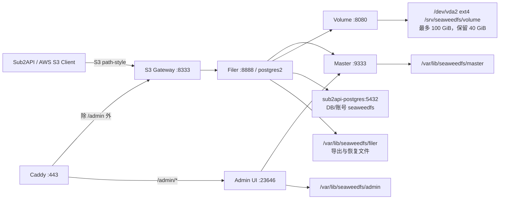
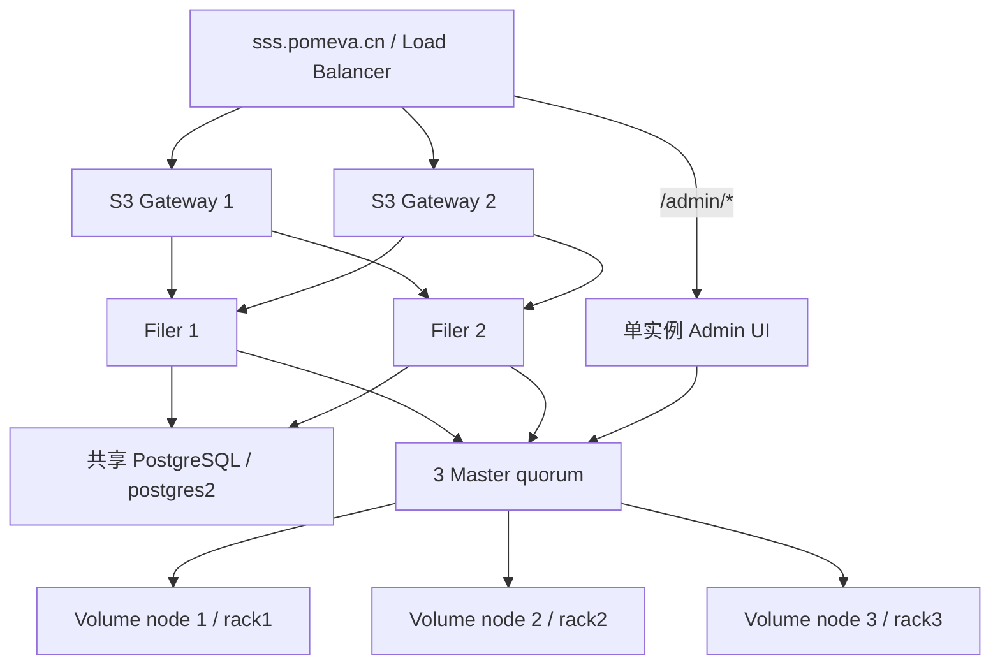

# SeaweedFS 单节点部署与多节点演进 Implementation Plan

> **For agentic workers:** REQUIRED SUB-SKILL: Use superpowers:subagent-driven-development (recommended) or superpowers:executing-plans to implement this plan task-by-task. Steps use checkbox (`- [ ]`) syntax for tracking.

**Goal:** 在 `43.165.171.148` 上部署一个受限、可验证、可回滚的 SeaweedFS S3 存储节点，从现有根盘划定最多 100 GiB 的逻辑对象容量，并保留演进为三节点集群的清晰路径。

**Architecture:** 首期仍是单主机，但将 Master、Volume、Filer、S3 Gateway、Admin UI 拆为五个 Docker Compose 服务。Volume 直接使用现有 `/dev/vda2` 根文件系统下的 `/srv/seaweedfs/volume`，通过 100 个 1 GiB volume 和 `40GiB` 根盘保留线控制容量；Master 与 Admin 状态使用根盘独立目录并纳入备份。Filer 从首次启动即使用现有 `sub2api-postgres` 容器中的独立 `seaweedfs` 数据库和独立 `seaweedfs` 账号，固定启用 `postgres2`，不经历 `leveldb2` 数据迁移。内部通信走隔离网络，Filer、S3 Gateway 与 Admin UI 加入现有 `pomeva-net`，宿主机仅绑定 `127.0.0.1:8333`；公网由现有 Caddy 将 `/admin` 分流到 Admin UI，其余请求进入 `https://sss.pomeva.cn` S3 API。未来扩容前可在停写窗口内使用 PostgreSQL 原生 dump/restore 将该独立数据库迁往外部共享 PostgreSQL，再增加多个 Filer/S3、Volume 节点和 3 个 Master。

**Tech Stack:** Ubuntu 24.04 x86_64、Docker Engine 29.5.2、Docker Compose 5.1.4、SeaweedFS 4.40、PostgreSQL 18.4（现有 `sub2api-postgres`）、ext4、Caddy 2.11.4、Python 3.12 + boto3 1.34.46（仅验收工具）。

## Global Constraints

- 本文已按用户确认的三个决定修订，但仍是实施前审核稿。收到明确“开始部署”指令前，不得安装软件、拉取镜像、创建配置、重启容器、修改 Caddy/DNS 或写入业务数据。
- `sss.pomeva.cn` 的 DNS 解析由人工在现有 DNS 服务商控制台完成；部署执行者只负责提供记录值并做只读解析验证，不登录 DNS 控制台、不代替人工创建或修改记录。
- 当前工作只允许新增本方案文档，不修改 Sub2API 源码。
- `43.165.171.148` 是现有业务机。任何实施必须先验证现有 `sub2api`、PostgreSQL、Redis、Notifier 和 Caddy 的健康状态，并在变更后复验。
- SeaweedFS 首次部署必须复用现有 `sub2api-postgres` 容器，但只允许新建独立数据库 `seaweedfs` 和独立登录账号 `seaweedfs`；不得使用现有 `sub2api` 数据库、schema 或应用账号保存 SeaweedFS 元数据。
- Filer Store 固定为 `postgres2`，`leveldb2` 必须显式禁用。数据库密码必须保存在 root-only secret 中，不得出现在 Compose、Git、命令行参数或普通日志中。
- 不新增、分区或格式化任何块设备，不修改 `/etc/fstab`，不创建稀疏文件、预分配镜像或 loop device。
- 100 GiB 是 SeaweedFS 逻辑容量上限，不是 ext4 目录硬配额：`100 × 1024 MiB` volume 上限配合 `-minFreeSpace=40GiB`。如果根盘其他服务增长，实际可写对象容量可能早于 100 GiB 停止。
- 不公开 Master、Volume、Filer、Admin worker gRPC 或 metrics 端口。公网只允许经 Caddy 的 HTTPS S3 入口和带强认证的 `/admin` 管理入口；初始 S3 宿主端口只绑定 `127.0.0.1:8333`，Admin `23646/33646` 不映射到宿主机。
- S3 必须从第一次启动就加载凭据。SeaweedFS 未配置任何身份时会进入匿名 Allow-All 模式，因此禁止先无鉴权启动、再补凭据。
- Admin 必须从第一次启动就加载独立强密码；S3 Access Key 不保护 Admin UI。Admin 密码不得出现在 Compose、命令行、Git 或普通日志中，公网 `/admin/metrics` 必须由 Caddy 阻断。
- 镜像固定为 `chrislusf/seaweedfs:4.40@sha256:52194fba4fecd0083c842158b3a902ba6e04a63619b2b0efcd08007bdb6a4602`；不得使用 `latest`。
- 单节点默认副本策略为 `000`，不宣称高可用。主机或根盘故障可能造成服务中断或数据丢失；不可替代数据在完成异机副本或异地备份前不得仅保存于该节点。
- 回滚只停止服务和撤销路由，不删除 `/srv/seaweedfs`、`/var/lib/seaweedfs` 或备份；禁止 `docker compose down -v`、`docker volume prune` 和任何磁盘格式化操作。

---

## 1. 审核结论与现场基线

### 1.1 2026-07-27 只读盘点结果

| 项目 | 当前值 | 对方案的影响 |
|---|---:|---|
| 主机 | `43.165.171.148` / `VM-0-6-ubuntu` | 目标机确认 |
| 系统/架构 | Ubuntu 24.04 / `x86_64` | 使用 SeaweedFS `linux/amd64` 镜像 |
| CPU | 4 vCPU | SeaweedFS 五个服务总 CPU 上限设为 3.0 CPU |
| 内存 | 15 GiB，总可用约 13 GiB | SeaweedFS 五个服务总硬上限约 2.75 GiB |
| Swap | 1.9 GiB | 只作缓冲，不作为容量预算 |
| 根盘 | `/dev/vda2`，`ext4`，约 178 GiB，可用约 152 GiB | 用户已确认复用；需设置 100 GiB 逻辑上限和 40 GiB 保留线 |
| 独立数据盘 | 不存在；当前只有 `/dev/vda` | 本方案不新增磁盘 |
| Docker | Engine 29.5.2 / Compose 5.1.4 | 可使用 Compose V2/5 语法 |
| 现有容器 | Caddy、Notifier、Sub2API、PostgreSQL、Redis | 需要保护现有栈 |
| PostgreSQL | `sub2api-postgres` / PostgreSQL 18.4 / `postgres:18-alpine` | 首期复用容器，新建独立 `seaweedfs` 数据库与账号 |
| PostgreSQL 网络 | `sub2api-postgres` 已加入 `pomeva-net` | Filer 加入同一网络后使用 `sub2api-postgres:5432` |
| PostgreSQL 连接 | `max_connections=100`，盘点时约 19 条连接 | 单 Filer 池限制为最多 10 条；扩容时重新核算总连接数 |
| SeaweedFS 端口 | `8333/8888/9333/19333/18080/18888/23646/33646` 均未监听 | 无现存端口冲突 |
| 防火墙 | UFW inactive | 依靠 loopback 绑定、Docker 网络和云安全组缩小暴露面 |
| 外部网络 | `pomeva-net` 已存在 | S3 与 Admin 可由 Caddy 通过容器 DNS 访问，Sub2API 可访问 S3 |
| 现有 COS 挂载 | `/lhcos-data`，`fuse.cosfs` | 不作为 SeaweedFS Volume 主存储 |

### 1.2 重要风险

- `sub2api` 当前仍没有 Docker 内存硬限制，且本次盘点时 `RestartCount=1`。历史上该主机在内存较小时发生过 Sub2API 全局 OOM。主机虽已扩容到 15 GiB，但 SeaweedFS 上线后仍需观察并最终给 Sub2API 设置独立资源边界。
- 当前仅有一块系统盘。用户已接受系统、Docker、数据库与 OSS 共享 `/dev/vda2` 的故障域；因此根盘余量监控、日志轮转和 `40GiB` 保留线是硬性上线条件。
- 单节点 `replication=000` 只有一份数据；“能扩容”不等于“当前高可用”。
- SeaweedFS 与 Sub2API 首期共享 `sub2api-postgres` 容器的故障域；该容器重启、资源耗尽或磁盘故障会同时影响两个服务。数据库、账号、备份和连接池必须逻辑隔离，但这不等于数据库高可用。
- `postgres2` 会按 bucket 建表，`seaweedfs` 账号需要在独立数据库 schema 内拥有建表、删表和 CRUD 权限，但不得拥有 superuser、createdb、createrole、replication 或 bypassrls 权限。

### 1.3 用户已确认决策

- **存储位置：** 复用现有 `/dev/vda2`，对象数据目录为 `/srv/seaweedfs/volume`，不新增独立磁盘。
- **公网入口：** 使用 `sss.pomeva.cn -> 43.165.171.148`，由现有 Caddy 终止 TLS。
- **管理入口：** 使用 `https://sss.pomeva.cn/admin`，由 Caddy 分流到独立 `weed admin :23646`；内置强认证必须启用，Admin 端口和 worker gRPC 不直接公开。
- **初始 bucket：** `pomeva-objects`；应用身份名为 `sub2api`，只授予该 bucket 的 `Read/Write/List/Tagging` 权限。
- **推荐对象 URL：** `https://sss.pomeva.cn/pomeva-objects/<key>`；bucket 保持私有，实际下载使用 presigned URL。
- **首期容量策略：** SeaweedFS 使用 1 GiB volume、最多 100 个 volume，并在共享根文件系统可用空间低于 40 GiB 时停止继续分配。
- **Filer Store：** 从首次部署起使用 `postgres2`；显式禁用 `leveldb2`，不存在已有 SeaweedFS 元数据的迁移步骤。
- **数据库隔离：** 复用 `sub2api-postgres` 容器，只新建独立数据库 `seaweedfs` 和独立账号 `seaweedfs`；不复用 `sub2api` 数据库、schema、账号或密码。
- **未来数据库迁移：** 扩容前可在停写窗口中使用 `pg_dump/pg_restore` 将完整 `seaweedfs` 数据库迁到 PostgreSQL 18 或更高版本的外部共享实例；不需要 `fs.meta.save/load` 进行存储驱动转换。

---

## 2. 目标拓扑



网络边界：

- `seaweedfs-backend`：Compose 内部网络，Master、Volume、Filer、S3、Admin 使用；不对宿主机或公网发布。
- `pomeva-net`：Filer、S3 Gateway 与 Admin UI 加入；Filer 通过 `sub2api-postgres:5432` 访问独立 `seaweedfs` 数据库，Caddy 访问 `seaweedfs-s3:8333` 和 `seaweedfs-admin:23646`，Sub2API 只需访问 `seaweedfs-s3:8333`。
- 宿主机：仅 `127.0.0.1:8333 -> s3:8333`，用于 SSH/本机 smoke test。
- 公网：`443 -> Caddy`；`/admin` 与 `/admin/*` 转发到 `seaweedfs-admin:23646`，`/admin/metrics` 返回 404，其余路径转发到 `seaweedfs-s3:8333`。

---

## 3. 计划文件与数据布局

### 3.1 实施时新增或修改

- Create: `/opt/seaweedfs/docker-compose.yml`
- Create: `/etc/seaweedfs/filer.toml`
- Create: `/etc/seaweedfs/postgres-password`（root-only，SeaweedFS 独立数据库账号密码）
- Create: `/etc/seaweedfs/s3.json`（root-only，包含 S3 密钥）
- Create: `/etc/seaweedfs/admin-password`（root-only，包含 Admin 独立强密码）
- Create: `/etc/seaweedfs/sub2api-s3.env`（root-only，供受控验收和后续应用注入）
- Create: `/var/lib/seaweedfs/master/`
- Create: `/var/lib/seaweedfs/filer/`
- Create: `/var/lib/seaweedfs/postgres-backups/`
- Create: `/var/lib/seaweedfs/admin/`
- Create: `/srv/seaweedfs/volume/`（位于现有 `/dev/vda2` 根文件系统）
- Create: `/home/ubuntu/pomeva/services/caddy.d/seaweedfs-s3.caddy`
- External manual change: DNS `A sss.pomeva.cn -> 43.165.171.148`（由人工完成，不属于部署自动化）

### 3.2 明确不改

- 不修改 Sub2API 源码。
- 不修改现有 `sub2api` 数据库、schema、账号、密码或数据；仅在同一个 `sub2api-postgres` PostgreSQL 实例中新建隔离的 `seaweedfs` 数据库和账号。
- 不把 SeaweedFS Volume 放到 `/lhcos-data`、`/var/lib/docker` 或 `/home/ubuntu/sub2api`。
- 不把 Access Key/Secret Key、Admin 密码或 PostgreSQL 密码写入 Git、命令行参数、Caddy 配置或文档。

---

## Task 1: 实施前重新采集基线并建立停止条件

**Files:**

- Read only: `/home/ubuntu/sub2api/deploy/docker-compose.yml`
- Read only: `/home/ubuntu/pomeva/services/caddy/Caddyfile`

- [ ] **Step 1: 核对主机、时间与资源**

```bash
ssh -o BatchMode=yes -o IdentitiesOnly=yes \
  -i ~/.ssh/server-jp-dev_ed25519 ubuntu@43.165.171.148

date --iso-8601=seconds
hostnamectl --static
uname -m
nproc
free -h
lsblk -b -e7 -o NAME,TYPE,SIZE,FSTYPE,FSAVAIL,FSUSE%,MOUNTPOINTS,MODEL
df -hT -x tmpfs -x devtmpfs
```

Expected: `VM-0-6-ubuntu`、`x86_64`、4 vCPU、约 15 GiB RAM；块设备仍只有系统盘 `/dev/vda`。

- [ ] **Step 2: 核对现有容器、资源边界与端口**

```bash
sudo docker ps --format '{{.Names}}|{{.Image}}|{{.Status}}|{{.Ports}}'
sudo docker stats --no-stream --format '{{.Name}}|{{.CPUPerc}}|{{.MemUsage}}|{{.PIDs}}'
sudo ss -lntup
for name in pomeva-caddy pomeva-notifier-api sub2api sub2api-postgres sub2api-redis; do
  sudo docker inspect --format \
    '{{.Name}}|restart={{.RestartCount}}|oom={{.State.OOMKilled}}|mem={{.HostConfig.Memory}}|policy={{.HostConfig.RestartPolicy.Name}}' \
    "$name"
done
```

Expected: 五个现有容器健康；SeaweedFS 端口均未占用；没有新的 OOM 证据。

- [ ] **Step 3: 核对 PostgreSQL 版本、网络、连接余量和目标命名冲突**

只读取运行状态和系统目录，不读取或打印现有数据库密码：

```bash
test "$(sudo docker inspect --format '{{.State.Health.Status}}' sub2api-postgres)" = "healthy"
sudo docker inspect --format '{{range $name, $_ := .NetworkSettings.Networks}}{{$name}}{{"\n"}}{{end}}' \
  sub2api-postgres | grep -Fx pomeva-net

sudo docker exec -i -u postgres sub2api-postgres \
  psql -X -v ON_ERROR_STOP=1 -U sub2api -d postgres <<'SQL'
SELECT current_setting('server_version') AS server_version;
SELECT current_setting('password_encryption') AS password_encryption;
SELECT current_setting('max_connections')::int AS max_connections,
       count(*) AS current_connections
FROM pg_stat_activity;
SELECT datname FROM pg_database WHERE datname = 'seaweedfs';
SELECT rolname FROM pg_roles WHERE rolname = 'seaweedfs';
SQL
```

Expected: PostgreSQL 为 `18.x`、密码加密为 `scram-sha-256`，`sub2api-postgres` 在 `pomeva-net`，最大连接数仍为 100 且有至少 20 条余量；首次部署时最后两条查询均返回 0 行。若 `seaweedfs` 数据库或账号已经存在，停止实施并先确认其来源，禁止覆盖或轮换未知账号密码。

- [ ] **Step 4: 执行上线门禁**

停止实施并回报用户，如果出现任意条件：

- `MemAvailable < 6 GiB`；
- 根盘可用空间 `< 150 GiB`，不足以同时容纳当前业务、100 GiB 对象上限和 40 GiB 安全余量；
- 任一现有业务容器处于 restarting/unhealthy；
- `sub2api-postgres` 不是 PostgreSQL 18.x、`password_encryption` 不是 `scram-sha-256`、未加入 `pomeva-net`、剩余连接数少于 20，或已经存在来源不明的 `seaweedfs` 数据库/账号；
- `sub2api` 在最近 30 分钟发生 OOM 或连续重启；
- `8333/8888/9333/19333/18080/18888/23646/33646` 任一端口已被未知服务占用；
- 块设备拓扑与当前基线不一致，或 `/srv/seaweedfs/volume` 不再落在 `/dev/vda2`。

---

## Task 2: 在现有根盘建立 100 GiB 逻辑容量边界

**Files:**

- Create: `/srv/seaweedfs/`
- Create: `/srv/seaweedfs/volume/`

- [ ] **Step 1: 验证根盘容量满足初始门禁**

```bash
root_avail_bytes="$(df --output=avail -B1 / | tail -n 1 | tr -d '[:space:]')"
test "$root_avail_bytes" -ge 161061273600
findmnt -T / -o SOURCE,FSTYPE,SIZE,AVAIL,OPTIONS,TARGET
df -hT /
```

Expected: 根盘可用空间不少于 150 GiB；本次只读盘点约为 152 GiB。若门禁失败，不得通过清理、扩盘或降低保留线自行绕过，先重新提交审核。

- [ ] **Step 2: 创建数据目录**

```bash
sudo install -d -m 0755 -o root -g root /srv/seaweedfs
sudo install -d -m 0750 -o root -g root /srv/seaweedfs/volume
```

- [ ] **Step 3: 验证目录确实位于现有根文件系统**

```bash
findmnt -T /srv/seaweedfs/volume -o SOURCE,FSTYPE,SIZE,AVAIL,OPTIONS,TARGET
df -hT /srv/seaweedfs/volume
sudo du -sh /srv/seaweedfs/volume
```

Expected: source 为 `/dev/vda2`，FSTYPE 为 `ext4`，初始目录为空。这里没有独立文件系统硬配额；容量边界由 Compose 中的 `-max=100` 与 `-minFreeSpace=40GiB` 联合执行。

---

## Task 3: 生成最小权限配置与 Compose 清单

**Files:**

- Create: `/opt/seaweedfs/docker-compose.yml`
- Create: `/etc/seaweedfs/filer.toml`
- Create: `/etc/seaweedfs/postgres-password`
- Create: `/etc/seaweedfs/s3.json`
- Create: `/etc/seaweedfs/admin-password`
- Create: `/etc/seaweedfs/sub2api-s3.env`
- Create: `/var/lib/seaweedfs/master/`
- Create: `/var/lib/seaweedfs/filer/`
- Create: `/var/lib/seaweedfs/postgres-backups/`
- Create: `/var/lib/seaweedfs/admin/`

- [ ] **Step 1: 创建目录**

```bash
sudo install -d -m 0755 -o root -g root /opt/seaweedfs
sudo install -d -m 0700 -o root -g root /etc/seaweedfs
sudo install -d -m 0750 -o root -g root /var/lib/seaweedfs/master
sudo install -d -m 0750 -o root -g root /var/lib/seaweedfs/filer
sudo install -d -m 0700 -o root -g root /var/lib/seaweedfs/postgres-backups
sudo install -d -m 0750 -o root -g root /var/lib/seaweedfs/admin
```

- [ ] **Step 2: 创建独立 PostgreSQL 密码、账号和数据库**

密码使用 64 位十六进制随机值，只通过 stdin 送入 PostgreSQL；不进入命令行参数、Compose 或 shell history。SQL 会先对当前会话关闭 statement/duration logging，避免口令落入 PostgreSQL 普通日志：

```bash
sudo bash -eu <<'SCRIPT'
umask 077
openssl rand -hex 32 > /etc/seaweedfs/postgres-password
chown root:root /etc/seaweedfs/postgres-password
chmod 0600 /etc/seaweedfs/postgres-password

db_password="$(cat /etc/seaweedfs/postgres-password)"
{
  printf '%s\n' "SET log_statement = 'none';"
  printf '%s\n' "SET log_duration = off;"
  printf '%s\n' "SET log_min_duration_statement = -1;"
  printf '%s\n' "SET log_min_error_statement = 'panic';"
  printf '%s\n' "CREATE ROLE seaweedfs LOGIN PASSWORD '${db_password}' NOSUPERUSER NOCREATEDB NOCREATEROLE NOREPLICATION NOBYPASSRLS;"
  printf '%s\n' "CREATE DATABASE seaweedfs OWNER seaweedfs TEMPLATE template0;"
} | docker exec -i -u postgres sub2api-postgres \
      psql -X -v ON_ERROR_STOP=1 -U sub2api -d postgres
unset db_password

docker exec -i -u postgres sub2api-postgres \
  psql -X -v ON_ERROR_STOP=1 -U sub2api -d seaweedfs <<'SQL'
REVOKE CREATE ON SCHEMA public FROM PUBLIC;
ALTER SCHEMA public OWNER TO seaweedfs;
GRANT USAGE, CREATE ON SCHEMA public TO seaweedfs;
SQL
SCRIPT
```

只验证权限结构，不打印密码：

```bash
sudo stat -c '%a %U:%G %s %n' /etc/seaweedfs/postgres-password
sudo docker exec -i -u postgres sub2api-postgres \
  psql -XAt -v ON_ERROR_STOP=1 -U sub2api -d postgres <<'SQL'
SELECT datname || '|owner=' || pg_get_userbyid(datdba)
FROM pg_database WHERE datname='seaweedfs';
SELECT rolname || '|super=' || rolsuper || '|createdb=' || rolcreatedb ||
       '|createrole=' || rolcreaterole || '|replication=' || rolreplication ||
       '|bypassrls=' || rolbypassrls
FROM pg_roles WHERE rolname='seaweedfs';
SQL
```

Expected: 密码文件为 `600 root:root` 且非空；数据库 owner 为 `seaweedfs`；账号所有高权限字段均为 `false`。本步骤仅适用于 Task 1 已证明账号和数据库均不存在的首次部署，不得改写为自动 `ALTER ROLE ... PASSWORD`。

- [ ] **Step 3: 写入 Filer Store 配置**

`/etc/seaweedfs/filer.toml`：

```toml
[leveldb2]
enabled = false

[postgres2]
enabled = true
hostname = "sub2api-postgres"
port = 5432
username = "seaweedfs"
password = ""
database = "seaweedfs"
schema = "public"
sslmode = "disable"
connection_max_idle = 2
connection_max_open = 10
connection_max_lifetime_seconds = 300
pgbouncer_compatible = false
enableUpsert = true
```

写入后执行：

```bash
sudo chown root:root /etc/seaweedfs/filer.toml
sudo chmod 0644 /etc/seaweedfs/filer.toml
```

`password = ""` 是非秘密占位值，运行时由 `WEED_POSTGRES2_PASSWORD` 覆盖。`sslmode = "disable"` 只适用于当前同主机 Docker 网络；迁移到外部 PostgreSQL 时必须使用 `verify-full` 和受信任 CA。

- [ ] **Step 4: 生成 S3 应用凭据和静态身份配置**

执行以下命令；它不会在终端打印密钥：

```bash
sudo bash -eu <<'SCRIPT'
umask 077
access_key="sub2api-$(openssl rand -hex 12)"
secret_key="$(openssl rand -base64 48 | tr -d '\n')"

jq -n \
  --arg access_key "$access_key" \
  --arg secret_key "$secret_key" \
  '{
    identities: [
      {
        name: "sub2api",
        credentials: [
          {accessKey: $access_key, secretKey: $secret_key}
        ],
        actions: [
          "Read:pomeva-objects",
          "Write:pomeva-objects",
          "List:pomeva-objects",
          "Tagging:pomeva-objects"
        ]
      }
    ]
  }' > /etc/seaweedfs/s3.json

printf '%s\n' \
  "AWS_ACCESS_KEY_ID=${access_key}" \
  "AWS_SECRET_ACCESS_KEY=${secret_key}" \
  'AWS_DEFAULT_REGION=us-east-1' \
  'S3_ENDPOINT=http://127.0.0.1:8333' \
  'S3_BUCKET=pomeva-objects' \
  > /etc/seaweedfs/sub2api-s3.env

chown root:root /etc/seaweedfs/s3.json /etc/seaweedfs/sub2api-s3.env
chmod 0600 /etc/seaweedfs/s3.json /etc/seaweedfs/sub2api-s3.env
SCRIPT
```

验证结构但不打印密钥：

```bash
sudo jq -e '
  .identities | length == 1 and
  .[0].name == "sub2api" and
  (.[0].credentials | length == 1) and
  (.[0].credentials[0].accessKey | length >= 16) and
  (.[0].credentials[0].secretKey | length >= 32)
' /etc/seaweedfs/s3.json >/dev/null
sudo stat -c '%a %U:%G %n' /etc/seaweedfs/s3.json /etc/seaweedfs/sub2api-s3.env
```

Expected: 两个 S3 秘密文件均为 `600 root:root`。

- [ ] **Step 5: 生成独立 Admin 密码**

执行以下命令；它不会在终端打印密码：

```bash
sudo bash -eu <<'SCRIPT'
umask 077
openssl rand -base64 48 | tr -d '\n' > /etc/seaweedfs/admin-password
chown root:root /etc/seaweedfs/admin-password
chmod 0600 /etc/seaweedfs/admin-password
test "$(wc -c < /etc/seaweedfs/admin-password)" -ge 48
SCRIPT

sudo stat -c '%a %U:%G %s %n' /etc/seaweedfs/admin-password
```

Expected: `/etc/seaweedfs/admin-password` 非空且为 `600 root:root`；不得使用 S3 Secret Key、现有系统密码或固定示例值代替。

- [ ] **Step 6: 写入 Docker Compose**

`/opt/seaweedfs/docker-compose.yml`：

```yaml
name: seaweedfs

x-image: &seaweedfs-image chrislusf/seaweedfs:4.40@sha256:52194fba4fecd0083c842158b3a902ba6e04a63619b2b0efcd08007bdb6a4602

x-logging: &default-logging
  driver: json-file
  options:
    max-size: "20m"
    max-file: "5"

services:
  master:
    image: *seaweedfs-image
    command:
      - master
      - -ip=master
      - -ip.bind=0.0.0.0
      - -mdir=/data
      - -volumeSizeLimitMB=1024
      - -defaultReplication=000
    restart: unless-stopped
    mem_limit: 256m
    mem_reservation: 64m
    cpus: "0.25"
    pids_limit: 128
    security_opt:
      - no-new-privileges:true
    volumes:
      - type: bind
        source: /var/lib/seaweedfs/master
        target: /data
    expose:
      - "9333"
      - "19333"
    networks:
      backend:
        aliases:
          - seaweedfs-master
    healthcheck:
      test: ["CMD-SHELL", "wget -qO- http://127.0.0.1:9333/cluster/status >/dev/null || exit 1"]
      interval: 10s
      timeout: 5s
      retries: 12
      start_period: 20s
    logging: *default-logging

  volume:
    image: *seaweedfs-image
    command:
      - volume
      - -ip=volume
      - -ip.bind=0.0.0.0
      - -master=master:9333
      - -dataCenter=jp1
      - -rack=server-jp-dev
      - -dir=/data
      - -max=100
      - -minFreeSpace=40GiB
      - -index=leveldb
      - -compactionMBps=20
      - -maintenanceMBps=20
    restart: unless-stopped
    mem_limit: 1g
    mem_reservation: 256m
    cpus: "1.00"
    pids_limit: 256
    security_opt:
      - no-new-privileges:true
    volumes:
      - type: bind
        source: /srv/seaweedfs/volume
        target: /data
    expose:
      - "8080"
      - "18080"
    networks:
      backend:
        aliases:
          - seaweedfs-volume
    depends_on:
      master:
        condition: service_healthy
    healthcheck:
      test: ["CMD-SHELL", "wget -qO- http://127.0.0.1:8080/status >/dev/null || exit 1"]
      interval: 10s
      timeout: 5s
      retries: 12
      start_period: 30s
    logging: *default-logging

  filer:
    image: *seaweedfs-image
    entrypoint:
      - /bin/sh
      - -ec
    command:
      - |
        chown seaweed:seaweed /data
        chmod 0750 /data
        postgres_password="$$(cat /run/secrets/postgres_password)"
        export WEED_POSTGRES2_PASSWORD="$${postgres_password}"
        unset postgres_password
        exec su-exec seaweed /usr/bin/weed -logtostderr=true filer \
          -ip=filer \
          -ip.bind=0.0.0.0 \
          -master=master:9333 \
          -dataCenter=jp1 \
          -rack=server-jp-dev \
          -defaultReplicaPlacement=000
    restart: unless-stopped
    mem_limit: 512m
    mem_reservation: 128m
    cpus: "0.50"
    pids_limit: 128
    security_opt:
      - no-new-privileges:true
    volumes:
      - type: bind
        source: /var/lib/seaweedfs/filer
        target: /data
      - type: bind
        source: /etc/seaweedfs/filer.toml
        target: /etc/seaweedfs/filer.toml
        read_only: true
    secrets:
      - source: postgres_password
        target: postgres_password
        mode: 0444
    expose:
      - "8888"
      - "18888"
    networks:
      backend:
        aliases:
          - seaweedfs-filer
      pomeva-net: {}
    depends_on:
      master:
        condition: service_healthy
      volume:
        condition: service_healthy
    healthcheck:
      test: ["CMD-SHELL", "wget -qO- http://127.0.0.1:8888/ >/dev/null || exit 1"]
      interval: 10s
      timeout: 5s
      retries: 12
      start_period: 30s
    logging: *default-logging

  s3:
    image: *seaweedfs-image
    environment:
      GODEBUG: fips140=on
    entrypoint:
      - /bin/sh
      - -ec
    command:
      - |
        cp /run/secrets/s3.json /tmp/s3.json
        chown seaweed:seaweed /tmp/s3.json
        chmod 0400 /tmp/s3.json
        exec su-exec seaweed /usr/bin/weed -logtostderr=true s3 \
          -filer=filer:8888 \
          -ip.bind=0.0.0.0 \
          -port=8333 \
          -config=/tmp/s3.json \
          -iam=false \
          -port.iceberg=0
    restart: unless-stopped
    mem_limit: 512m
    mem_reservation: 128m
    cpus: "0.75"
    pids_limit: 256
    security_opt:
      - no-new-privileges:true
    read_only: true
    tmpfs:
      - /tmp:mode=1777,size=16m
    ports:
      - "127.0.0.1:8333:8333"
    secrets:
      - source: s3_config
        target: s3.json
        mode: 0444
    networks:
      backend:
        aliases:
          - seaweedfs-s3-backend
      pomeva-net:
        aliases:
          - seaweedfs-s3
    depends_on:
      filer:
        condition: service_healthy
    healthcheck:
      test: ["CMD-SHELL", "wget -S -O /dev/null http://127.0.0.1:8333/ 2>&1 | grep -qE 'HTTP/[0-9.]+ 403'"]
      interval: 10s
      timeout: 5s
      retries: 12
      start_period: 30s
    logging: *default-logging

  admin:
    image: *seaweedfs-image
    environment:
      WEED_ADMIN_USER: admin
    entrypoint:
      - /bin/sh
      - -ec
    command:
      - |
        chown seaweed:seaweed /data
        chmod 0700 /data
        admin_password="$$(cat /run/secrets/admin_password)"
        export WEED_ADMIN_PASSWORD="$${admin_password}"
        unset admin_password
        exec su-exec seaweed /usr/bin/weed -logtostderr=true admin \
          -master=master:9333 \
          -port=23646 \
          -port.grpc=33646 \
          -dataDir=/data \
          -urlPrefix=/admin \
          -iceberg.port=0 \
          -metricsPort=0
    restart: unless-stopped
    mem_limit: 512m
    mem_reservation: 128m
    cpus: "0.50"
    pids_limit: 256
    security_opt:
      - no-new-privileges:true
    read_only: true
    tmpfs:
      - /tmp:mode=1777,size=32m
    volumes:
      - type: bind
        source: /var/lib/seaweedfs/admin
        target: /data
    expose:
      - "23646"
      - "33646"
    secrets:
      - source: admin_password
        target: admin_password
        mode: 0444
    networks:
      backend:
        aliases:
          - seaweedfs-admin-backend
      pomeva-net:
        aliases:
          - seaweedfs-admin
    depends_on:
      master:
        condition: service_healthy
      filer:
        condition: service_healthy
    healthcheck:
      test: ["CMD-SHELL", "wget -qO- http://127.0.0.1:23646/admin/health | grep -q '\"health\":\"ok\"'"]
      interval: 10s
      timeout: 5s
      retries: 12
      start_period: 30s
    logging: *default-logging

networks:
  backend:
    internal: true
  pomeva-net:
    external: true
    name: pomeva-net

secrets:
  postgres_password:
    file: /etc/seaweedfs/postgres-password
  s3_config:
    file: /etc/seaweedfs/s3.json
  admin_password:
    file: /etc/seaweedfs/admin-password
```

说明：Compose 非 Swarm 的 file secret 可能保留宿主 bind mount 的 owner/mode。Filer 和 Admin 只在启动 shell 中读取各自密码并导出为最终进程环境变量，不把密码放入 Compose 初始环境或命令行参数；Filer 使用 SeaweedFS 的 `WEED_POSTGRES2_PASSWORD` 环境覆盖机制替换 `filer.toml` 中的空密码。S3 服务先以 root 将 `0600 root:root` 的 secret 复制到内存型 `/tmp`，改为 `seaweed` 所有。三个服务随后均用 `su-exec` 降权并 `exec` SeaweedFS，secret 不会放宽为宿主全局可读，也不会持久化到容器可写层。

- [ ] **Step 7: 仅渲染验证，不启动**

```bash
cd /opt/seaweedfs
sudo docker network inspect pomeva-net >/dev/null
sudo docker compose config --quiet
sudo docker compose config --images
sudo docker compose config --format json \
  | jq -e '[.services[].ports[]? | select(.host_ip != "127.0.0.1")] | length == 0' >/dev/null
if sudo docker compose config | grep -q -- '-adminPassword'; then
  echo 'Admin password must not be passed on the command line' >&2
  exit 1
fi
if sudo docker compose config | sudo grep -qFf /etc/seaweedfs/admin-password; then
  echo 'Rendered Compose contains the Admin password' >&2
  exit 1
fi
if sudo docker compose config | sudo grep -qFf /etc/seaweedfs/postgres-password; then
  echo 'Rendered Compose contains the PostgreSQL password' >&2
  exit 1
fi
test "$(sudo docker inspect --format '{{.State.Health.Status}}' sub2api-postgres)" = "healthy"
sudo docker inspect --format '{{range $name, $_ := .NetworkSettings.Networks}}{{$name}}{{"\n"}}{{end}}' \
  sub2api-postgres | grep -Fx pomeva-net
```

Expected: YAML 合法；镜像仅为固定的 4.40 digest；没有任何 `0.0.0.0` 宿主端口映射；渲染结果不含 Admin 或 PostgreSQL 密码实际值，也不通过命令行参数传密钥；现有 PostgreSQL 容器健康且仍连接 `pomeva-net`。

---

## Task 4: 拉取镜像并启动单节点服务

**Files:**

- Read: `/opt/seaweedfs/docker-compose.yml`
- Write runtime state: Docker images/containers/networks

- [ ] **Step 1: 验证镜像架构和摘要**

```bash
cd /opt/seaweedfs
sudo docker buildx imagetools inspect chrislusf/seaweedfs:4.40
sudo docker compose pull
```

Expected: index digest 为 `sha256:52194fba...a4602`，平台包含 `linux/amd64`；拉取成功。

- [ ] **Step 2: 启动服务**

```bash
cd /opt/seaweedfs
findmnt -T /srv/seaweedfs/volume -o SOURCE,FSTYPE,SIZE,AVAIL,TARGET
test "$(findmnt -T /srv/seaweedfs/volume -n -o SOURCE)" = "/dev/vda2"
sudo docker compose up -d
sudo docker compose ps
sudo docker compose logs --no-color filer | grep -F 'configured filer store to postgres2'
```

Expected: `master`、`volume`、`filer`、`s3`、`admin` 五个服务最终均为 healthy；Filer 日志明确显示使用 `postgres2`，没有回退到嵌入式 store。

- [ ] **Step 3: 检查日志和实际资源边界**

```bash
cd /opt/seaweedfs
sudo docker compose logs --no-color --tail=200
for name in seaweedfs-master-1 seaweedfs-volume-1 seaweedfs-filer-1 seaweedfs-s3-1 seaweedfs-admin-1; do
  sudo docker inspect --format \
    '{{.Name}}|image={{.Image}}|mem={{.HostConfig.Memory}}|reservation={{.HostConfig.MemoryReservation}}|cpus={{.HostConfig.NanoCpus}}|restart={{.RestartCount}}|oom={{.State.OOMKilled}}' \
    "$name"
done
sudo docker stats --no-stream --format '{{.Name}}|{{.CPUPerc}}|{{.MemUsage}}|{{.PIDs}}'
if sudo docker inspect --format '{{json .Config.Env}}' seaweedfs-admin-1 \
  | grep -q 'WEED_ADMIN_PASSWORD'; then
  echo 'Admin password leaked into Docker Config.Env' >&2
  exit 1
fi
if sudo docker inspect --format '{{json .Config.Env}}' seaweedfs-filer-1 \
  | grep -q 'WEED_POSTGRES2_PASSWORD'; then
  echo 'PostgreSQL password leaked into Docker Config.Env' >&2
  exit 1
fi
sudo docker exec -i -u postgres sub2api-postgres \
  psql -XAt -v ON_ERROR_STOP=1 -U sub2api -d seaweedfs <<'SQL'
SELECT current_database() || '|owner=' || pg_get_userbyid(datdba)
FROM pg_database WHERE datname=current_database();
SELECT count(*) FROM pg_tables WHERE schemaname='public';
SQL
```

Expected: S3 无匿名访问告警，Admin 无 `running without authentication` 告警；Filer 无 PostgreSQL 连接失败循环，`seaweedfs` 数据库 owner 正确且已创建至少一个元数据表；数据库密码不在 Docker 初始 `Config.Env`；五个容器无 OOM，合计内存硬上限约 2.75 GiB、CPU 上限 3.0。

- [ ] **Step 4: 验证网络暴露面**

```bash
sudo ss -lntp | grep -E ':(8333|8888|9333|19333|18080|18888|23646|33646)([[:space:]]|$)'
curl -sS -o /dev/null -w '%{http_code}\n' http://127.0.0.1:8333/
```

Expected: 宿主机仅 `127.0.0.1:8333`；未认证 S3 请求返回 `403`。`23646/33646` 只存在于 Docker 网络，不出现在宿主监听列表。

---

## Task 5: 创建 bucket 并设置小盘友好的增长策略

**Files:**

- Write metadata: `sub2api-postgres` 中的独立 `seaweedfs` 数据库（`postgres2`）
- Write volume state: `/srv/seaweedfs/volume/`

- [ ] **Step 1: 将 bucket 目录的 volume 增长数设为 1**

```bash
cd /opt/seaweedfs
printf 'fs.configure -locationPrefix=/buckets/ -volumeGrowthCount=1 -apply\n' \
  | sudo docker compose exec -T filer \
      /usr/bin/weed shell -master=master:9333 -filer=filer:8888
```

理由：SeaweedFS 默认每个 bucket/collection 可能一次增长多个 volume；共享根盘的 100 GiB 逻辑预算应使用 1 GiB volume，并一次只增长 1 个。

- [ ] **Step 2: 直接通过 `weed shell` 创建 bucket 并指定 owner**

```bash
cd /opt/seaweedfs
printf 's3.bucket.create -name=pomeva-objects -owner=sub2api\n' \
  | sudo docker compose exec -T filer \
      /usr/bin/weed shell -master=master:9333 -filer=filer:8888

printf 's3.bucket.list\n' \
  | sudo docker compose exec -T filer \
      /usr/bin/weed shell -master=master:9333 -filer=filer:8888
```

Expected: `pomeva-objects` 存在，owner 为 `sub2api`。无需创建全局 Admin S3 凭据。

- [ ] **Step 3: 确认 Master 已看到 Volume 容量**

```bash
cd /opt/seaweedfs
sudo docker compose exec -T master \
  wget -qO- http://127.0.0.1:9333/dir/status | jq .
sudo docker compose exec -T volume \
  wget -qO- http://127.0.0.1:8080/status | jq .
```

Expected: Volume 注册到 Master，最大 volume 数为 100，volume size limit 为 1024 MB，根文件系统保留线为 40 GiB。

---

## Task 6: 进行 S3 协议、鉴权和持久化验收

**Files:**

- Read: `/etc/seaweedfs/sub2api-s3.env`
- Temporary: `/tmp/seaweedfs-smoke.txt`

- [ ] **Step 1: 验证主机已有 boto3 验收依赖**

```bash
python3 - <<'PY'
import boto3
import botocore
print(f"boto3={boto3.__version__} botocore={botocore.__version__}")
PY
```

Expected: 可以成功导入；本次只读盘点已确认 `python3-boto3 1.34.46` 已安装。无需为验收新增 apt 包。

- [ ] **Step 2: 执行 Put/Head/Get/Delete**

```bash
sudo bash -eu <<'SCRIPT'
set -a
. /etc/seaweedfs/sub2api-s3.env
set +a
python3 - <<'PY'
import datetime
import os

import boto3
from botocore.config import Config

s3 = boto3.client(
    "s3",
    endpoint_url=os.environ["S3_ENDPOINT"],
    region_name=os.environ["AWS_DEFAULT_REGION"],
    config=Config(s3={"addressing_style": "path"}),
)
bucket = os.environ["S3_BUCKET"]
key = f"smoke/{datetime.datetime.now(datetime.timezone.utc):%Y%m%d-%H%M%S}.txt"
payload = b"seaweedfs-s3-smoke\n"

s3.head_bucket(Bucket=bucket)
s3.put_object(Bucket=bucket, Key=key, Body=payload, ContentType="text/plain")
head = s3.head_object(Bucket=bucket, Key=key)
assert head["ContentLength"] == len(payload)
assert s3.get_object(Bucket=bucket, Key=key)["Body"].read() == payload
s3.delete_object(Bucket=bucket, Key=key)
print("S3 Put/Head/Get/Delete smoke: PASS")
PY
SCRIPT
```

Expected: Put/Head/Get/Delete 全部成功。

- [ ] **Step 3: 验证最小权限**

```bash
sudo bash -eu <<'SCRIPT'
set -a
. /etc/seaweedfs/sub2api-s3.env
set +a
python3 - <<'PY'
import os

import boto3
from botocore.config import Config
from botocore.exceptions import ClientError

s3 = boto3.client(
    "s3",
    endpoint_url=os.environ["S3_ENDPOINT"],
    region_name=os.environ["AWS_DEFAULT_REGION"],
    config=Config(s3={"addressing_style": "path"}),
)
try:
    s3.create_bucket(Bucket="forbidden-bucket")
except ClientError as exc:
    status = exc.response["ResponseMetadata"]["HTTPStatusCode"]
    assert status in (400, 403), status
    print(f"Cross-bucket create denied: PASS ({status})")
else:
    raise SystemExit("ERROR: scoped identity unexpectedly created another bucket")
PY
SCRIPT
```

Expected: 创建其他 bucket 被拒绝。

- [ ] **Step 4: 验证容器重启后数据仍在**

```bash
sudo bash -eu <<'SCRIPT'
set -a
. /etc/seaweedfs/sub2api-s3.env
set +a
python3 - <<'PY'
import os
import boto3
from botocore.config import Config
s3 = boto3.client(
    "s3",
    endpoint_url=os.environ["S3_ENDPOINT"],
    region_name=os.environ["AWS_DEFAULT_REGION"],
    config=Config(s3={"addressing_style": "path"}),
)
s3.put_object(Bucket=os.environ["S3_BUCKET"], Key="smoke/persist.txt", Body=b"persist-after-restart\n")
PY
SCRIPT

cd /opt/seaweedfs
sudo docker compose restart
sudo docker compose ps

sudo bash -eu <<'SCRIPT'
set -a
. /etc/seaweedfs/sub2api-s3.env
set +a
python3 - <<'PY'
import os
import boto3
from botocore.config import Config
s3 = boto3.client(
    "s3",
    endpoint_url=os.environ["S3_ENDPOINT"],
    region_name=os.environ["AWS_DEFAULT_REGION"],
    config=Config(s3={"addressing_style": "path"}),
)
bucket = os.environ["S3_BUCKET"]
body = s3.get_object(Bucket=bucket, Key="smoke/persist.txt")["Body"].read()
assert body == b"persist-after-restart\n"
s3.delete_object(Bucket=bucket, Key="smoke/persist.txt")
print("Restart persistence smoke: PASS")
PY
SCRIPT
```

Expected: 重启后对象可读，证明 Master/Filer/Volume bind mount 生效。

---

## Task 7: 配置 Caddy 并启用 `sss.pomeva.cn` 公网 HTTPS S3 入口

用户已确认启用 `sss.pomeva.cn`。本任务是初始上线验收的一部分，不再作为可选项。DNS 解析由人工完成；部署执行者负责 Caddy 配置、只读解析确认和 HTTPS 健康检查。

**Files:**

- Create: `/home/ubuntu/pomeva/services/caddy.d/seaweedfs-s3.caddy`

- [ ] **Step 1: 由人工创建 DNS A 记录**

人工登录现有 DNS 服务商控制台并添加：

```text
Type: A
Name: sss
Value: 43.165.171.148
TTL: 300
Proxy/CDN: 首次验收关闭
```

部署执行者不得登录 DNS 控制台或代替人工修改记录。人工完成后通知部署执行者继续；若尚未完成，保留已部署的 SeaweedFS 内网服务并暂停公网验收，不把 DNS 未生效误判为 SeaweedFS 故障。

- [ ] **Step 2: 只读确认 DNS 已生效**

```bash
test "$(dig @1.1.1.1 +short A sss.pomeva.cn)" = "43.165.171.148"
test -z "$(dig @1.1.1.1 +short AAAA sss.pomeva.cn)"
```

Expected: A 记录唯一目标为 `43.165.171.148`；如果主机没有可用公网 IPv6，AAAA 查询必须为空。未满足时停止公网入口验收并交由人工修正 DNS。

- [ ] **Step 3: 写入 Caddy 路由**

`/home/ubuntu/pomeva/services/caddy.d/seaweedfs-s3.caddy`：

```caddyfile
sss.pomeva.cn {
	import proxy_common

	route {
		@seaweedfs_admin_metrics path /admin/metrics
		respond @seaweedfs_admin_metrics 404

		@seaweedfs_admin path /admin /admin/*
		handle @seaweedfs_admin {
			reverse_proxy seaweedfs-admin:23646 {
				header_down Set-Cookie "(.*)" "$1; Secure"
			}
		}

		handle {
			reverse_proxy seaweedfs-s3:8333 {
				flush_interval -1
			}
		}
	}
}
```

Admin 服务必须以 `-urlPrefix=/admin` 启动；Caddy 使用 `handle` 而不是 `handle_path`，让 Admin 自己处理和生成 `/admin/static`、`/admin/api`、`/admin/login` 等路径。Admin 内部使用 HTTP，SeaweedFS 4.40 不会自行给 session cookie 增加 `Secure`，因此 Caddy 必须在下行 `Set-Cookie` 追加 `Secure`。路由必须保留原始 `Host`、请求路径和查询参数，不能把 path-style 的 bucket/key 重写掉，也不能对 S3 请求启用响应缓存。`/admin/metrics` 在进入 Admin 前固定返回 404，避免公开未鉴权指标。

- [ ] **Step 4: 验证并热加载 Caddy**

```bash
sudo docker exec pomeva-caddy caddy validate --config /etc/caddy/Caddyfile
sudo docker exec pomeva-caddy caddy reload --config /etc/caddy/Caddyfile
```

Expected: Caddy validate 和 reload 均成功，现有 `api.pomeva.cn` 健康检查仍通过。

- [ ] **Step 5: 部署完成后通过公网 HTTPS 入口执行 S3 服务健康检查**

```bash
status="$(curl --silent --show-error --output /dev/null \
  --write-out '%{http_code}' \
  https://sss.pomeva.cn/)"
test "$status" = "403"
printf 'SeaweedFS public S3 health: PASS (HTTP %s)\n' "$status"
```

Expected: `https://sss.pomeva.cn/` TLS 验证成功并返回 `403`。`403` 表示公网 HTTPS、Caddy、S3 Gateway 和鉴权链路均已连通；`200` 表示可能误开匿名访问，`404` 表示路由错误，`502` 表示 Caddy 无法访问 `seaweedfs-s3:8333`，TLS/连接错误则优先检查 DNS、安全组、80/443 和证书签发。

- [ ] **Step 6: 验证 `/admin` 管理入口、登录跳转和 metrics 阻断**

```bash
test "$(curl --silent --show-error https://sss.pomeva.cn/admin/health)" = '{"health":"ok"}'

admin_result="$(curl --silent --show-error --location --output /dev/null \
  --write-out '%{http_code} %{url_effective}' \
  https://sss.pomeva.cn/admin)"
test "$admin_result" = '200 https://sss.pomeva.cn/admin/login'

curl --silent --show-error --dump-header - --output /dev/null \
  https://sss.pomeva.cn/admin/login \
  | tr -d '\r' \
  | grep -iE '^Set-Cookie: .*; Secure([;[:space:]]|$)'

test "$(curl --silent --show-error --output /dev/null \
  --write-out '%{http_code}' \
  https://sss.pomeva.cn/admin/metrics)" = '404'

sudo docker compose -f /opt/seaweedfs/docker-compose.yml logs --no-color admin \
  | grep -F 'running without authentication' && exit 1 || true
```

Expected: `/admin/health` 返回 `200` 和 `{"health":"ok"}`；访问 `/admin` 经 `/admin/` 跳转到 `/admin/login`；未登录不能进入管理页面；登录页 session cookie 含 `Secure`；`/admin/metrics` 返回 `404`；Admin 日志没有未启用鉴权告警。若登录最终地址、状态、cookie 或日志不符合预期，停止公网验收，不得通过关闭 Admin 鉴权绕过。

人工登录使用用户名 `admin`，密码权威来源为服务器 root-only 文件 `/etc/seaweedfs/admin-password`。密码只允许通过受控 SSH 会话转录到密码管理器，不进入工单、聊天、截图、shell history 或浏览器自动化日志；首次登录成功后不得删除该文件，因为容器重启仍依赖同一 secret。

- [ ] **Step 7: 验证公网 path-style 和 presigned URL**

```bash
sudo bash -eu <<'SCRIPT'
set -a
. /etc/seaweedfs/sub2api-s3.env
set +a
S3_ENDPOINT=https://sss.pomeva.cn python3 - <<'PY'
import os
import urllib.request

import boto3
from botocore.config import Config

s3 = boto3.client(
    "s3",
    endpoint_url=os.environ["S3_ENDPOINT"],
    region_name=os.environ["AWS_DEFAULT_REGION"],
    config=Config(s3={"addressing_style": "path"}),
)
bucket = os.environ["S3_BUCKET"]
key = "smoke/public.txt"
payload = b"public-presign-smoke\n"
s3.put_object(Bucket=bucket, Key=key, Body=payload)
url = s3.generate_presigned_url(
    "get_object",
    Params={"Bucket": bucket, "Key": key},
    ExpiresIn=300,
)
assert urllib.request.urlopen(url, timeout=15).read() == payload
s3.delete_object(Bucket=bucket, Key=key)
print("Public path-style and presigned URL smoke: PASS")
PY
SCRIPT
```

Expected: path-style S3 操作和 5 分钟 presigned URL 均成功。

---

## Task 8: 使用 `pomeva-objects` 并接入 Sub2API

### 8.1 统一推荐参数

| 参数 | 推荐值 |
|---|---|
| S3 Endpoint | `https://sss.pomeva.cn` |
| Region | `us-east-1` |
| Bucket | `pomeva-objects` |
| Addressing style | `path` |
| 对象 URL | `https://sss.pomeva.cn/pomeva-objects/<key>` |
| Access Key / Secret Key | 从服务器 root-only 文件 `/etc/seaweedfs/sub2api-s3.env` 读取 |

`pomeva-objects` 保持私有；推荐对象 URL 描述 path-style 地址格式，不代表对象可匿名读取。浏览器或外部调用方下载对象时使用 presigned URL。

- [ ] **Step 1: 使用 AWS CLI 验证上传、列举、下载链接和删除**

以下示例在 SeaweedFS 主机执行，不打印 Access Key 或 Secret Key：

```bash
sudo bash -eu <<'SCRIPT'
set -a
. /etc/seaweedfs/sub2api-s3.env
set +a

S3_ENDPOINT='https://sss.pomeva.cn'
aws_config="$(mktemp)"
trap 'rm -f "$aws_config"' EXIT
export AWS_CONFIG_FILE="$aws_config"
aws configure set s3.addressing_style path

aws --endpoint-url "$S3_ENDPOINT" s3 ls s3://pomeva-objects/
aws --endpoint-url "$S3_ENDPOINT" s3 cp \
  /etc/hostname s3://pomeva-objects/examples/hostname.txt
aws --endpoint-url "$S3_ENDPOINT" s3api head-object \
  --bucket pomeva-objects --key examples/hostname.txt
aws --endpoint-url "$S3_ENDPOINT" s3 presign \
  s3://pomeva-objects/examples/hostname.txt --expires-in 300
aws --endpoint-url "$S3_ENDPOINT" s3 rm \
  s3://pomeva-objects/examples/hostname.txt
SCRIPT
```

Expected: list、upload、head、5 分钟 presigned URL 和 delete 全部成功；对象 path-style 地址为 `https://sss.pomeva.cn/pomeva-objects/examples/hostname.txt`，不带签名直接访问应返回 `403`。

- [ ] **Step 2: 在 Sub2API 管理后台保存备份 S3 配置**

进入 `管理员后台 -> Backup`，使用以下值：

```text
Endpoint:          https://sss.pomeva.cn
Region:            us-east-1
Bucket:            pomeva-objects
Prefix:            backups/
Access Key ID:     /etc/seaweedfs/sub2api-s3.env 中的 AWS_ACCESS_KEY_ID 实际值
Secret Access Key: /etc/seaweedfs/sub2api-s3.env 中的 AWS_SECRET_ACCESS_KEY 实际值
强制 path-style:   开启
```

先执行“测试连接”，成功后保存。密钥只能通过受控方式从 root-only 文件转录，不写入文档、Git、shell 历史或普通日志。

- [ ] **Step 3: 配置异步图片对象存储**

继续在 `管理员后台 -> Backup -> Async image object storage` 使用：

```text
启用异步图片对象存储: 开启
复用 Backup S3 配置: 开启
Bucket:             留空，继承 pomeva-objects
Prefix:             images/
Public Base URL:    留空
Presign Expiry:     24 小时
```

Expected: 测试连接成功；生成图片写入 `pomeva-objects/images/`，Sub2API 返回限时 presigned URL。`Public Base URL` 必须留空，否则私有 bucket 的未签名地址会返回 `403`。

---

## Task 9: 备份、监控和容量门禁

**Files:**

- Create during implementation: `/var/lib/seaweedfs/filer/backups/`
- Create during implementation: `/var/lib/seaweedfs/postgres-backups/`
- External: 系统盘快照策略和监控规则

- [ ] **Step 1: 创建独立 `seaweedfs` 数据库逻辑备份**

```bash
backup_path="/var/lib/seaweedfs/postgres-backups/seaweedfs-$(date +%Y%m%d-%H%M%S).dump"
sudo sh -ec '
  docker exec -u postgres sub2api-postgres \
    pg_dump -U sub2api -d seaweedfs \
      --format=custom --no-owner --no-privileges > "$1"
  chmod 0600 "$1"
  test -s "$1"
' sh "$backup_path"
sudo sh -ec '
  docker exec -i -u postgres sub2api-postgres pg_restore --list < "$1" >/dev/null
' sh "$backup_path"
sudo stat -c '%a %U:%G %s %n' "$backup_path"
```

Expected: 生成非零的 PostgreSQL custom-format dump，权限为 `600 root:root`，`pg_restore --list` 可完整读取。它只包含独立 `seaweedfs` 数据库，不包含 `sub2api` 业务数据库。

- [ ] **Step 2: 创建 SeaweedFS 可移植元数据导出**

```bash
cd /opt/seaweedfs
sudo docker compose exec -T filer sh -ec \
  'mkdir -p /data/backups && chown seaweed:seaweed /data/backups && chmod 0750 /data/backups'
backup_name="/data/backups/filer-$(date +%Y%m%d-%H%M%S).meta.gz"
printf 'fs.meta.save -o %s /\n' "$backup_name" \
  | sudo docker compose -f /opt/seaweedfs/docker-compose.yml exec -T filer \
      /usr/bin/weed shell -master=master:9333 -filer=filer:8888
sudo find /var/lib/seaweedfs/filer/backups -type f -name '*.meta.gz' -printf '%s %p\n'
```

Expected: 生成非零大小的 `.meta.gz`。`pg_dump` 是 `postgres2` 数据库级主备份，`fs.meta.save` 是 SeaweedFS 级可移植补充；二者都只保护 Filer 元数据，不等价于对象数据备份。

- [ ] **Step 3: 配置数据保护策略**

- 现有系统盘每天创建快照，保留 7 天；每周保留 4 份。系统盘快照同时覆盖操作系统、PostgreSQL 和对象数据，但只有在暂停 S3 写入并确认 PostgreSQL checkpoint/逻辑备份完成后，才能作为应用一致性恢复点。
- `/var/lib/seaweedfs/admin` 中的 session key、维护配置和运行状态必须随系统盘快照保护；恢复后文件 owner/mode 不得放宽，Admin 密码仍由 `/etc/seaweedfs/admin-password` 独立恢复。
- `seaweedfs` 数据库 dump 与 Filer metadata export 每天执行并复制到异机/对象存储；不要只留在同一根盘。备份任务不得包含 `sub2api` 数据库，也不得读取 `/etc/seaweedfs/postgres-password` 内容。
- 每月至少做一次隔离环境恢复演练，验证 PostgreSQL dump、metadata export 与对象数据快照属于同一可恢复时间窗口。
- 存放不可替代对象前，必须完成异机副本或异地备份；否则只能定位为单节点缓存/初级存储。

- [ ] **Step 4: 配置监控阈值**

| 指标 | Warning | Critical |
|---|---:|---:|
| 根文件系统 `/` 使用率 | ≥ 70% | ≥ 78% |
| 根文件系统 `/` 可用空间 | < 50 GiB | < 40 GiB |
| SeaweedFS 容器 RestartCount | > 0 | 持续增加 |
| SeaweedFS OOMKilled | 任意 | 任意 |
| S3 未认证根请求 | 必须为 403 | 非 403 |
| S3 Put/Get smoke | 1 次失败 | 连续 2 次失败 |
| Admin `/admin/health` | 必须为 200 | 非 200 |
| Admin 未登录入口 | 必须进入 `/admin/login` | 可绕过登录或出现未鉴权告警 |
| Admin `/admin/metrics` | 必须为 404 | 非 404 |
| Master free volume count | < 20 | < 10 |
| 宿主 `MemAvailable` | < 4 GiB | < 2 GiB |
| PostgreSQL 连接数 | ≥ 70/100 | ≥ 85/100 |
| `seaweedfs` 数据库备份 | 超过 24 小时未成功 | dump 无法由 `pg_restore --list` 读取 |

- [ ] **Step 5: 观察 30 分钟并复验现有业务**

```bash
curl -fsS https://api.pomeva.cn/health
test "$(curl --silent --show-error https://sss.pomeva.cn/admin/health)" = '{"health":"ok"}'
test "$(curl --silent --show-error --output /dev/null --write-out '%{http_code}' https://sss.pomeva.cn/)" = '403'
test "$(curl --silent --show-error --output /dev/null --write-out '%{http_code}' https://sss.pomeva.cn/admin/metrics)" = '404'
sudo docker ps --format '{{.Names}}|{{.Status}}'
sudo docker stats --no-stream --format '{{.Name}}|{{.CPUPerc}}|{{.MemUsage}}|{{.PIDs}}'
sudo docker exec -i -u postgres sub2api-postgres \
  psql -XAt -U sub2api -d postgres \
    -c "SELECT count(*) || '/' || current_setting('max_connections') FROM pg_stat_activity;"
free -h
df -hT /
sudo journalctl -k --since '-30 min' --no-pager \
  | grep -E 'Out of memory|oom-kill|Killed process' || true
```

Expected: Sub2API、S3 和 Admin 入口均符合健康门禁；Filer 持续使用 `postgres2` 且无数据库连接错误；SeaweedFS 无重启/OOM；PostgreSQL 连接数和根盘余量符合门禁。

---

## Task 10: 回滚方案

### 10.1 服务或应用验收失败

- [ ] **Step 1: 先撤销公网路由（如已启用）**

```bash
sudo mv /home/ubuntu/pomeva/services/caddy.d/seaweedfs-s3.caddy \
  /home/ubuntu/pomeva/services/caddy.d/seaweedfs-s3.caddy.disabled
sudo docker exec pomeva-caddy caddy validate --config /etc/caddy/Caddyfile
sudo docker exec pomeva-caddy caddy reload --config /etc/caddy/Caddyfile
```

- [ ] **Step 2: 停止 SeaweedFS，但保留全部数据**

```bash
cd /opt/seaweedfs
sudo docker compose down
findmnt -T /srv/seaweedfs
sudo du -sh /srv/seaweedfs/volume /var/lib/seaweedfs/master /var/lib/seaweedfs/filer /var/lib/seaweedfs/admin
sudo docker exec -i -u postgres sub2api-postgres \
  psql -XAt -U sub2api -d postgres \
    -c "SELECT datname || '|owner=' || pg_get_userbyid(datdba) FROM pg_database WHERE datname='seaweedfs';"
```

Expected: SeaweedFS 容器已停止，但对象目录、Master/Admin 状态、`seaweedfs` 数据库、独立账号、密码文件和备份全部保留。回滚不得自动 `DROP DATABASE`、`DROP ROLE` 或轮换密码。

- [ ] **Step 3: 复验现有业务**

```bash
curl -fsS https://api.pomeva.cn/health
sudo docker ps --format '{{.Names}}|{{.Status}}'
```

### 10.2 根盘容量异常

本方案没有新增挂载、分区或 `/etc/fstab` 变更，因此不存在卸载数据盘的回滚动作。SeaweedFS 停止后只做只读容量定位：

```bash
findmnt -T /srv/seaweedfs/volume -o SOURCE,FSTYPE,SIZE,AVAIL,TARGET
df -hT /
sudo du -x -d1 -h /srv/seaweedfs /var/lib/seaweedfs /var/lib/docker /home/ubuntu \
  2>/dev/null | sort -h
```

保留所有对象和元数据，不自动删除 volume、Docker volume、数据库、日志或业务目录。若根盘可用空间已低于 40 GiB，维持 SeaweedFS 停止状态并提交容量处置方案。

---

## 4. 多节点演进方案

### 4.1 目标三节点拓扑



### 4.2 演进顺序

1. 新增第 2、3 台 Ubuntu 节点，每台使用独立数据盘；节点之间走私网或受控 VPN，不在公网开放 SeaweedFS 内部端口。
2. 部署 3 个 Master，使用固定私网 DNS/IP 和完整 `-peers=master1:9333,master2:9333,master3:9333`。不要部署 2 Master；两节点无法形成稳定多数派。
3. 在增加跨主机 Filer 前，将现有独立 `seaweedfs` 数据库从 `sub2api-postgres` 迁到可被所有节点私网访问的外部共享 PostgreSQL；驱动始终保持 `postgres2`，使用数据库级 `pg_dump/pg_restore`，不执行 `fs.meta.load`。
4. 部署至少 2 个 Filer；S3 Gateway 使用 `-filer=filer1:8888,filer2:8888`，利用其无状态特性水平扩展。
5. 为每个物理 Volume 节点设置唯一 `-rack`。不要把同一物理机上的多个 Volume 进程当作跨主机副本。
6. 将新写入默认副本策略从 `000` 调整为 `001`，保证每个对象有 2 份物理副本；已有对象通过受控修复流程补副本。
7. 新增 Volume 节点后，SeaweedFS 不会自动搬迁旧数据。只有在容量分布确需调整时，才在低峰期执行 `volume.balance -force`，并限制 maintenance IO。
8. 最终将多个 S3 Gateway 放在 Caddy/L4 Load Balancer 后，统一由 `sss.pomeva.cn` 提供入口；应用继续使用 path-style，避免 wildcard bucket DNS/TLS 复杂度。
9. Admin UI 保持单实例，继续使用 `-urlPrefix=/admin` 和独立持久化状态；负载均衡层只将 `/admin`、`/admin/*` 路由到该实例，不把 Admin worker gRPC、metrics 或后端端口公开。Admin 故障不影响 S3 数据面，恢复时先校验认证、session key 和维护状态再开放入口。

### 4.3 容量换算

- 单节点：共享根盘，SeaweedFS 上限 100 × 1 GiB，副本 `000`；逻辑上限约 100 GiB，但根盘先触及 40 GiB 保留线时会提前停止写入。
- 三节点、每节点配置 100 GiB 逻辑上限：原始容量上限约 300 GiB。
- 副本 `001`（2 份）：逻辑容量上限约 150 GiB。
- 副本 `002`（3 份）：逻辑容量上限约 100 GiB。

### 4.4 将 `postgres2` 数据库迁往外部共享 PostgreSQL 的维护窗口

首期部署时 SeaweedFS 是全新服务，直接在 `sub2api-postgres` 中创建独立 `seaweedfs` 数据库，因此不存在 `leveldb2 → postgres2` 数据迁移。未来这里只迁移 PostgreSQL 数据库位置，SeaweedFS 驱动、数据库名和对象 Volume 数据均不改变。

1. 准备外部共享 PostgreSQL，优先选择 PostgreSQL 18 或更高版本；通过私网/VPN 或严格来源白名单访问，不把 `5432` 无限制暴露到公网。
2. 在目标实例创建独立 `seaweedfs` 账号和数据库，保持账号无 superuser/createdb/createrole/replication/bypassrls 权限；目标 schema 允许该账号建表、删表和 CRUD。
3. 先做一次在线预演 dump/restore，验证所有 `postgres2` bucket 表、owner、权限、行数和索引；PostgreSQL 不保证把 18.x dump 恢复到更旧大版本，因此目标版本不得未经验证低于 18。
4. 正式切换时停止 Sub2API/客户端 S3 写入并停止所有 Filer/S3，确认没有继续产生元数据写入。
5. 从 `sub2api-postgres` 对完整 `seaweedfs` 数据库执行最终 `pg_dump --format=custom --no-owner --no-privileges`，校验 `pg_restore --list` 后使用目标端 `--role=seaweedfs --no-owner --no-privileges` 恢复到空的 `seaweedfs` 数据库；不要导出或迁移 `sub2api` 数据库。
6. 更新 Filer 的 `hostname`、TLS CA 和 root-only 密码 secret；驱动仍为 `postgres2`，外部连接使用 `sslmode=verify-full`。先只启动一个 Filer。
7. 校验数据库表数/行数、bucket 列表、对象数、抽样对象 ETag/内容、Put/Get/Delete、presigned URL 和 Filer 日志，再恢复写入并启动第 2 个 Filer/S3。
8. 失败时停止新 Filer，恢复原 `sub2api-postgres:5432` 配置并重新验收；在回滚窗口结束前不得删除源 `seaweedfs` 数据库、账号、密码或最终 dump。

---

## 5. 最终验收清单

- [ ] `/srv/seaweedfs/volume` 明确位于现有 `/dev/vda2` ext4 根文件系统；没有新增磁盘、分区、loop device 或 `/etc/fstab` 变更。
- [ ] `/lhcos-data`、数据库目录和 `/var/lib/docker` 未被用作 SeaweedFS Volume。
- [ ] Master、Volume、Filer、S3、Admin 五个 SeaweedFS 服务都使用 4.40 固定 digest，且状态 healthy。
- [ ] Filer 日志明确为 `configured filer store to postgres2`；`leveldb2` 已禁用，没有发生 SeaweedFS 元数据导入或驱动迁移。
- [ ] `sub2api-postgres` 中只有独立 `seaweedfs` 数据库和账号供 SeaweedFS 使用；数据库 owner 为 `seaweedfs`，账号无 superuser/createdb/createrole/replication/bypassrls 权限，现有 `sub2api` 数据库、schema、账号和数据未修改。
- [ ] `/etc/seaweedfs/postgres-password` 为 `600 root:root`，实际密码未出现在 Compose、Docker 初始 `Config.Env`、命令行、Git 或普通日志中。
- [ ] 宿主机仅 `127.0.0.1:8333` 监听 S3；Admin `23646/33646` 和其他 SeaweedFS 端口不对宿主/公网直接暴露。
- [ ] `/etc/seaweedfs/admin-password` 为 `600 root:root`，Admin 日志无未鉴权告警，密码未出现在 Compose、命令行、Git 或普通日志中。
- [ ] 未认证请求返回 403；应用 key 仅能访问 `pomeva-objects`，无法新建其他 bucket。
- [ ] Put/Head/Get/Delete、容器重启持久化均通过。
- [ ] Volume size limit 为 1 GiB、max volumes 为 100、共享根盘保留空间为 40 GiB。
- [ ] Docker 日志轮转生效，容器资源限制与 Compose 一致。
- [ ] 独立 `seaweedfs` 数据库的 custom-format dump 和 Filer metadata export 均已生成，`pg_restore --list` 可读取，并完成一次一致性恢复演练计划登记。
- [ ] DNS A 记录已由人工创建；部署执行者只做了公开 DNS 的只读解析验证，没有登录或修改 DNS 控制台。
- [ ] Caddy 路由 validate/reload 成功；部署完成后 `https://sss.pomeva.cn/` 健康检查返回预期 `403`。
- [ ] `https://sss.pomeva.cn/admin/health` 返回 `{"health":"ok"}`，未登录访问进入 `/admin/login`，`/admin/metrics` 返回 `404`。
- [ ] `https://sss.pomeva.cn` TLS、`pomeva-objects` path-style 和 presigned URL 验收通过，对象 URL 格式统一为 `https://sss.pomeva.cn/pomeva-objects/<key>`。
- [ ] 现有 `api.pomeva.cn`、Notifier、PostgreSQL、Redis、Caddy 无回归。
- [ ] 30 分钟观察期内无新增 OOM、容器重启或磁盘异常。

---

## 6. 官方依据

- SeaweedFS 4.40 release：<https://github.com/seaweedfs/seaweedfs/releases/tag/4.40>
- Production Setup：<https://github.com/seaweedfs/seaweedfs/wiki/Production-Setup>
- Amazon S3 API：<https://github.com/seaweedfs/seaweedfs/wiki/Amazon-S3-API>
- S3 Credentials：<https://github.com/seaweedfs/seaweedfs/wiki/S3-Credentials>
- Filer Stores：<https://github.com/seaweedfs/seaweedfs/wiki/Filer-Stores>
- SeaweedFS 4.40 `postgres2` 实现：<https://github.com/seaweedfs/seaweedfs/blob/4.40/weed/filer/postgres2/postgres2_store.go>
- SeaweedFS 4.40 Filer 配置与 `postgres2` 参数：<https://github.com/seaweedfs/seaweedfs/blob/4.40/weed/command/scaffold/filer.toml#L1421-L1492>
- SeaweedFS 4.40 `WEED_*` 环境覆盖机制：<https://github.com/seaweedfs/seaweedfs/blob/4.40/weed/util/config.go>
- PostgreSQL 18 `pg_dump`：<https://www.postgresql.org/docs/18/app-pgdump.html>
- PostgreSQL 18 `pg_restore`：<https://www.postgresql.org/docs/18/app-pgrestore.html>
- 官方 Docker Compose 示例：<https://github.com/seaweedfs/seaweedfs/blob/4.40/docker/seaweedfs-compose.yml>
- SeaweedFS 4.40 Admin 命令与安全参数：<https://github.com/seaweedfs/seaweedfs/blob/4.40/weed/command/admin.go#L63-L194>
- SeaweedFS 4.40 Admin `urlPrefix` 处理：<https://github.com/seaweedfs/seaweedfs/blob/4.40/weed/command/admin.go#L305-L434>
- SeaweedFS 4.40 Admin 路由与鉴权：<https://github.com/seaweedfs/seaweedfs/blob/4.40/weed/admin/handlers/admin_handlers.go#L61-L104>
- Caddy Automatic HTTPS：<https://caddyserver.com/docs/automatic-https>
- Caddy `reverse_proxy`：<https://caddyserver.com/docs/caddyfile/directives/reverse_proxy>
- AWS CLI S3 addressing style：<https://docs.aws.amazon.com/cli/latest/topic/s3-config.html>
